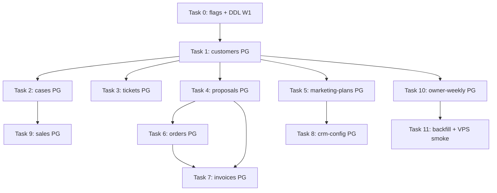

# Zero SQLite Wave 1 — SQLite-Only Nest Modules Implementation Plan

> **For agentic workers:** REQUIRED SUB-SKILL: Use superpowers:subagent-driven-development (recommended) or superpowers:executing-plans to implement this plan task-by-task. Steps use checkbox (`- [ ]`) syntax for tracking.

**Goal:** Migrate 10 module Nest sqlite-only sang PostgreSQL với flag `PTT_CRM_*_PG` + service router — `/api/crm/customers`, `/cases`, `/tickets` và các route billing/config/sales **200** khi `PTT_SQLITE_DISABLED=1` trên VPS.

**Architecture:** Chia **3 sub-wave** theo dependency: **P1** CSKH core (customers → cases → tickets), **P2** presales/config (proposals, marketing-plans, crm-config), **P3** billing/dashboard (orders, invoices, sales, owner-weekly). Mỗi module: DDL mở rộng hoặc greenfield → `*-pg.repository.ts` (port SQL từ sqlite) → service `usePg` router → backfill script → bật flag trên `deploy/runtime.env`. Giữ `*-sqlite.repository.ts` đến Wave 4. **`/api/crm/tickets` ≠ `/api/v1/staff-tickets`** — không reuse `crm_staff_tickets`.

**Tech Stack:** NestJS 10, Jest, `pg` Pool, PostgreSQL `rnosaidb`, `psql`, Python backfill tùy chọn.

**Spec:** [2026-08-23-zero-sqlite-full-stack-design.md](../specs/2026-08-23-zero-sqlite-full-stack-design.md) §4 Wave 1  
**Prerequisite:** Wave 0 deployed (`0e2af08`, `PTT_SQLITE_DISABLED=1`, `deploy/runtime.env`).

## Global Constraints

- Wave 1 **không** xóa `*-sqlite.repository.ts`, **không** migrate AI context repos (Wave 2), **không** Flask/script e2e cleanup (Wave 3).
- Khi `PTT_SQLITE_DISABLED=1`, mọi flag module Wave 1 **ép PG** (pattern payroll Wave 0): `isSqliteDisabled() || envFlag`.
- Flag env mới default **`0`** local/CI; VPS prod bật qua `deploy/runtime.env` sau backfill + smoke.
- PG id mapping: dùng cột bridge `sqlite_*_id` (pattern B5) cho backfill; API **vẫn expose** id số legacy (`id` = `sqlite_customer_id` khi có, else PG id) — khớp FE hiện tại.
- Guard sqlite vẫn active — sqlite repo chỉ chạy khi flag off **và** sqlite không disabled.
- Test: `cd services/ptt-crm-api && ./node_modules/.bin/jest <file> --runInBand`
- Không commit trừ khi user yêu cầu.
- VPS DDL: `source /var/www/realosai/.env` trước `psql`; flags ghi `deploy/runtime.env` (root `.env` không writable).

---

## Dependency graph



**Ship order khuyến nghị:** Task 0 → 1 → 2 → 3 (deploy P1) → 4–8 → 9–10 → 11.

---

## File map (Wave 1)

```
docs/specs/postgresql-ddl-zero-sqlite-w1.sql           CREATE consolidated DDL
scripts/apply_pg_ddl_zero_sqlite_w1.sh                 CREATE
scripts/backfill_zero_sqlite_w1_customers.py          CREATE (P1)
scripts/backfill_zero_sqlite_w1_cases.py              CREATE (P1)
scripts/backfill_zero_sqlite_w1_tickets.py            CREATE (P1)
docs/runbooks/zero-sqlite-wave-1-vps.md               CREATE

services/ptt-crm-api/src/config/app-config.service.ts MODIFY + spec
services/ptt-crm-api/src/customers/customers-pg.repository.ts         CREATE
services/ptt-crm-api/src/customers/customers-pg.repository.spec.ts    CREATE
services/ptt-crm-api/src/customers/customers.service.ts               MODIFY router
services/ptt-crm-api/src/customers/customers.module.ts                MODIFY providers

services/ptt-crm-api/src/cases/cases-pg.repository.ts                 CREATE + spec
services/ptt-crm-api/src/cases/cases.service.ts                       MODIFY
services/ptt-crm-api/src/cases/cases.module.ts                        MODIFY

services/ptt-crm-api/src/tickets/tickets-pg.repository.ts           CREATE + spec
services/ptt-crm-api/src/tickets/tickets.service.ts                   MODIFY
services/ptt-crm-api/src/tickets/tickets.module.ts                    MODIFY

(... P2/P3 tương tự: proposals-pg, marketing-plans-pg, crm-config-pg, orders-pg, invoices-pg, sales-pg, owner-weekly-pg)
```

---

## Existing PG assets (reuse / extend)

| Asset | Path | Wave 1 use |
|-------|------|------------|
| B5 bridge customers/cases | `docs/specs/2026-08-02-wave-b5-pg-oltp-bridge.sql` | ALTER thêm cột profile + satellite tables |
| Orders/invoices DDL | `docs/specs/2026-07-27-postgresql-ddl-rnos25-orders-invoices.sql` | Apply nếu chưa; cần `crm_proposals` base trước |
| Funnel marketing_plans | `docs/specs/2026-07-23-wave-b4-funnel-pg-ddl.sql` | **Khác schema** TMMT official — W1 DDL tách bảng `crm_marketing_plans_official` hoặc ALTER |
| Deal room proposals ALTER | `docs/specs/2026-08-11-deal-room-s0-proposals-ddl.sql` | Cần `CREATE TABLE crm_proposals` trước |
| Staff tickets (out of scope) | `docs/specs/postgresql-ddl-bds-p12.sql` | **Không** dùng cho `/api/crm/tickets` |

---

### Task 0: Config flags + consolidated DDL W1

**Files:**
- Create: `docs/specs/postgresql-ddl-zero-sqlite-w1.sql`
- Create: `scripts/apply_pg_ddl_zero_sqlite_w1.sh`
- Modify: `services/ptt-crm-api/src/config/app-config.service.ts`
- Create: `services/ptt-crm-api/src/config/app-config.wave1-pg-flags.spec.ts`

**Interfaces:**
- Produces flags: `crmCustomersPg`, `crmCasesPg`, `crmTicketsPg`, `crmProposalsPg`, `crmMarketingPlansPg`, `crmConfigPg`, `crmOrdersPg`, `crmInvoicesPg`, `crmSalesPg`, `crmOwnerWeeklyPg`
- Env keys: `PTT_CRM_CUSTOMERS_PG`, `PTT_CRM_CASES_PG`, `PTT_CRM_TICKETS_PG`, `PTT_CRM_PROPOSALS_PG`, `PTT_CRM_MARKETING_PLANS_PG`, `PTT_CRM_CONFIG_PG`, `PTT_CRM_ORDERS_PG`, `PTT_CRM_INVOICES_PG`, `PTT_CRM_SALES_PG`, `PTT_CRM_OWNER_WEEKLY_PG` — each default **`0`**, forced **`true`** when `isSqliteDisabled()`.

- [ ] **Step 1: Write failing flag spec**

```typescript
import { AppConfigService } from './app-config.service';

describe('AppConfigService wave1 PG flags', () => {
  const KEY = 'PTT_SQLITE_DISABLED';
  let prev: string | undefined;

  beforeEach(() => { prev = process.env[KEY]; });
  afterEach(() => {
    if (prev === undefined) delete process.env[KEY];
    else process.env[KEY] = prev;
    delete process.env.PTT_CRM_CUSTOMERS_PG;
  });

  it('crmCustomersPg false by default', () => {
    delete process.env.PTT_SQLITE_DISABLED;
    delete process.env.PTT_CRM_CUSTOMERS_PG;
    expect(new AppConfigService().crmCustomersPg).toBe(false);
  });

  it('sqlite disabled forces crmCustomersPg true', () => {
    process.env.PTT_SQLITE_DISABLED = '1';
    process.env.PTT_CRM_CUSTOMERS_PG = '0';
    expect(new AppConfigService().crmCustomersPg).toBe(true);
  });
});
```

- [ ] **Step 2: Run test — expect FAIL**

Run: `cd services/ptt-crm-api && ./node_modules/.bin/jest src/config/app-config.wave1-pg-flags.spec.ts --runInBand`

- [ ] **Step 3: Add flags to AppConfigService**

Thêm 10 `readonly` boolean fields. Helper private:

```typescript
private resolveCrmModulePg(envKey: string): boolean {
  if (isSqliteDisabled()) return true;
  return ['1', 'true', 'yes', 'on'].includes(
    (process.env[envKey] ?? '0').trim().toLowerCase(),
  );
}
```

Constructor assignments:

```typescript
this.crmCustomersPg = this.resolveCrmModulePg('PTT_CRM_CUSTOMERS_PG');
this.crmCasesPg = this.resolveCrmModulePg('PTT_CRM_CASES_PG');
this.crmTicketsPg = this.resolveCrmModulePg('PTT_CRM_TICKETS_PG');
this.crmProposalsPg = this.resolveCrmModulePg('PTT_CRM_PROPOSALS_PG');
this.crmMarketingPlansPg = this.resolveCrmModulePg('PTT_CRM_MARKETING_PLANS_PG');
this.crmConfigPg = this.resolveCrmModulePg('PTT_CRM_CONFIG_PG');
this.crmOrdersPg = this.resolveCrmModulePg('PTT_CRM_ORDERS_PG');
this.crmInvoicesPg = this.resolveCrmModulePg('PTT_CRM_INVOICES_PG');
this.crmSalesPg = this.resolveCrmModulePg('PTT_CRM_SALES_PG');
this.crmOwnerWeeklyPg = this.resolveCrmModulePg('PTT_CRM_OWNER_WEEKLY_PG');
```

- [ ] **Step 4: Write DDL** `docs/specs/postgresql-ddl-zero-sqlite-w1.sql`

Nội dung khóa (copy verbatim structure):

```sql
-- Zero SQLite Wave 1 — extend B5 bridge + CSKH + config + billing + sales
BEGIN;

-- crm_customers profile columns (B5 minimal → Nest parity)
ALTER TABLE crm_customers
  ADD COLUMN IF NOT EXISTS lead_source TEXT NOT NULL DEFAULT '',
  ADD COLUMN IF NOT EXISTS lead_source_note TEXT NOT NULL DEFAULT '',
  ADD COLUMN IF NOT EXISTS date_of_birth TEXT NOT NULL DEFAULT '',
  ADD COLUMN IF NOT EXISTS gender TEXT NOT NULL DEFAULT '',
  ADD COLUMN IF NOT EXISTS id_number TEXT NOT NULL DEFAULT '',
  ADD COLUMN IF NOT EXISTS occupation TEXT NOT NULL DEFAULT '',
  ADD COLUMN IF NOT EXISTS interests TEXT NOT NULL DEFAULT '',
  ADD COLUMN IF NOT EXISTS profile_notes TEXT NOT NULL DEFAULT '';

CREATE TABLE IF NOT EXISTS crm_customer_relations (
  id BIGSERIAL PRIMARY KEY,
  sqlite_relation_id BIGINT UNIQUE,
  customer_id BIGINT NOT NULL REFERENCES crm_customers(id) ON DELETE CASCADE,
  relation_type TEXT NOT NULL DEFAULT 'other',
  full_name TEXT NOT NULL DEFAULT '',
  phone TEXT NOT NULL DEFAULT '',
  email TEXT NOT NULL DEFAULT '',
  notes TEXT NOT NULL DEFAULT '',
  created_at TIMESTAMPTZ NOT NULL DEFAULT NOW()
);

CREATE TABLE IF NOT EXISTS crm_customer_purchases (
  id BIGSERIAL PRIMARY KEY,
  sqlite_purchase_id BIGINT UNIQUE,
  customer_id BIGINT NOT NULL REFERENCES crm_customers(id) ON DELETE CASCADE,
  product_name TEXT NOT NULL DEFAULT '',
  purchase_date TEXT NOT NULL DEFAULT '',
  amount_vnd BIGINT NOT NULL DEFAULT 0,
  status TEXT NOT NULL DEFAULT 'completed',
  notes TEXT NOT NULL DEFAULT '',
  created_at TIMESTAMPTZ NOT NULL DEFAULT NOW()
);

CREATE TABLE IF NOT EXISTS crm_customer_issues (
  id BIGSERIAL PRIMARY KEY,
  sqlite_issue_id BIGINT UNIQUE,
  customer_id BIGINT NOT NULL REFERENCES crm_customers(id) ON DELETE CASCADE,
  issue_type TEXT NOT NULL DEFAULT 'other',
  priority TEXT NOT NULL DEFAULT 'binh_thuong',
  status TEXT NOT NULL DEFAULT 'moi',
  title TEXT NOT NULL DEFAULT '',
  description TEXT NOT NULL DEFAULT '',
  created_at TIMESTAMPTZ NOT NULL DEFAULT NOW(),
  updated_at TIMESTAMPTZ NOT NULL DEFAULT NOW()
);

CREATE TABLE IF NOT EXISTS crm_customer_brief_scans (
  id BIGSERIAL PRIMARY KEY,
  sqlite_brief_id BIGINT UNIQUE,
  customer_id BIGINT NOT NULL REFERENCES crm_customers(id) ON DELETE CASCADE,
  meeting_purpose TEXT NOT NULL DEFAULT '',
  ai_output TEXT NOT NULL DEFAULT '',
  created_at TIMESTAMPTZ NOT NULL DEFAULT NOW()
);

-- crm_cases extensions
ALTER TABLE crm_cases
  ADD COLUMN IF NOT EXISTS deal_value_vnd BIGINT NOT NULL DEFAULT 0;

CREATE TABLE IF NOT EXISTS crm_case_events (
  id BIGSERIAL PRIMARY KEY,
  sqlite_event_id BIGINT UNIQUE,
  case_id BIGINT NOT NULL REFERENCES crm_cases(id) ON DELETE CASCADE,
  event_type TEXT NOT NULL DEFAULT 'note',
  body TEXT NOT NULL DEFAULT '',
  created_by_staff_id BIGINT,
  created_at TIMESTAMPTZ NOT NULL DEFAULT NOW()
);

CREATE TABLE IF NOT EXISTS crm_care_reports (
  id BIGSERIAL PRIMARY KEY,
  sqlite_report_id BIGINT UNIQUE,
  case_id BIGINT NOT NULL REFERENCES crm_cases(id) ON DELETE CASCADE,
  contact_method TEXT NOT NULL DEFAULT '',
  care_status TEXT NOT NULL DEFAULT '',
  summary TEXT NOT NULL DEFAULT '',
  next_action TEXT NOT NULL DEFAULT '',
  created_by_staff_id BIGINT,
  created_at TIMESTAMPTZ NOT NULL DEFAULT NOW()
);

-- crm_tickets (CSKH — NOT crm_staff_tickets)
CREATE TABLE IF NOT EXISTS crm_tickets (
  id BIGSERIAL PRIMARY KEY,
  sqlite_ticket_id BIGINT UNIQUE,
  customer_id BIGINT NOT NULL REFERENCES crm_customers(id) ON DELETE CASCADE,
  ticket_type TEXT NOT NULL DEFAULT 'phan_anh',
  status TEXT NOT NULL DEFAULT 'moi',
  priority TEXT NOT NULL DEFAULT 'binh_thuong',
  channel TEXT NOT NULL DEFAULT 'khac',
  title TEXT NOT NULL DEFAULT '',
  description TEXT NOT NULL DEFAULT '',
  resolution TEXT NOT NULL DEFAULT '',
  assigned_staff_id BIGINT,
  sentiment_score REAL,
  sentiment_label TEXT NOT NULL DEFAULT '',
  sentiment_updated_at TIMESTAMPTZ,
  created_at TIMESTAMPTZ NOT NULL DEFAULT NOW(),
  updated_at TIMESTAMPTZ NOT NULL DEFAULT NOW(),
  resolved_at TIMESTAMPTZ
);

CREATE TABLE IF NOT EXISTS crm_ticket_messages (
  id BIGSERIAL PRIMARY KEY,
  sqlite_message_id BIGINT UNIQUE,
  ticket_id BIGINT NOT NULL REFERENCES crm_tickets(id) ON DELETE CASCADE,
  author_staff_id BIGINT,
  body TEXT NOT NULL DEFAULT '',
  is_internal BOOLEAN NOT NULL DEFAULT TRUE,
  created_at TIMESTAMPTZ NOT NULL DEFAULT NOW()
);

-- crm_config (pipeline + lookups + custom fields)
CREATE TABLE IF NOT EXISTS crm_custom_field_defs (
  id BIGSERIAL PRIMARY KEY,
  sqlite_field_id BIGINT UNIQUE,
  entity_type TEXT NOT NULL DEFAULT 'lead',
  field_key TEXT NOT NULL,
  label TEXT NOT NULL DEFAULT '',
  field_type TEXT NOT NULL DEFAULT 'text',
  options_json JSONB NOT NULL DEFAULT '[]'::jsonb,
  required BOOLEAN NOT NULL DEFAULT FALSE,
  sort_order INT NOT NULL DEFAULT 0,
  active BOOLEAN NOT NULL DEFAULT TRUE,
  created_at TIMESTAMPTZ NOT NULL DEFAULT NOW()
);

CREATE TABLE IF NOT EXISTS crm_pipeline_stages (
  id BIGSERIAL PRIMARY KEY,
  sqlite_stage_id BIGINT UNIQUE,
  pipeline_key TEXT NOT NULL DEFAULT 'sales',
  stage_key TEXT NOT NULL,
  label TEXT NOT NULL DEFAULT '',
  sort_order INT NOT NULL DEFAULT 0,
  win_probability REAL NOT NULL DEFAULT 0,
  active BOOLEAN NOT NULL DEFAULT TRUE,
  created_at TIMESTAMPTZ NOT NULL DEFAULT NOW(),
  UNIQUE (pipeline_key, stage_key)
);

CREATE TABLE IF NOT EXISTS crm_lead_lookup_options (
  id BIGSERIAL PRIMARY KEY,
  sqlite_lookup_id BIGINT UNIQUE,
  lookup_key TEXT NOT NULL,
  option_value TEXT NOT NULL,
  label TEXT NOT NULL DEFAULT '',
  sort_order INT NOT NULL DEFAULT 0,
  active BOOLEAN NOT NULL DEFAULT TRUE,
  created_at TIMESTAMPTZ NOT NULL DEFAULT NOW()
);

-- crm_proposals + quote lines (base — before deal-room ALTER)
CREATE TABLE IF NOT EXISTS crm_proposals (
  id BIGSERIAL PRIMARY KEY,
  sqlite_proposal_id BIGINT UNIQUE,
  customer_id BIGINT NOT NULL REFERENCES crm_customers(id) ON DELETE CASCADE,
  lead_id BIGINT,
  presales_id BIGINT,
  title TEXT NOT NULL DEFAULT '',
  status TEXT NOT NULL DEFAULT 'draft',
  total_vnd BIGINT NOT NULL DEFAULT 0,
  notes TEXT NOT NULL DEFAULT '',
  lifecycle_id BIGINT,
  created_at TIMESTAMPTZ NOT NULL DEFAULT NOW(),
  updated_at TIMESTAMPTZ NOT NULL DEFAULT NOW()
);

CREATE TABLE IF NOT EXISTS crm_quote_line_item (
  id BIGSERIAL PRIMARY KEY,
  sqlite_line_id BIGINT UNIQUE,
  proposal_id BIGINT NOT NULL REFERENCES crm_proposals(id) ON DELETE CASCADE,
  sku_code TEXT NOT NULL DEFAULT '',
  description TEXT NOT NULL DEFAULT '',
  quantity INT NOT NULL DEFAULT 1,
  unit_price_vnd BIGINT NOT NULL DEFAULT 0,
  amount_vnd BIGINT NOT NULL DEFAULT 0,
  lifecycle_id BIGINT,
  sort_order INT NOT NULL DEFAULT 0
);

-- crm_marketing_plans official (Nest TMMT — tách khỏi presales draft B4)
CREATE TABLE IF NOT EXISTS crm_marketing_plans_official (
  id BIGSERIAL PRIMARY KEY,
  sqlite_plan_id BIGINT UNIQUE,
  lifecycle_id BIGINT,
  title TEXT NOT NULL DEFAULT '',
  status TEXT NOT NULL DEFAULT 'draft',
  plan_json JSONB NOT NULL DEFAULT '{}'::jsonb,
  owner_staff_id BIGINT,
  created_at TIMESTAMPTZ NOT NULL DEFAULT NOW(),
  updated_at TIMESTAMPTZ NOT NULL DEFAULT NOW()
);

CREATE TABLE IF NOT EXISTS crm_marketing_plan_milestones (
  id BIGSERIAL PRIMARY KEY,
  sqlite_milestone_id BIGINT UNIQUE,
  plan_id BIGINT NOT NULL REFERENCES crm_marketing_plans_official(id) ON DELETE CASCADE,
  title TEXT NOT NULL DEFAULT '',
  due_date TEXT NOT NULL DEFAULT '',
  status TEXT NOT NULL DEFAULT 'pending',
  sort_order INT NOT NULL DEFAULT 0
);

CREATE TABLE IF NOT EXISTS crm_marketing_plan_campaigns (
  id BIGSERIAL PRIMARY KEY,
  sqlite_link_id BIGINT UNIQUE,
  plan_id BIGINT NOT NULL REFERENCES crm_marketing_plans_official(id) ON DELETE CASCADE,
  campaign_id BIGINT NOT NULL
);

-- sales + owner-weekly
CREATE TABLE IF NOT EXISTS crm_sales_plans (
  id BIGSERIAL PRIMARY KEY,
  sqlite_plan_id BIGINT UNIQUE,
  title TEXT NOT NULL DEFAULT '',
  period_month TEXT NOT NULL DEFAULT '',
  status TEXT NOT NULL DEFAULT 'draft',
  notes TEXT NOT NULL DEFAULT '',
  created_at TIMESTAMPTZ NOT NULL DEFAULT NOW()
);

CREATE TABLE IF NOT EXISTS crm_sales_targets (
  id BIGSERIAL PRIMARY KEY,
  plan_id BIGINT NOT NULL REFERENCES crm_sales_plans(id) ON DELETE CASCADE,
  staff_id BIGINT,
  target_vnd BIGINT NOT NULL DEFAULT 0
);

CREATE TABLE IF NOT EXISTS crm_sales_partners (
  id BIGSERIAL PRIMARY KEY,
  sqlite_partner_id BIGINT UNIQUE,
  name TEXT NOT NULL DEFAULT '',
  contact TEXT NOT NULL DEFAULT '',
  notes TEXT NOT NULL DEFAULT '',
  created_at TIMESTAMPTZ NOT NULL DEFAULT NOW()
);

CREATE TABLE IF NOT EXISTS crm_sales_trainings (
  id BIGSERIAL PRIMARY KEY,
  sqlite_training_id BIGINT UNIQUE,
  title TEXT NOT NULL DEFAULT '',
  training_date TEXT NOT NULL DEFAULT '',
  notes TEXT NOT NULL DEFAULT '',
  created_at TIMESTAMPTZ NOT NULL DEFAULT NOW()
);

CREATE TABLE IF NOT EXISTS crm_sales_market_research (
  id BIGSERIAL PRIMARY KEY,
  sqlite_research_id BIGINT UNIQUE,
  title TEXT NOT NULL DEFAULT '',
  summary TEXT NOT NULL DEFAULT '',
  created_at TIMESTAMPTZ NOT NULL DEFAULT NOW()
);

CREATE TABLE IF NOT EXISTS crm_sales_transactions (
  id BIGSERIAL PRIMARY KEY,
  sqlite_tx_id BIGINT UNIQUE,
  case_id BIGINT REFERENCES crm_cases(id) ON DELETE SET NULL,
  amount_vnd BIGINT NOT NULL DEFAULT 0,
  tx_date TEXT NOT NULL DEFAULT '',
  notes TEXT NOT NULL DEFAULT '',
  created_at TIMESTAMPTZ NOT NULL DEFAULT NOW()
);

CREATE TABLE IF NOT EXISTS crm_owner_cash_snapshots (
  id BIGSERIAL PRIMARY KEY,
  sqlite_snapshot_id BIGINT UNIQUE,
  snapshot_date DATE NOT NULL,
  cash_vnd BIGINT NOT NULL DEFAULT 0,
  notes TEXT NOT NULL DEFAULT '',
  created_at TIMESTAMPTZ NOT NULL DEFAULT NOW(),
  UNIQUE (snapshot_date)
);

COMMIT;
```

Script `apply_pg_ddl_zero_sqlite_w1.sh`: prerequisite `./scripts/apply_pg_ddl_wave_b5_oltp.sh`, then `./scripts/apply_pg_ddl_rnos25_orders_invoices.sh` (tạo nếu thiếu wrapper), rồi apply W1 file.

- [ ] **Step 5: Run flag spec — PASS**

- [ ] **Step 6: Commit (khi user yêu cầu)**

---

### Task 1: Customers PG repository + router (P1)

**Files:**
- Create: `services/ptt-crm-api/src/customers/customers-pg.repository.ts`
- Create: `services/ptt-crm-api/src/customers/customers-pg.mapper.ts`
- Create: `services/ptt-crm-api/src/customers/customers-pg.repository.spec.ts`
- Modify: `services/ptt-crm-api/src/customers/customers.service.ts`
- Modify: `services/ptt-crm-api/src/customers/customers.module.ts`
- Create: `scripts/backfill_zero_sqlite_w1_customers.py`

**Interfaces:**
- Consumes: `AppConfigService.crmCustomersPg`, types từ `customers.types.ts`
- Produces: `CustomersPgRepository` với **method parity** sqlite: `listCustomers`, `getCustomerById`, `createCustomer`, `patchCustomer`, `fetchRelations`, `fetchPurchases`, `fetchIssues`, `computeStats`, relation/purchase/issue CRUD, `getLatestBrief`, `insertBrief`

- [ ] **Step 1: Mapper test**

```typescript
import { mapCustomerRow } from './customers-pg.mapper';

describe('customers-pg.mapper', () => {
  it('exposes legacy id from sqlite_customer_id', () => {
    const row = mapCustomerRow({
      id: '100',
      sqlite_customer_id: '42',
      name: 'A',
      phone: '09',
      email: '',
      address: '',
      company: '',
      lead_source: 'web',
      lead_source_note: '',
      date_of_birth: '',
      gender: '',
      id_number: '',
      occupation: '',
      interests: '',
      profile_notes: '',
      created_at: '2026-01-01T00:00:00.000Z',
    });
    expect(row.id).toBe(42);
    expect(row.name).toBe('A');
  });
});
```

- [ ] **Step 2: Implement mapper** — `id = Number(row.sqlite_customer_id ?? row.id)`

- [ ] **Step 3: PG repository** — `Pool` từ `databaseUrl`; port SQL từ `customers-sqlite.repository.ts` (WHERE `COALESCE(is_placeholder,false)=false` → `is_placeholder IS NOT TRUE`).

- [ ] **Step 4: Wire service**

```typescript
private get usePg(): boolean {
  return this.config.crmCustomersPg;
}

listCustomers(q?: string, limit?: number) {
  return this.usePg
    ? this.pg.listCustomers(q, limit)
    : this.sqlite.listCustomers(q, limit);
}
```

Áp dụng cho **mọi** public method service (detail, relations, purchases, issues, brief).

- [ ] **Step 5: Module** — register `CustomersPgRepository`.

- [ ] **Step 6: Backfill script** — đọc `PTT_SQLITE_PATH`, upsert vào PG set `sqlite_customer_id`; map FK satellite tables qua PG customer id lookup.

- [ ] **Step 7: Jest mapper + service router spec (mock pg/sqlite)**

Run: `jest customers-pg customers.service.spec --runInBand`

**VPS partial deploy P1a:** apply W1 DDL → backfill customers → `PTT_CRM_CUSTOMERS_PG=1` in `deploy/runtime.env` → restart → smoke `GET /api/crm/customers`.

---

### Task 2: Cases PG (P1)

**Files:**
- Create: `services/ptt-crm-api/src/cases/cases-pg.repository.ts`
- Create: `services/ptt-crm-api/src/cases/cases-pg.repository.spec.ts`
- Modify: `services/ptt-crm-api/src/cases/cases.service.ts`, `cases.module.ts`
- Create: `scripts/backfill_zero_sqlite_w1_cases.py`

**Interfaces:**
- Method parity: `listCases`, `getCaseById`, `patchCase`, `listEvents`, `createEvent`, `listCareReports`, `createCareReport`, `isValidStatus`
- Reuse `CASE_SELECT` join pattern — PG: `JOIN crm_customers cu ON cu.id = c.customer_id` (customer_id PG FK; list API id vẫn legacy case id)

- [ ] **Step 1–7:** Same TDD pattern as Task 1; mapper `id = sqlite_case_id ?? id`.

**Blocker:** backfill cases **sau** customers (FK).

**Smoke:** `GET /api/crm/cases`, `PATCH /api/crm/cases/:id`, `POST .../events`.

---

### Task 3: Tickets PG (P1) — CSKH board

**Files:**
- Create: `services/ptt-crm-api/src/tickets/tickets-pg.repository.ts`
- Create: `services/ptt-crm-api/src/tickets/tickets-pg.repository.spec.ts`
- Modify: `services/ptt-crm-api/src/tickets/tickets.service.ts`, `tickets.module.ts`
- Create: `scripts/backfill_zero_sqlite_w1_tickets.py`

**Interfaces:**
- Method parity: `list`, `create`, `patch`, `getById`, `updateSentiment`, `listMessages`, `addMessage`
- **Không** import `staff-ticket.repository.ts`

- [ ] **Step 1: List query test** — filter `status`, `customer_id`, pagination `total` khớp sqlite.

- [ ] **Step 2–6:** Port SQL từ `tickets-sqlite.repository.ts`; bỏ `ensureSchema()` (DDL Task 0).

**Smoke P1 complete:** customers + cases + tickets 200; CSKH board ops-web.

**Deploy milestone:** commit `feat: zero-sqlite W1 P1 customers cases tickets PG`.

---

### Task 4: Proposals PG (P2)

**Files:**
- Create: `services/ptt-crm-api/src/proposals/proposals-pg.repository.ts` + spec
- Modify: `proposals.service.ts`, `proposals.module.ts`
- Create: `scripts/backfill_zero_sqlite_w1_proposals.py`

**Notes:**
- Sau Task 0 DDL, apply `docs/specs/2026-08-11-deal-room-s0-proposals-ddl.sql` nếu chưa.
- `ProposalsService` giữ PG sidecars (funnel, lifecycle, spc) — chỉ thay storage repo router.
- Methods: `listByCustomer`, `listByLeadId`, `getById`, `listLines`, `create`, `replaceLines`, `patchStatus`, lifecycle sku helpers — lifecycle writes vẫn qua `ServiceLifecycleService` PG khi `crmServiceLifecyclePg`.

**Smoke:** `GET /api/crm/proposals`, `POST /api/crm/proposals`.

---

### Task 5: Marketing-plans PG (P2)

**Files:**
- Create: `marketing-plans-pg.repository.ts` + spec
- Modify: `marketing-plans.service.ts`, module

**Notes:**
- Map sqlite `crm_marketing_plans` → PG `crm_marketing_plans_official` (tránh clash B4 presales `crm_marketing_plans`).
- Methods: `listPlans`, `getPlanById`, `listMilestones`, `listCampaigns`, `createPlan`, `patchPlan`.

---

### Task 6: Orders PG (P3)

**Files:**
- Create: `orders-pg.repository.ts` + spec (port `OrdersSqliteRepositoryCore` logic)
- Modify: `orders.service.ts`, module
- Reuse `billing-schema.util.ts` types; PG DDL từ RNOS-25 (apply script)

**Dependency:** customers PG + proposals PG for FK/backfill.

**Methods:** `list`, `getById`, `listLines`, `create`, `createFromProposal`, `patch`, `setStatus`, `addLine`, `deleteLine`.

---

### Task 7: Invoices PG (P3)

**Files:**
- Create: `invoices-pg.repository.ts` + spec
- Modify: `invoices.service.ts` — inject `OrdersPgRepository` thay sqlite khi PG
- `syncPaidStatus` đọc `crm_svc_payments` PG (finance module đã PG)

**Methods:** parity sqlite repo public API.

---

### Task 8: CRM-config PG (P2 — có thể song song Task 5)

**Files:**
- Create: `crm-config-pg.repository.ts` + spec
- Modify: `crm-config.service.ts`, module

**Notes:** Blocks **sales PG** (pipeline runtime). Methods: full sqlite repo surface (lookups, custom fields, pipeline stages, `getSalesPipelineConfig`, `replacePipelineStages`).

**Smoke:** `GET /api/crm/config/pipeline/sales/stages`.

---

### Task 9: Sales PG (P3)

**Files:**
- Create: `sales-pg.repository.ts` + spec
- Modify: `sales.service.ts`, module

**Dependency:** cases PG + crm-config PG.

**Methods:** `computeFunnel`, `fetchSummary`, plans/partners/trainings/market CRUD, `listPipelineCases`, `fetchSalesReport`.

---

### Task 10: Owner-weekly PG (P3)

**Files:**
- Create: `owner-weekly-pg.repository.ts` + spec
- Modify: `owner-weekly.service.ts`, module

**Notes:**
- `crm_finance_kpi_config` PG (B6) dùng `thresholds_json` — owner-weekly sqlite dùng key/value `owner_*`: lưu snapshot PG table `crm_owner_weekly_config` JSONB **hoặc** adapter đọc B6 shape.
- Methods: `dashboard`, `configGet/Patch`, cash snapshots CRUD, `export`, `alertCron`, `inboxSync`, `inboxSummary`.

---

### Task 11: Backfill batch + VPS runbook + verify

**Files:**
- Create: `docs/runbooks/zero-sqlite-wave-1-vps.md`
- Create: `scripts/backfill_zero_sqlite_w1_all.sh` (orchestrate P1→P3)

- [ ] **Step 1: Runbook**

```markdown
# Zero SQLite Wave 1 — VPS

## DDL (once)
cd /var/www/realosai && source .env
./scripts/apply_pg_ddl_wave_b5_oltp.sh   # if not applied
./scripts/apply_pg_ddl_zero_sqlite_w1.sh
# orders/invoices base if missing:
psql "$DATABASE_URL" -f docs/specs/2026-07-27-postgresql-ddl-rnos25-orders-invoices.sql

## Backfill (per domain, maintenance window)
python3 scripts/backfill_zero_sqlite_w1_customers.py
python3 scripts/backfill_zero_sqlite_w1_cases.py
python3 scripts/backfill_zero_sqlite_w1_tickets.py
# ... proposals, etc.

## Flags (deploy/runtime.env — append after each sub-wave)
PTT_CRM_CUSTOMERS_PG=1
PTT_CRM_CASES_PG=1
PTT_CRM_TICKETS_PG=1
# P2/P3 when ready

## Deploy
npm run build locally → rsync dist → sudo systemctl restart realosai-api

## Smoke matrix
| Route | Expect |
| GET /api/crm/customers | 200 |
| GET /api/crm/cases | 200 |
| GET /api/crm/tickets | 200 |
| GET /api/crm/proposals | 200 after P2 |
| GET /api/crm/orders | 200 after P3 |
```

- [ ] **Step 2: Verification grep**

```bash
# No sqlite-only service left without usePg when all flags on
rg "private readonly sqlite:" services/ptt-crm-api/src/{customers,cases,tickets}/ -g '*.service.ts'
# Expect usePg router alongside
```

- [ ] **Step 3: Full Jest wave1 suite**

```bash
cd services/ptt-crm-api && ./node_modules/.bin/jest \
  src/config/app-config.wave1-pg-flags.spec.ts \
  src/customers/customers-pg.repository.spec.ts \
  src/cases/cases-pg.repository.spec.ts \
  src/tickets/tickets-pg.repository.spec.ts \
  --runInBand
# extend as modules land
```

- [ ] **Step 4: VPS smoke** — `/health` vẫn `sqlite_disabled: true`; P1 routes 200.

---

## Rollback (per module)

1. Set `PTT_CRM_<MODULE>_PG=0` in `deploy/runtime.env` (sqlite vẫn blocked nếu `PTT_SQLITE_DISABLED=1` → **module 503**; rollback thực tế cần tắt hard-ban hoặc giữ PG).
2. PG data giữ nguyên; sqlite `ptt.db` backup vẫn có thể re-backfill.

---

## Ước lượng

| Sub-wave | Modules | Effort |
|----------|---------|--------|
| **P1** | customers, cases, tickets | 5–7 ngày |
| **P2** | proposals, marketing-plans, crm-config | 4–6 ngày |
| **P3** | orders, invoices, sales, owner-weekly | 5–8 ngày |
| **Total W1** | 10 modules | **2–3 tuần** |

---

## Self-review vs spec Wave 1

| Spec requirement | Task |
|------------------|------|
| P1 customers, cases | 1, 2 |
| P1 tickets (not staff-tickets) | 3 |
| P2 proposals, marketing-plans, crm-config | 4, 5, 8 |
| P3 orders, invoices, sales, owner-weekly | 6, 7, 9, 10 |
| `*-pg.repository` + router + DDL | All |
| Backfill PG | 1–3 scripts + Task 11 |
| VPS apply | Task 0, 11 |

**Gap sau W1 (Wave 2):** AI context repos, lifecycle-launch-qa direct sqlite, deal-room consumers.

---

## Execution handoff

Plan saved to `docs/superpowers/plans/2026-08-23-zero-sqlite-wave-1.md`.

**Two execution options:**

1. **Subagent-Driven (recommended)** — Task 0 → Task 1 → review → … theo sub-wave P1 trước
2. **Inline Execution** — làm P1 trong session với checkpoint deploy sau Task 3

**Which approach?**
