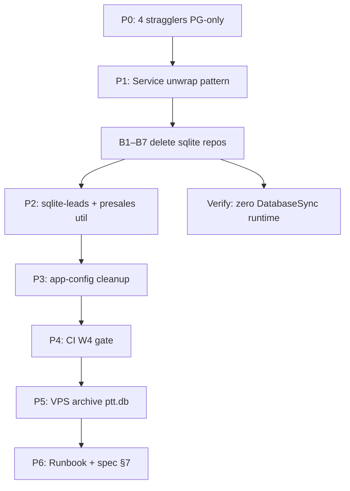

# Zero SQLite Wave 4 — Delete SQLite Code + Archive Implementation Plan

> **For agentic workers:** REQUIRED SUB-SKILL: Use superpowers:subagent-driven-development (recommended) or superpowers:executing-plans to implement this plan task-by-task. Steps use checkbox (`- [ ]`) syntax for tracking.

**Goal:** Xóa code SQLite khỏi Nest `ptt-crm-api` runtime — không còn `*-sqlite.repository.ts`, không còn `DatabaseSync` trên prod path — và archive `ptt.db` trên VPS vĩnh viễn.

**Architecture:** W0–W3 đã PG-only prod (`PTT_SQLITE_DISABLED=1`, P6 absence PASS). W4 **xóa dead code** và **wire PG-only** cho 4 stragglers còn `DatabaseSync` ngoài `*-sqlite.repository.ts`. Không migrate Flask/Python unit tests (`:memory:`) trừ khi optional backlog.

**Spec:** [2026-08-23-zero-sqlite-full-stack-design.md](../specs/2026-08-23-zero-sqlite-full-stack-design.md) §4 Wave 4  
**Prerequisite:** W3 complete VPS (`090a2c2`+, `./scripts/ci_zero_sqlite_w3_verify.sh` PASS, P6 live acceptance OK).

## Global Constraints

- **Không** set `PTT_SQLITE_DISABLED=1` trong Jest unit tests cho tới khi xóa hết sqlite repos (hoặc refactor guard specs).
- **Không** big-bang delete — batch theo domain, build + Jest sau mỗi batch.
- Prod VPS: giữ `PTT_SQLITE_DISABLED=1`; **không** rollback PG flags.
- `sqlite-guard.util.ts` giữ tới P4 config cleanup; có thể xóa khi không còn `DatabaseSync`.
- Python `tests/test_crm*.py` (`:memory:` sqlite3) — **out of scope W4** (optional W4b).
- Legacy scripts (~53 refs `PTT_SQLITE_PATH` / `ptt.db`) — optional W4b; không block prod.
- Không commit trừ khi user yêu cầu.

---

## Hiện trạng sau W3 (audit 2026-08-24)

### ✅ Done W0–W3

| Area | Status |
|------|--------|
| VPS OLTP | PG-only, `/health` → `sqlite_disabled: true` |
| Flask | `retired`, `ptt.service` inactive |
| Playwright e2e | 40/40 PG bootstrap, 0 `PTT_SQLITE_PATH` |
| Staging/local/backup | `e2e_pg_bootstrap.sh`, PG-primary backup |
| P6 acceptance | `ptt.db` rename → API 200, auto-restore OK |

### 🔴 W4 scope — còn trong Nest

| Nhóm | Count | W4 action |
|------|-------|-----------|
| `*-sqlite.repository.ts` | **22** | Delete + unwrap services/modules |
| Stragglers `DatabaseSync` (non-sqlite file) | **4** | PG-only wire **trước** delete |
| `sqlite-leads.repository.ts` | **1** | Remove dev read path |
| `presales-funnel-metrics-load.sqlite.util.ts` | **1** | Port PG or inline PG util |
| `app-config.service.ts` `sqlitePath` | **1** | Dev-only optional / remove |
| Jest `:memory:` DatabaseSync | **2 spec files** | Keep or PG fixture |
| `sqlite-guard.wire.spec.ts` | **1** | Rewrite after repo delete |

### 🟡 4 stragglers (P0 — block delete)

```
service-lifecycle/lifecycle-finance-confirm.repository.ts   → PG repo exists; service có useFinanceConfirmPg khi disabled
service-lifecycle/lifecycle-tasks.repository.ts             → PG repo exists; wire tasksPg when disabled
seo-admin/seo-admin.repository.ts                           → PG seo_aeo primary; sqliteDb fallback còn
re-projects/re-projects-accounting.repository.ts            → PG repo exists; pgPrimary() when BDS PG
```

W3 smoke: prod routes **401/404**, không 503 — stragglers chưa hit hot path. W4 P0 vẫn bắt buộc trước delete.

### ⚪ Out of scope W4 (optional W4b)

| Nhóm | Count | Notes |
|------|-------|-------|
| `scripts/` refs `PTT_SQLITE_PATH` / `ptt.db` | **~53** | backfill, migration, legacy cutover |
| Python `tests/test_crm*.py` | **~60** | `:memory:` fixtures OK |
| `deploy/env.*.example` legacy sqlite | **~9** | phase1/2/3 staging examples |
| Flask `ptt_crm/crm_sqlite.py` consumers | many | tests/gates only |

---

## 22 sqlite repos — delete batches

| Batch | Files | Domain |
|-------|-------|--------|
| **B1** | customers, cases, tickets, crm-config | CSKH / config |
| **B2** | proposals, marketing-plans, intake | Presales |
| **B3** | orders, invoices, sales, owner-weekly | Billing / dashboard |
| **B4** | finance, svc-finance, kpi, payroll | Finance / KPI |
| **B5** | service-lifecycle, sop, crm-staff, crm-leads-legacy | Lifecycle / staff |
| **B6** | leads-funnel, leads-contract | Funnel / contract |
| **B7** | re-projects-sqlite | BĐS (PG primary VPS) |

**Per batch pattern:**

1. Service: remove `*SqliteRepository` inject + `usePg` ternary → PG only
2. Module: remove sqlite provider/export
3. Delete `*-sqlite.repository.ts`
4. `npm run build` + targeted Jest
5. Grep: no import of deleted file

---

## Dependency graph



**Ship order:** P0 → P1 (pilot B1) → B2…B7 → P2 → P3 → P4 → P5 → P6.

---

## File map (Wave 4)

```
docs/superpowers/plans/2026-08-24-zero-sqlite-wave-4.md          CREATE (this file)
docs/runbooks/zero-sqlite-wave-4-vps.md                         CREATE

scripts/ci_zero_sqlite_w4_gate.sh                               CREATE
scripts/ci_zero_sqlite_w4_verify.sh                             CREATE (extends W3 verify)

services/ptt-crm-api/src/**/**-sqlite.repository.ts             DELETE (22)
services/ptt-crm-api/src/**/**.service.ts                       MODIFY — PG-only
services/ptt-crm-api/src/**/**.module.ts                        MODIFY
services/ptt-crm-api/src/service-lifecycle/lifecycle-*.repository.ts   DELETE (2 stragglers after PG wire)
services/ptt-crm-api/src/re-projects/re-projects-accounting.repository.ts  DELETE
services/ptt-crm-api/src/seo-admin/seo-admin.repository.ts      MODIFY — drop sqliteDb
services/ptt-crm-api/src/leads/sqlite-leads.repository.ts       DELETE
services/ptt-crm-api/src/config/app-config.service.ts           MODIFY — optional sqlitePath
services/ptt-crm-api/src/common/sqlite-guard.wire.spec.ts       MODIFY
```

---

### Task 0: Baseline audit

- [ ] **Step 1:** Confirm W3 gates on VPS

```bash
./scripts/ci_zero_sqlite_w3_verify.sh
ssh deploy@real.gomira.vn 'cd /var/www/realosai && ./scripts/ci_zero_sqlite_w3_verify.sh'
```

- [ ] **Step 2:** Inventory sqlite files

```bash
find services/ptt-crm-api/src -name '*-sqlite.repository.ts' | wc -l   # expect 22
cd services/ptt-crm-api && rg -l 'new DatabaseSync' src --glob '*.ts' \
  | rg -v 'sqlite\.repository|\.spec\.ts|sqlite-leads' | sort
# expect 4 stragglers
```

- [ ] **Step 3:** Save baseline → runbook W4

---

### Task 1 / P0: Straggler PG-only (blocker)

**Files:** 4 stragglers above + owning services

| File | Fix |
|------|-----|
| `lifecycle-finance-confirm.repository.ts` | Service always `financeConfirmPg` when `PTT_SQLITE_DISABLED=1`; delete sqlite repo |
| `lifecycle-tasks.repository.ts` | Service always `tasksPg` when disabled; delete sqlite repo |
| `seo-admin.repository.ts` | Remove `sqliteDb` / `DatabaseSync`; PG Pool only (`seo_aeo`) |
| `re-projects-accounting.repository.ts` | `deps()` throws or PG-only when `PTT_SQLITE_DISABLED=1`; delete sqlite repo |

- [x] **Step 1:** Implement PG-only branches
- [x] **Step 2:** Jest straggler specs
- [x] **Step 3:** VPS smoke lifecycle + BĐS accounting routes (401/200, not 503)

**Effort:** 0.5–1 ngày

---

### Task 2 / P1: Service unwrap pilot (B1)

**Files:** `customers`, `cases`, `tickets`, `crm-config` services + modules

Pattern:

```typescript
// BEFORE
private get usePg(): boolean { return this.config.crmCustomersPg; }
async list() {
  return this.usePg ? this.pg.list() : this.sqlite.list();
}

// AFTER
async list() {
  return this.pg.list();
}
```

- [x] **Step 1:** Unwrap B1 services
- [x] **Step 2:** Delete B1 sqlite repos
- [x] **Step 3:** Build + Jest `customers`, `cases`, `tickets`, `crm-config`

---

### Task 3 / P2: Delete batches B2–B7

Repeat P1 pattern per batch (see table above).

- [x] **B2** proposals, marketing-plans, intake
- [x] **B3** orders, invoices, sales, owner-weekly
- [x] **B4** finance, svc-finance, kpi, payroll
- [x] **B5** service-lifecycle, sop, crm-staff, crm-leads-legacy
- [x] **B6** leads-funnel, leads-contract
- [x] **B7** re-projects-sqlite (+ accounting sqlite after P0)

**After each batch:**

```bash
cd services/ptt-crm-api && npm run build
./node_modules/.bin/jest <module>.spec.ts --runInBand
find src -name '*-sqlite.repository.ts' | wc -l
```

**Effort:** 2–3 ngày

---

### Task 4 / P3: Leads read path + presales util

**Files:**
- `leads/sqlite-leads.repository.ts` — DELETE
- `leads/leads.repository.ts`, `leads.module.ts` — PG-only read
- `leads-funnel/presales-funnel-metrics-load.sqlite.util.ts` — PG port or delete if unused

- [x] **Step 1:** Grep `SqliteLeadsRepository` / `sqlite-leads` → 0 prod imports
- [x] **Step 2:** `PTT_LEADS_READ_SOURCE=pg` only path in Nest

---

### Task 5 / P4: Config + guard cleanup

**Files:**
- `config/app-config.service.ts` — remove or dev-gate `sqlitePath`, `sqliteAvailable()`
- `common/sqlite-guard.util.ts` — delete if no `DatabaseSync` left
- `common/sqlite-guard.wire.spec.ts` — remove or replace with “no sqlite repos” smoke

- [x] **Step 1:** Grep `sqlitePath` / `assertSqliteAllowed` in `src/` → 0 runtime (specs OK)
- [x] **Step 2:** Remove dead env reads from prod templates if any remain

---

### Task 6 / P5: CI W4 gate + verify

**Files:**
- Create: `scripts/ci_zero_sqlite_w4_gate.sh`
- Create: `scripts/ci_zero_sqlite_w4_verify.sh`

**W4-G01…G04:**

| Gate | Check |
|------|-------|
| W4-G01 | Zero `*-sqlite.repository.ts` in `src/` |
| W4-G02 | Zero `new DatabaseSync` in `src/` except `.spec.ts` |
| W4-G03 | W3 verify still PASS |
| W4-G04 | Nest `npm run build` OK |

```bash
./scripts/ci_zero_sqlite_w4_verify.sh
# Report: .local-dev/zero-sqlite-w4-verify-report.json
```

- [x] **Step 1:** Create `scripts/ci_zero_sqlite_w4_gate.sh` (W4-G01, G02, G04)
- [x] **Step 2:** Create `scripts/ci_zero_sqlite_w4_verify.sh` (W4-G03 via W3 verify)
- [x] **Step 3:** Update W3-V01 straggler count → 0 post-W4

Wire pre-deploy:

```bash
./scripts/ci_zero_sqlite_w4_verify.sh && cd services/ptt-crm-api && npm run build
```

Post-archive (VPS P6):

```bash
APPLY=1 ARCHIVE=1 WITH_BACKUP=1 \
  HEALTH_URL=http://127.0.0.1:3010/health PTT_APP_DIR=/var/www/realosai \
  ./scripts/ci_zero_sqlite_w4_p6_accept.sh
```

---

### Task 7 / P6: VPS archive `ptt.db`

**Files:**
- Create: `scripts/ci_zero_sqlite_w4_p6_accept.sh`
- Update: `docs/runbooks/zero-sqlite-wave-4-vps.md`

**Prerequisite:** W4 code deployed + smoke PASS.

```bash
# PG backup + permanent archive (no restore)
APPLY=1 ARCHIVE=1 WITH_BACKUP=1 \
  HEALTH_URL=http://127.0.0.1:3010/health PTT_APP_DIR=/var/www/realosai \
  ./scripts/ci_zero_sqlite_w4_p6_accept.sh
```

- [x] **Step 0:** Create `ci_zero_sqlite_w4_p6_accept.sh` (archive + W4 smoke matrix)
- [x] **Step 1:** Confirm `ptt.db` at `$PTT_APP_DIR/backups/ptt-archived-*.db` (VPS 2026-08-24)
- [x] **Step 2:** Remove `PTT_SQLITE_PATH` from VPS `.env` if present (none active)
- [x] **Step 3:** `/health` + W2 smoke matrix full regression (W4-P6-04 PASS)

---

### Task 8 / P7: Runbook + spec

**Files:**
- Update: `docs/runbooks/zero-sqlite-wave-4-vps.md`
- Update: spec §7 Wave 4 ticks
- Update: `docs/runbooks/zero-sqlite-wave-3-vps.md` (Wave 4 complete link)

- [x] **Step 1:** Runbook completion checklist + VPS acceptance record
- [x] **Step 2:** Spec §7 Wave 4 ticks + §4 Wave 4 summary
- [x] **Step 3:** P6 script sources `.env` + backup-dir fallback for VPS

---

## Verification matrix (W4 complete)

```bash
# Local
./scripts/ci_zero_sqlite_w4_verify.sh
cd services/ptt-crm-api && rg 'DatabaseSync|sqlite\.repository' src --glob '*.ts' | rg -v '\.spec\.ts'
# expect: 0 matches

# VPS
curl -sS https://real.gomira.vn/health | jq '{sqlite_disabled, postgres}'
ssh deploy@real.gomira.vn 'test ! -f /var/www/realosai/ptt.db && echo archived OK'
```

### ops-web smoke (post-W4)

| Route | Expect |
|-------|--------|
| `GET /health` | 200, `sqlite_disabled: true` |
| Leads list/detail | 401/200 |
| Finance dashboard | 401/200 |
| BĐS project accounting | 401/200 |
| CSKH tickets board | 401/200 |

---

## Rollback

1. **Code:** revert W4 commit(s), rsync `dist/`, restart API — PG data unchanged.
2. **ptt.db:** restore from `/var/backups/ptt/ptt-archived-*.db` if emergency local dev.
3. **Flags:** keep `PTT_SQLITE_DISABLED=1` — do not re-enable sqlite OLTP on prod.

---

## Ước lượng

| Sub-wave | Scope | Effort |
|----------|-------|--------|
| **P0** | 4 stragglers PG-only | 0.5–1 ngày |
| **P1–P2** | Unwrap + delete 22 repos (B1–B7) | 2–3 ngày |
| **P3** | sqlite-leads + presales util | 0.5 ngày |
| **P4** | app-config / guard cleanup | 0.5–1 ngày |
| **P5** | CI W4 gate | 0.5 ngày |
| **P6** | VPS archive + regression | 0.5 ngày |
| **P7** | Runbook + spec | 0.5 ngày |
| **W4b optional** | scripts + Python tests | 1–2 tuần backlog |
| **Total W4** | | **~1–1.5 tuần** |

---

## Self-review vs spec Wave 4

| Spec requirement | Task |
|------------------|------|
| Remove `*-sqlite.repository.ts` | P2 B1–B7 |
| Remove `node:sqlite` runtime usage | P0, P2, P4 |
| Archive `ptt.db` VPS | P6 |
| Zero `DatabaseSync` when disabled | P0, P5 |
| Update runbooks | P7 |

**Gap sau W4:** Flask/Python `:memory:` tests; legacy migration scripts; staging env examples with `PTT_SQLITE_PATH`.

---

## Execution handoff

Plan saved to `docs/superpowers/plans/2026-08-24-zero-sqlite-wave-4.md`.

**Recommended first session:** Task 0 audit + **P0 stragglers** (4 files) + **P1 B1** (customers/cases/tickets/crm-config delete) — visible grep win, low prod risk.

**Two execution options:**

1. **Subagent-Driven** — P0 → B1 → B2…B7 → P3 → P4 → P5 → P6 → P7
2. **Inline** — P0 one straggler + B1 one module end-to-end proof in one session
