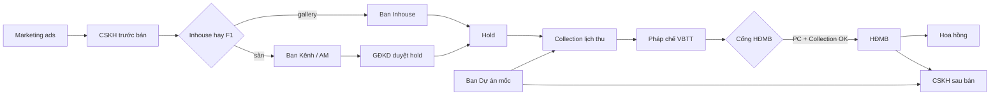
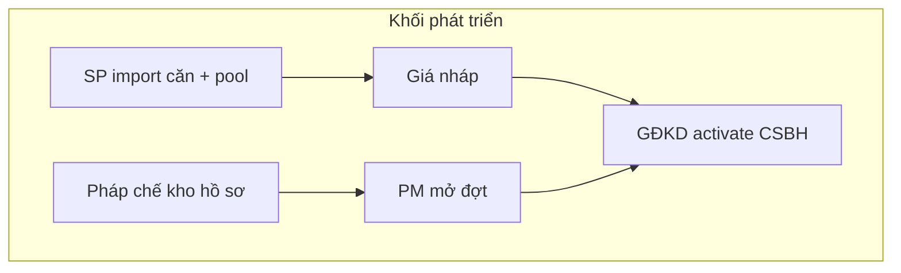
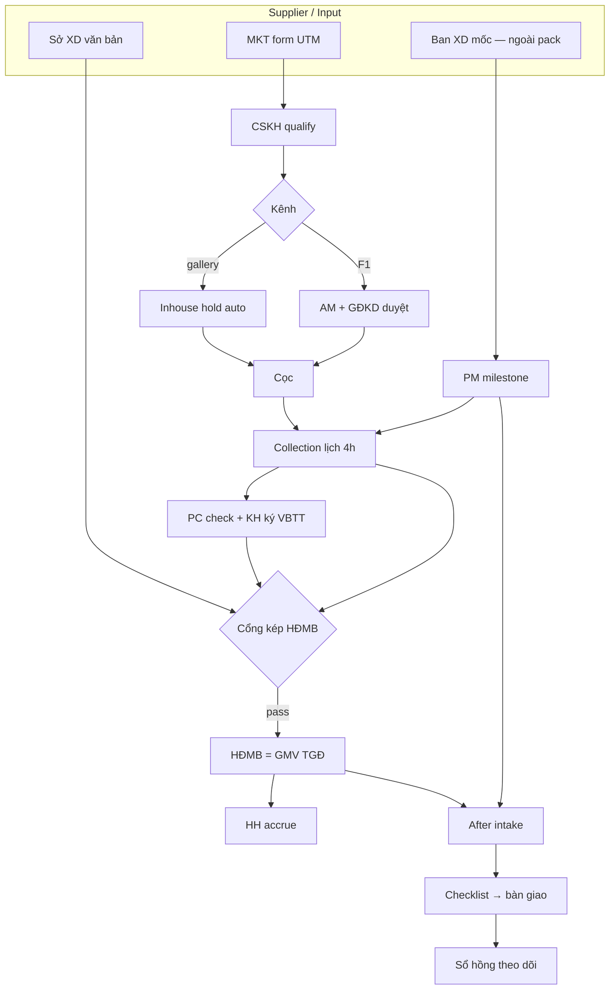
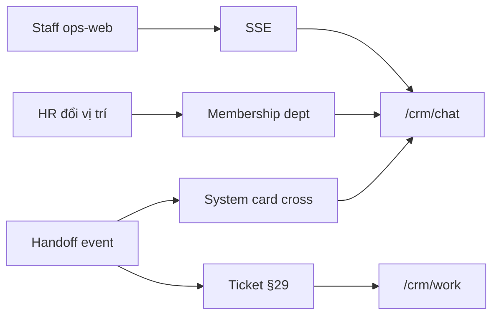
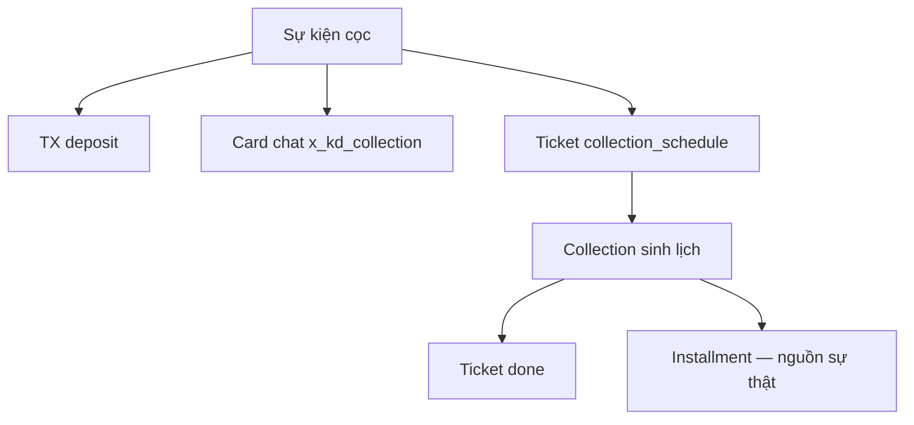

# Design: RNOSAI Industry Pack — BĐS (CĐT + Sàn)

**Ngày:** 2026-08-21  
**Trạng thái:** Chờ duyệt  
**Module:** Industry Pack `bds` (pha 1 của nền tảng đa ngành)  
**Quyết định sản phẩm:** Một nền RNOSAI dùng chung mọi ngành. Pack đầu tiên là Bất động sản. Một tenant chọn **CĐT**, **Sàn**, hoặc **Hybrid** lúc onboard — cùng lõi tồn kho + giao dịch, khác quyền và UI.

---

## 1. Vấn đề

RNOSAI hôm nay là Revenue OS cho agency PTT. Phân hệ `crm_re_projects` đã có hồ sơ dự án, tồn kho căn (5 trạng thái), bảng giá version, KPI, P&L, rủi ro, staff theo khu, ingest FB/Zalo. Catalog có slug `bds`. Addon lead BĐS là **ô text**, không FK căn.

Hệ quả khi bán cho CĐT / sàn chuyên nghiệp:

- Một operator PTT, không cô lập từng CĐT / sàn.
- Tồn kho BĐS **SQLite-primary** — không khóa đồng thời, không SaaS.
- Status căn là field (`available|hold|booked|sold|locked`); đã có `hold_lead_id` / `hold_at` nhưng không TTL, không phiếu, không duyệt.
- Hoa hồng là sổ B2B PTT (first-touch/closer), không phải hoa hồng sàn / CTV.
- Lead chỉ `spa_operational` | `b2b_prospect`. Deal Room = chốt dịch vụ agency.
- Portal = khách agency duyệt ads, không phải console CĐT / app CTV.
- `developer_name` là chuỗi, không phải tổ chức.
- Đại lý (nếu có) chỉ là staff + `%` gợi ý trong `sales_plan` JSON — không hạng, không giỏ căn, không đối soát.
- Dự án = 7 tab kế hoạch JSON, không cổng pháp lý, không đợt/tòa entity, không duyệt bản kế hoạch.

Hai nghĩa «dự án» đã tách đúng: `crm_re_projects` (BĐS) ≠ `crm_b2b_projects` (chiến dịch PTT). Spec này **không gộp** hai bảng đó.

---

## 2. Quyết định đã khóa

| # | Quyết định | Chọn |
|---|------------|------|
| Q1 | Kiến trúc dài hạn | **Platform + Industry Pack** — không custom-field Getfly, không năm product tách repo |
| Q2 | Pack đầu | **BĐS** — spa / giáo dục / GYM / Marketing pack sau, cùng contract pack |
| Q3 | Ai dùng | **CĐT và Sàn cùng hệ** — tenant chọn `developer` \| `broker` \| `hybrid` |
| Q4 | Isolation | **Tenant org** (`bds_tenant_id`) trên mọi entity pack BĐS. Không dùng `agency_client_id` làm tenant CĐT |
| Q5 | «Dự án» | Giữ `crm_re_projects`. Cấm ghi `b2b_project_id` cho khách mua căn |
| Q6 | Lead khách mua | Flow mới `re_buyer`. Không nhồi vào `b2b_prospect` |
| Q7 | Hợp đồng mua căn | Bounded context **Giao dịch BĐS**. Không dùng `crm_contracts` dịch vụ agency |
| Q8 | Hoa hồng | Sổ BĐS riêng + scheme bậc thang (§20.4). Không tái dùng `crm_b2b_commission_ledger` |
| Q9 | OLTP tồn kho | **PostgreSQL** bắt buộc trước khi bật pack trên staging có 2 tenant. Giai đoạn chuyển: dual-write SQLite→PG, rồi cắt đọc/ghi PG |
| Q10 | ID | Bảng RE hiện có: giữ `INTEGER` PK + thêm `tenant_id`. Entity mới (giao dịch, đối tác, CSBH): `UUID` |
| Q11 | Flag | `PTT_BDS_PACK=0` mặc định. Tắt = `/crm/re-projects` hành vi cũ |
| Q12 | UI v1 | Console CĐT + workspace sàn trên ops-web (skin theo mode). PWA staff: list lead + xin hold. App CTV riêng (store) = ngoài v1 |
| Q13 | Pháp lý / chữ ký số | v1: checklist + file đính kèm + trạng thái. eSign / HĐMB điện tử = ngoài v1 |
| Q14 | Marketplace public | Ngoài v1. Không syndication Batdongsan/Chotot |
| Q15 | Quản lý đại lý | **Module CĐT riêng** (`bds_agency_*`): hạng, giỏ căn first-class, hoa hồng bậc thang + đối soát — không chỉ `allocation_json` + 1 `%` |
| Q16 | Hạng đại lý | Bậc cấu hình per tenant (mặc định Thử–Đồng–Bạc–Vàng–Chiến lược). Recalc kỳ + override có audit. Hạng mở quota, % HH, TTL hold, quyền độc quyền |
| Q17 | Hoa hồng CĐT→sàn | Scheme theo hạng × dự án × dòng SP × đợt; giải ngân theo mốc (cọc / HĐMB / bàn giao); clawback; bảng kê kỳ |
| Q18 | Dự án | Nâng `re-projects` từ 7 tab JSON → **Project OS**: pháp lý có cổng, đợt mở bán, tòa/khu entity, mốc thi công, duyệt kế hoạch, kho tài liệu |
| Q19 | Mô hình kênh CĐT | **Inhouse + F1 + Tổng đại lý + F2 + liên minh** song song (kiểu Vinhomes / Masterise / Novaland). Một giá (`one_price`) trên toàn kênh — đại lý không tự cộng phí |
| Q20 | Hành trình mua (VN) | Giữ chỗ → cọc → **VBTT** → thu theo tiến độ → **HĐMB** (khi đủ điều kiện bán + % tối thiểu) → bàn giao → sổ hồng. Không rút còn «cọc / HĐMB» |
| Q21 | Cổng HĐMB | Ký HĐMB chỉ khi `legal_gate` có văn bản **đủ điều kiện bán NƠHTTT** (Sở XD / NĐ 96/2024) + bảo lãnh NH (hoặc KH từ chối bảo lãnh có biên bản) + căn đã giải chấp nếu từng thế chấp |
| Q22 | Tự doanh vs kênh | Hai pool căn: `inhouse` \| `channel` (+ `reserved_vip` \| `reserved_staff`). Lead/TX không đè nhau. Cùng CSBH / một giá |
| Q23 | Sự kiện mở bán | Module **Ra quân / Launch**: TTL hold ngắn, hàng đợi căn, khóa bảng giá, war-room Ban KD |
| Q24 | Thu tiền | Collection OS: lịch theo tiến độ + mốc thi công, aging, ngân hàng vay, phiếu thu. Không thay ERP kế toán — xuất chứng từ |
| Q25 | Sau bán | Ban CSKH CĐT: checklist bàn giao, khiếu nại/BH, theo dõi sổ hồng. Không làm phần mềm BQL tòa nhà |
| Q26 | Tham chiếu vận hành | Chuẩn phòng KD CĐT chuyên nghiệp (Vinhomes inhouse+F1, Masterise F1/một giá/VBTT, Novaland mạng đại lý, NĐ 96/2024). Không clone brand; clone **nghiệp vụ** |
| Q27 | Tổ chức CĐT | **Phòng ban + vị trí + RACI** first-class (§25). Seed khi onboard tenant `developer`/`hybrid`. Role `cdt_*` là permission set, không thay sơ đồ phòng ban |
| Q28 | Chat nhân sự | **Module chat nội bộ gắn việc** (§27): phòng ban + liên phòng + DM + huddle + thread case. Không dùng `crm_b2b_conversation_*` (Zalo lead). Đại lý / khách mua **không** vào room CĐT |
| Q29 | Ticket việc nhân sự | **Work ticket nội bộ** (§29): queue theo ban + ticket liên phòng có SLA. Không dùng `tickets` khách hàng (customer_id). Không thay state hold/TX/HĐMB — ticket điều phối người; domain object là nguồn sự thật |

---

## 3. Mục tiêu và phi mục tiêu

### 3.1. Mục tiêu v1 (pack BĐS)

CĐT vận hành **phòng kinh doanh** như CĐT chuyên nghiệp: pháp lý đủ điều kiện bán, đợt/ra quân, lưới căn, inhouse + F1/TĐL/F2, một giá, hành trình VBTT→HĐMB, thu tiền, bàn giao/sổ hồng, mạng đại lý có hạng và giỏ.

**Thắng — căn:** hai hold cùng căn → 201 + 409.  
**Thắng — đại lý:** Đồng không hold exclusive Vàng; F2 không hold ngoài giỏ F1.  
**Thắng — pháp lý:** thiếu văn bản Sở XD → 400 HĐMB; giữ chỗ vẫn được nếu gate đợt cho phép.  
**Thắng — một giá:** sàn gửi giá lệch CSBH → 400.  
**Thắng — ra quân:** TTL 180s, giá khóa.  
**Thắng — sàn:** không thấy pool inhouse / giỏ sàn khác.

### 3.2. Phi mục tiêu v1

- Pack spa / giáo dục / GYM (chỉ chừa hook `IndustryPack`).
- Buyer portal chọn căn / đóng tiền online.
- CAD / mặt bằng interactive (v1: lưới + filter tower/tầng/khu).
- ERP kế toán / phần mềm thi công / BQL tòa nhà. Sổ hồng = **theo dõi hồ sơ**, không nộp cục đăng ký.
- Secondary listing (nhà phố đã bàn giao ngoài dự án CĐT).
- Đổi `crm_b2b_projects` hay Deal Room agency.

---

## 4. Personas và chế độ tenant

### 4.1. Chế độ lúc onboard (`tenant.mode`)

| Mode | Ai mua | Quyền mặc định |
|------|--------|----------------|
| `developer` | Chủ đầu tư / Ban dự án | Master căn, CSBH, duyệt hold, cấp giỏ, báo cáo sell-through |
| `broker` | Sàn / đại lý | Xem giỏ được cấp, lead khách mua, xin hold, hoa hồng nội bộ |
| `hybrid` | CĐT có sàn nội bộ + cấp giỏ ra ngoài | Đủ quyền CĐT + org sàn con trong cùng tenant |

Một legal entity = một `bds_tenants` row. Hybrid **không** tạo hai tenant. Sàn độc lập mua phần mềm = tenant `broker` riêng, liên kết CĐT qua `bds_channel_partnerships` (cross-tenant).

### 4.2. Vai trò hệ thống (permission set)

Đây là **mã quyền**, không phải tên phòng. Sơ đồ phòng ban, cấp báo cáo, việc hàng ngày và RACI: **§25**.

| Set | Phòng điển hình (seed) |
|-----|------------------------|
| `cdt_admin` | Ban TGĐ / CNTT nội bộ |
| `cdt_pm` | Ban Dự án |
| `cdt_sales_dir` | Giám đốc khối KD |
| `cdt_channel` | Ban Kênh / Đại lý |
| `cdt_inventory` | Ban Sản phẩm – Giá – Giỏ hàng |
| `cdt_legal` | Ban Pháp chế |
| `cdt_finance` | Ban Tài chính (collection + HH) |
| `cdt_aftersales` | Ban CSKH sau bán |
| `cdt_mkt` | Ban Marketing |
| `cdt_viewer` | Mọi ban — chỉ xem |

**Phía sàn** (nội bộ hybrid hoặc tenant broker)

| Role | Việc |
|------|------|
| `broker_admin` | Org sàn, CTV, hoa hồng nội bộ |
| `broker_leader` | Team, chia lead, duyệt claim |
| `sale` | Lead của mình, xin hold, cập nhật chăm sóc |
| `ctv` | Lead mình, giỏ được share, không thấy giá vốn CĐT |

**Nền tảng (PTT vận hành hộ)**

| Role | Việc |
|------|------|
| `platform_ops` | Tạo tenant, impersonate break-glass, support |

Staff PTT khi `PTT_BDS_PACK=1` và tenant = PTT-operated CĐT: map vào `cdt_*` hoặc `platform_ops`. Không dùng `crm_gdkd.view_all_leads` để xem lead khách mua mọi tenant.

### 4.3. Actor phụ

- **Khách mua (buyer):** v1 không login. Hồ sơ = lead `re_buyer` + `bds_buyers` sau qualify.
- **Đồng sở hữu / người quyết định:** bảng `bds_buyer_parties` (v1: tên + SĐT + vai `buyer\|spouse\|referrer`).

---

## 5. Kiến trúc

### 5.1. Vị trí pack trên nền

```
ops-web / portal-web
        │
        ▼
ptt-crm-api
  ├── Platform (auth, RBAC, staff-org, staff-chat, staff-tickets, ingest, CSKH board, Marketing OS, HR, AI)
  ├── IndustryPack registry
  │     └── bds  →  module Nest `bds/`
  ├── re-projects (giữ route, ủy quyền sang bds khi flag ON)
  └── b2b-projects (không đụng)
        │
        ▼
PostgreSQL  tenant_id trên mọi bảng pack
```

Contract pack (mọi ngành sau này implement):

```ts
interface IndustryPack {
  slug: 'bds' | 'spa' | 'giao-duc' | 'gym' | 'marketing';
  leadFlowKind: string;
  tenantModes: string[];
  mapWonToRevenue(tx: { type: string; amountVnd: number }): RevenueEvent;
}
```

Won BĐS = giao dịch sang `booked` (cọc) hoặc `contracted` (HĐMB) — cấu hình per tenant, mặc định **cọc** tính pipeline, **HĐMB** tính doanh thu CĐT.

### 5.2. Luồng chính

```
CĐT: dự án → nhập căn → CSBH + bảng giá → cấp giỏ cho sàn
                                         ↓
Lead ads / tay / CTV → re_buyer → matching căn → xin HOLD
                                         ↓
CĐT duyệt / auto-approve nội bộ → TTL
                                         ↓
Cọc (booked) → lịch thanh toán → HĐMB (contracted) → sold / bàn giao
                                         ↓
Sổ hoa hồng (sàn + CTV) + CAPI conversion
```

### 5.3. Module Nest

Tạo `services/ptt-crm-api/src/bds/` (bounded context mới). `re-projects/` **không xóa**: khi flag OFF giữ nguyên; khi ON, write tồn kho đi qua `BdsInventoryService` (cùng bảng, thêm tenant + lock).

| Service | Việc |
|---------|------|
| `BdsTenantService` | CRUD tenant, mode, onboarding |
| `BdsInventoryService` | Căn, lock optimistic, import |
| `BdsHoldService` | Phiếu giữ chỗ, TTL job |
| `BdsPolicyService` | CSBH gắn đợt mở bán |
| `BdsTransactionService` | Cọc, HĐMB, lịch TT |
| `BdsAgencyService` | Đại lý, hạng, giỏ căn, hợp đồng phân phối — §20 |
| `BdsCommissionService` | Scheme bậc thang, ledger, bảng kê, clawback — §20.4 |
| `BdsProjectOsService` | Pháp lý, đợt, tòa/khu, mốc thi công, duyệt KH — §21 |
| `BdsBuyerLeadService` | Flow `re_buyer`, matching |
| `BdsLaunchService` | Ra quân, queue căn, khóa giá — §23.5 |
| `BdsCollectionService` | Phiếu thu, aging, vay NH — §23.6 |
| `BdsAftersalesService` | Bàn giao, sổ hồng, ticket BH — §23.7 |
| `BdsReportService` | Sell-through, war-room Ban KD, hạng đại lý |
| `StaffChatService` | Chat nội bộ (platform `staff-chat/`) — seed room + system card BĐS §27 |
| `StaffTicketService` | Ticket việc nhân sự (platform `staff-tickets/`) — queue + SLA + liên phòng §29 |

---

## 6. Mô hình dữ liệu

Mọi bảng dưới đây có `tenant_id UUID NOT NULL` FK `bds_tenants.id` (trừ `bds_tenants` và `bds_channel_partnerships` có `developer_tenant_id` + `broker_tenant_id`). JWT claim / header: `bds_tenant_id` — cùng giá trị. Timestamp `timestamptz`. Soft-delete chỉ trên đối tác / CSBH (archive), không trên căn đã sold.

### 6.1. `bds_tenants`

| Cột | Kiểu | Ý nghĩa |
|-----|------|---------|
| `id` | UUID PK | |
| `code` | citext unique | Slug URL |
| `name` | text | Tên pháp nhân |
| `mode` | text | `developer` \| `broker` \| `hybrid` |
| `legal_name`, `tax_id` | text | MST |
| `status` | text | `draft` \| `active` \| `suspended` |
| `operated_by_ptt` | bool | PTT vận hành hộ |
| `settings_json` | jsonb | TTL hold mặc định, won-revenue trigger |

Một staff user thuộc đúng một tenant BĐS active (v1). Platform ops không thuộc tenant.

### 6.2. Tiến hóa bảng RE hiện có (PG)

Copy schema SQLite → PG, thêm cột:

**`crm_re_projects`**

| Cột mới | Ý nghĩa |
|---------|---------|
| `tenant_id` | CĐT sở hữu dự án. Tenant broker **không** có dòng project master |
| `developer_org_name` | Thay dần `developer_name` (giữ cột cũ đến hết dual-write) |
| `legal_gate` | `blocked` \| `enough_to_sell` \| `restricted` — **cổng**, không chỉ checklist JSON. Chi tiết §21.2 |
| `master_plan_id` | FK kế hoạch mẹ (optional, KĐT nhiều phân khu) |
| `current_phase_id` | FK đợt mở bán đang active |
| `one_price` | bool mặc định true — §23.1 |
| `hdmb_min_paid_pct` | Mặc định 30 — cổng HĐMB |

`legal_docs_json` trên SQLite **không** còn nguồn sự thật khi PACK ON — chuyển `bds_legal_documents`. Kế hoạch KD/MKT/sales JSON giữ để đọc; bản duyệt sống ở `bds_plan_revisions` (§21.5).

**`crm_re_project_products`**

| Cột mới | Ý nghĩa |
|---------|---------|
| `tenant_id` | Denormalize = project.tenant_id |
| `row_version` | `bigint` optimistic lock |
| `hold_id` | UUID FK phiếu hold hiện tại |
| `pool` | `inhouse` \| `channel` \| `reserved_vip` \| `reserved_staff` |
| `layout_id` | FK `bds_unit_layouts` (căn mẫu — sửa giá/diện tích hàng loạt) |
| `status` | Thêm `reserved`. Chuyển **chỉ** qua service |

Giữ: `unit_code`, `tower`, `floor`, `zone`, `product_line`, `typology`, `is_corner`, `area_m2`, `bedrooms`, `direction`, `view_type`, `list_price_vnd`, `net_price_vnd`, `price_batch`, `sales_staff_id`, `hold_lead_id`, `hold_at`.

Khi P2 bật: service ghi đồng thời `hold_id` (nguồn sự thật) và `hold_lead_id`/`hold_at` (tương thích UI cũ). Sau cutover PACK, UI mới chỉ đọc `hold_id`.

Unique: `(project_id, lower(trim(unit_code)))` khi `unit_code <> ''`.

**`crm_re_price_lists` / `_items`:** thêm `tenant_id`, `policy_id` (nullable) — giá gắn CSBH.

**`crm_re_project_staff`:** thêm `tenant_id`, `org_kind` = `cdt` \| `broker`. Scope khu / dòng SP giữ.

KPI, budget, risks, cash flow, lead config: thêm `tenant_id`, không đổi semantics.

### 6.3. `bds_sales_policies` (CSBH)

| Cột | Ý nghĩa |
|-----|---------|
| `id` | UUID |
| `project_id` | FK dự án |
| `code`, `name` | Đợt / tên CSBH |
| `status` | `draft` \| `active` \| `archived` |
| `effective_from`, `effective_to` | |
| `audience` | `direct` \| `broker` \| `all` |
| `discount_cap_pct` | Trần chiết khấu saler không cần duyệt |
| `hold_ttl_minutes` | Override tenant default |
| `deposit_min_vnd` | Cọc tối thiểu |
| `payment_template_json` | Mốc % theo tiến độ |
| `vat_mode` | `included` \| `excluded` |
| `maintenance_fee_vnd` | PBT / căn hoặc `/m2` (`fee_unit`) |
| `rules_json` | Điều kiện (loại căn, tầng, đợt) |

Một dự án nhiều CSBH; **một** `active` theo `audience` tại một thời điểm (partial unique index).

### 6.4. `bds_holds`

| Cột | Ý nghĩa |
|-----|---------|
| `id` | UUID |
| `product_id` | FK căn |
| `lead_id` | FK `crm_leads` (`re_buyer`) |
| `buyer_id` | FK `bds_buyers` nullable đến khi convert |
| `requested_by_staff_id` | |
| `channel_partner_id` | Sàn xin giữ — null nếu saler CĐT |
| `status` | `pending` \| `active` \| `expired` \| `cancelled` \| `converted` \| `rejected` |
| `expires_at` | TTL |
| `note` | |
| `approved_by`, `approved_at` | |

Khi `active`: căn `status=hold`, `hold_id` trỏ phiếu. Hết hạn job → `expired`, căn `available` nếu không có phiếu khác pending được promote.

### 6.5. `bds_transactions`

Một căn **tối đa một** giao dịch `open` (`hold` đã convert trở đi, chưa `cancelled` / `lost`).

| Cột | Ý nghĩa |
|-----|---------|
| `id` | UUID |
| `product_id` | Unique among open |
| `project_id` | |
| `lead_id`, `buyer_id` | |
| `policy_id` | CSBH lúc chốt |
| `channel_partner_id` | |
| `closer_staff_id`, `first_touch_staff_id` | |
| `stage` | `reservation` \| `deposit` \| `vbtt` \| `contracted` \| `handed_over` \| `title_issued` \| `cancelled` \| `lost` — §23.2 |
| `channel` | `inhouse` \| `agency` |
| `list_price_vnd`, `net_price_vnd`, `discount_vnd` | Snapshot; `net` phải = list − CSBH (one_price: không markup đại lý) |
| `reservation_fee_vnd`, `reservation_paid_at` | Tiền giữ chỗ (vd. 50tr) — hoàn nếu không mua trong cửa sổ ra quân |
| `deposit_vnd`, `deposit_paid_at` | Cọc mua |
| `vbtt_no`, `vbtt_at` | Văn bản thỏa thuận |
| `contract_no`, `contracted_at` | HĐMB |
| `paid_pct` | Tổng đã thu / net — cổng HĐMB |
| `mortgage_status` | `none` \| `applying` \| `approved` \| `disbursed` \| `rejected` |
| `handover_at`, `title_issued_at` | |
| `lost_reason` | |

Không xóa row. Hủy cọc: `cancelled` + căn về `available` (nếu CSBH cho phép bán lại).

### 6.6. `bds_payment_schedules` / `bds_payment_installments`

Sinh từ template CSBH lúc `deposit` hoặc `vbtt` (cấu hình). Cột thêm: `milestone_code`, `receipt_no`, `method` (`bank`\|`cash`\|`loan`), `overdue_days`. Chi tiết thu §23.6.

### 6.7. Đại lý — xem §20

Bảng mỏng `bds_channel_partners` + `allocation_json` + một `commission_pct` **bị thay**. Nguồn sự thật:

- `bds_agencies`, `bds_agency_contracts`, `bds_agency_tiers`, `bds_agency_tier_scores`
- `bds_basket_rules`, `bds_basket_units` (giỏ căn first-class)
- `bds_commission_schemes`, `bds_commission_tiers`, `bds_commission_statements`

`allocation_json` nếu còn trên DB cũ: backfill một lần sang `bds_basket_units` rồi ngừng ghi.

### 6.8. `bds_buyers`

Tạo khi lead `re_buyer` qualify (status ≥ `da_lien_he` + có SĐT). Unique `(tenant_id, phone_e164)` khi phone không rỗng.

Cột: `full_name`, `phone`, `email`, `id_number` (ABAC `view_pii`), `budget_vnd`, `need_json` (loại, khu, PN, hướng).

Lead giữ `buyer_id` sau convert. Một buyer nhiều lead (nhiều dự án) trong cùng tenant CĐT; tenant sàn thấy buyer **chỉ** qua lead mình (không 360 xuyên CĐT trừ hybrid cùng tenant).

### 6.9. Hoa hồng — xem §20.4

`bds_commission_ledger` vẫn là dòng tiền theo giao dịch. `%` **không** hardcode trên partnership. Engine đọc scheme theo hạng đại lý + đợt + dòng SP tại thời điểm convert. Bảng kê kỳ = `bds_commission_statements`.

### 6.10. `bds_site_visits`

Lịch xem nhà. Cột: `lead_id`, `product_id` (nullable = xem khu), `staff_id`, `scheduled_at`, `outcome` (`showed` \| `no_show` \| `cancelled` \| `planned`), `note`. CAPI `Schedule` khi `outcome=showed` hoặc khi tạo lịch (tenant setting, mặc định lúc `showed`).

### 6.11. Lead

`crm_leads` thêm:

| Cột | Ý nghĩa |
|-----|---------|
| `lead_flow_kind` | Mở enum: thêm `re_buyer` |
| `bds_tenant_id` | Bắt buộc khi kind = `re_buyer` |
| `re_project_id` | Phục hồi FK (không còn «legacy gỡ») khi pack ON |
| `re_product_id` | Căn quan tâm / đang hold |
| `buyer_id` | |

Cấm `b2b_project_id` + `re_project_id` cùng khác null. Dedup SĐT **trong** `(bds_tenant_id, re_project_id)`. Hai dự án = hai lead.

Addon pack `bds` text: backfill sang FK rồi ẩn UI (giữ cột JSON 90 ngày).

---

## 7. Máy trạng thái

### 7.1. Căn (`crm_re_project_products.status`)

```
available ──hold──► hold ──reservation_fee──► reserved
    ▲         │                │
    └─ttl/hủy─┘                └──không mua hết cửa sổ──► available
reserved ──cọc──► booked ──VBTT──► (vẫn booked) ──HĐMB──► sold
booked / reserved ──hủy đúng CSBH──► available
available|hold|reserved|booked ──cdt_lock──► locked
sold ──không bán lại── (chỉ đảo nếu TX cancelled + rule CĐT + pháp chế)
```

Status căn: thêm `reserved` (đã thu tiền giữ chỗ). `sold` = đã HĐMB. Bàn giao / sổ hồng = stage TX, không đổi status căn.

Chỉ `BdsInventoryService.transition` được UPDATE status. PATCH product khi flag ON: 409 nếu client gửi `status`.

Optimistic: `UPDATE … WHERE id=$1 AND row_version=$2` → 0 row = `409 conflict { error: 'unit_locked' }`.

### 7.2. Hold

`pending` → `active` | `rejected`  
`active` → `converted` | `expired` | `cancelled`

Saler CĐT / hybrid internal: auto `active` nếu `settings.auto_approve_internal_hold=true` (mặc định true).  
Sàn ngoài: luôn `pending` đến `cdt_sales_dir` duyệt.

TTL mặc định 30 phút (presale) / 24 giờ (selling) — per policy.

### 7.3. Lead `re_buyer`

```
moi → da_lien_he → xem_nha → giu_cho → dat_coc → vbtt → hdmb → ban_giao → so_hong → lost
```

Gate: `giu_cho` = hold `active`; `dat_coc` = TX `deposit`; `vbtt` = TX `vbtt`; `hdmb` = TX `contracted` + cổng §23.3; `ban_giao` / `so_hong` = after-sales. Lost: hủy hold/TX theo reason.

Không dùng status B2B `bao_gia` / `proposal` / `won` cho `re_buyer`.

### 7.4. Dự án

Giữ status: `planning` → `presale` → `selling` → `handover` → `completed` (+ `paused`).

Cổng (§21): `planning` → `presale` cần `legal_gate=enough_to_sell` **và** ít nhất một `bds_launch_phases` `active`. Hold sàn ngoài chỉ khi project `presale`/`selling` **và** căn thuộc đợt đang mở (hoặc đợt `open_to_channel=true`).

### 7.5. Hạng đại lý

`trial` → `bronze` → `silver` → `gold` → `strategic` (code seed; tenant đổi label).  
Rớt hạng: `gold` → `silver` khi điểm kỳ dưới ngưỡng — **không** tự cướp căn đang hold/TX; chỉ cắt quyền giỏ mới và % HH giao dịch **mới**. Override tay: `cdt_sales_dir`, bắt buộc lý do, audit.

---

## 8. Nghiệp vụ theo khối nền

### 8.1. Leads

- Ingest FB/Zalo/web **theo dự án BĐS** (giữ `crm_re_project_lead_config`).
- Khi pack ON: lead tạo ra `lead_flow_kind=re_buyer`, `bds_tenant_id=project.tenant_id`.
- Assign: pool `crm_re_project_staff` `assign_enabled` + scope zone/line. Tenant broker: pool staff sàn trên partnership.
- SLA first-touch: tái sử dụng engine CSKH (phút), **không** hop hoa hồng B2B.
- Matching: API gợi ý căn `available` theo `need_json` + giỏ của caller.
- `resolveLeadFlowKind`: nếu `re_project_id` hoặc `meta.lead_flow_kind=re_buyer` → `re_buyer`. Agency form không map dự án BĐS vẫn B2B/spa như cũ.

### 8.2. CSKH

- Board filter `re_buyer`. Cột: dự án, căn, hold hết hạn, stage giao dịch.
- Playbook: gọi lần đầu, mời xem nhà (`bds_site_visits`: thời gian, staff, product_id, outcome), nhắc TTL hold.
- Ticket after-sales khi `handed_over`.
- Không mở Deal Room agency trên lead `re_buyer` (ẩn route, 404).

### 8.3. Marketing

- Giữ Meta/Zalo/Email/Content. CAPI: event `Lead` lúc ingest, `Schedule` lúc xem nhà, `Purchase` lúc `deposit` hoặc `contracted` (tenant setting, mặc định cọc).
- Doanh thu closed-loop = `transactions.net_price_vnd` khi trigger, không lấy `crm_contracts.amount_vnd`.
- Portal agency PTT không đổi. Tenant CĐT v1 xem báo cáo ads trên ops-web `/crm/re-projects/:id` tab Marketing (đã có kế hoạch JSON — đọc spend từ hub nếu ad account map).

### 8.4. HR

- Không fork payroll/leave. Onboard tenant CĐT: seed phòng ban + vị trí + permission set §25 (`crm_departments`, `crm_positions`, `staff_teams`).
- Job function seed: `cdt_sales`, `cdt_pm`, `cdt_channel`, `broker_sale`, `ctv`, `inventory`.
- Hoa hồng BĐS **không** ghi vào payroll v1 — export ledger CSV. v2 có thể map payslip.
- `crm_re_project_staff.role` map: `sales` → sale/ctv, `manager` → leader/dir.
- Chat nội bộ (§27): HR gán/đổi phòng → membership room `dept` đồng bộ trong 1 phút. Offboard → disable user + revoke room.
- Ticket việc (§29): offboard — ticket `open`/`in_progress` của user chuyển về queue trưởng ban (không mất).

---

## 9. Visibility và RBAC

### 9.1. Quy tắc thấy dữ liệu

| Thực thể | CĐT | Sàn (allocation) | CTV |
|----------|-----|------------------|-----|
| Dự án master | Tất cả dự án tenant | Dự án có partnership active | Như sale sàn, giỏ hẹp hơn nếu share-link |
| Căn | Tất cả | Intersection `bds_basket_units` ∩ hạng đủ quyền ∩ không exclusive người khác | Giỏ team / được share |
| Giá list | Có | Có | Có |
| Giá net / floor | Có | Nếu `floor_price_visible` | Không |
| Lead `re_buyer` | Theo project staff + dir | Lead `channel_partner` = mình | Owner = mình |
| Hold / TX | Tất cả trên dự án | Của partner mình | Của mình |
| Hoa hồng CĐT→sàn | Finance CĐT + admin sàn | Số của mình | Không |
| PII buyer | Cap `view_pii` | Cap + cùng partner | Chỉ lead mình |

Ngoài scope: **404**, không 403 (tránh dò id). Giống B2B visibility C.

### 9.2. Cap mới

Section prefix `bds_*` (không nhồi thêm action lạ vào `crm_re_projects_*` ngoài view/edit hiện có).

| Section | Actions |
|---------|---------|
| `bds_tenant` | view, configure |
| `bds_inventory` | view, create, edit, import, lock |
| `bds_holds` | view, create, approve, cancel |
| `bds_transactions` | view, create, edit, export |
| `bds_policies` | view, create, edit, approve |
| `bds_agencies` | view, create, edit, suspend |
| `bds_agency_tiers` | view, configure, override |
| `bds_baskets` | view, create, edit |
| `bds_commission` | view, approve, export, payout |
| `bds_project_os` | view, edit, approve |
| `bds_legal` | view, edit, approve |
| `bds_launches` | view, create, open |
| `bds_collections` | view, create, export |
| `bds_aftersales` | view, edit, approve |
| `bds_buyers` | view, edit, view_pii |
| `staff_chat` | view, post, moderate, export |
| `staff_tickets` | view, create, assign, close, export |

Permission set seed theo `tenant.mode`. Cap cũ `crm_re_projects*` vẫn mở tab kế hoạch/KPI khi user CĐT.

---

## 10. API

Prefix: `/api/v1/bds`. Guard: JWT staff + tenant context (claim `bds_tenant_id` hoặc header `X-Bds-Tenant` cho platform ops).  
Route cũ `/api/crm/re-projects` giữ; khi flag ON, mutate sản phẩm ủy quyền inventory service.

### 10.1. Tenant

| Method | Path | Việc |
|--------|------|------|
| POST | `/tenants` | Platform tạo tenant + admin đầu |
| GET | `/tenants/me` | Mode, settings |
| PATCH | `/tenants/me` | Settings (TTL, CAPI trigger) |

### 10.2. Inventory

| Method | Path | Việc |
|--------|------|------|
| GET | `/projects/:id/units` | Giỏ theo quyền |
| POST | `/projects/:id/units/import` | CSV (unit_code bắt buộc) |
| POST | `/units/:id/lock` | `locked` vận hành |
| POST | `/units/:id/unlock` | |

### 10.3. Hold / giao dịch

| Method | Path | Body chính | Lỗi |
|--------|------|------------|-----|
| POST | `/units/:id/holds` | lead_id | 409 `unit_locked`, 403 ngoài giỏ |
| POST | `/holds/:id/approve` | | Chỉ CĐT |
| POST | `/holds/:id/cancel` | reason | |
| POST | `/holds/:id/convert-deposit` | deposit_vnd, policy_id | 400 dưới `deposit_min` |
| POST | `/transactions/:id/contract` | contract_no | |
| POST | `/transactions/:id/handover` | | |
| POST | `/transactions/:id/cancel` | reason | |

Idempotency: header `Idempotency-Key` trên POST hold/convert (lưu 24h).

### 10.4. CSBH / đại lý / hoa hồng / dự án

| Method | Path | Việc |
|--------|------|------|
| GET/POST | `/projects/:id/policies` | CSBH |
| POST | `/policies/:id/activate` | Gắn đợt |
| GET/POST | `/agencies` | Hồ sơ đại lý |
| POST | `/agencies/:id/contracts` | HĐ phân phối |
| GET/POST | `/tier-defs` | Định nghĩa hạng (admin) |
| POST | `/agencies/:id/tier/override` | Xếp hạng tay |
| POST | `/tiers/recalc` | Job kỳ (hoặc cron) |
| GET/PUT | `/projects/:id/agencies/:id/basket` | Rule + danh sách căn |
| POST | `/baskets/:id/units` | Gán / gỡ căn (bulk) |
| GET | `/me/basket` | Giỏ sàn đang login |
| GET/POST | `/commission-schemes` | Scheme bậc thang |
| GET | `/commissions` | Ledger |
| GET | `/commission-statements` | Bảng kê kỳ |
| POST | `/commission-statements/:id/approve` | Finance duyệt |
| POST | `/commission-statements/:id/pay` | Đánh dấu chi |
| GET/POST | `/projects/:id/towers` | Tòa / block |
| GET/POST | `/projects/:id/zones` | Phân khu entity |
| GET/POST | `/projects/:id/phases` | Đợt mở bán |
| POST | `/phases/:id/open` | Mở đợt — check legal gate |
| GET/POST | `/projects/:id/legal-docs` | Kho pháp lý |
| POST | `/projects/:id/legal-gate` | Duyệt cổng bán |
| GET/POST | `/projects/:id/milestones` | Mốc thi công |
| GET/POST | `/projects/:id/plan-revisions` | Duyệt KH KD/MKT/sales |
| GET | `/agencies/leaderboard` | Xếp hạng kỳ |
| GET | `/projects/:id/stack` | Lưới tòa × tầng |
| POST | `/projects/:id/launches` | Tạo lễ ra quân |
| POST | `/launches/:id/open` | Khóa giá + TTL ngắn |
| POST | `/receipts` | Phiếu thu |
| GET | `/collections/aging` | Công nợ khách mua |
| POST | `/transactions/:id/vbtt` | Ký VBTT |
| POST | `/transactions/:id/mortgage` | Hồ sơ vay |
| POST | `/transactions/:id/handover-check` | Checklist bàn giao |
| POST | `/transactions/:id/title` | Sổ hồng |

### 10.5. Buyer lead

| Method | Path |
|--------|------|
| GET/POST | `/leads` | Luôn `re_buyer` |
| GET | `/leads/:id/matches` | Gợi ý căn |
| POST | `/leads/:id/visits` | Lịch xem nhà |

Webhook dự án BĐS hiện có đổi path nội bộ sang `BdsBuyerLeadService` khi flag ON; URL ngoài **không đổi** (tránh gãy form).

### 10.6. Staff chat (platform)

Prefix chat: `/api/v1/staff-chat`. Cùng JWT + `bds_tenant_id`. Flag `PTT_STAFF_CHAT`. Không nằm dưới `/bds` để pack sau tái dùng.

| Method | Path | Việc |
|--------|------|------|
| GET | `/rooms` | Room user là member, nhóm theo kind |
| POST | `/rooms` | Tạo `dm` / `huddle` / `case` (dept/cross do seed) |
| GET | `/rooms/:id` | Meta + members |
| POST | `/rooms/:id/members` | Chỉ `huddle`/`case`/`project` — moderate |
| GET | `/rooms/:id/messages` | Cursor `before_id`, 50/page |
| POST | `/rooms/:id/messages` | body, reply_to, entity_ref, file_ids |
| PATCH | `/messages/:id` | Sửa ≤ 15 phút (tác giả) |
| POST | `/messages/:id/tombstone` | Xóa mềm |
| POST | `/rooms/:id/read` | `last_read_message_id` |
| GET | `/search` | Full-text trong room được xem |
| GET | `/stream` | SSE sự kiện tin mới |

POST message: `Idempotency-Key` 24h.

### 10.7. Staff tickets (platform)

Prefix: `/api/v1/staff-tickets`. Cùng JWT + tenant. Flag `PTT_STAFF_TICKETS`.

| Method | Path | Việc |
|--------|------|------|
| GET | `/tickets` | Filter: queue, dept, mine, inbound, overdue, project |
| POST | `/tickets` | Tạo `dept` hoặc `cross` |
| GET | `/tickets/:id` | Chi tiết + events |
| PATCH | `/tickets/:id` | title, priority, body (requester / assignee) |
| POST | `/tickets/:id/assign` | Trong `assignee_dept` — trưởng hoặc self-claim |
| POST | `/tickets/:id/transition` | `in_progress` \| `blocked` \| `waiting` \| `done` \| `cancelled` |
| POST | `/tickets/:id/watch` | Watcher |
| GET | `/queues` | Queue seed + SLA + ban chủ |
| GET | `/board` | Cột theo status, một ban hoặc inbound |

`Idempotency-Key` trên POST create (24h).

---

## 11. UI (ops-web)

Skin theo `tenants/me.mode`: nav CĐT vs sàn. Cùng app, khác menu.

**CĐT / hybrid**

| Route | Việc |
|-------|------|
| `/crm/bds` | Hub: sell-through, hold sắp hết, hàng duyệt |
| `/crm/re-projects` | Hub dự án — Project OS (§21) |
| `/crm/re-projects/:id` | Tổng quan + cổng pháp lý + đợt + tòa |
| `/crm/re-projects/:id/units` | Lưới căn + lock + import |
| `/crm/re-projects/:id/policies` | CSBH theo đợt |
| `/crm/re-projects/:id/legal` | Kho hồ sơ + duyệt gate |
| `/crm/re-projects/:id/phases` | Đợt mở bán |
| `/crm/re-projects/:id/structure` | Tòa / khu / mặt cắt |
| `/crm/bds/agencies` | Mạng đại lý |
| `/crm/bds/agencies/:id` | Hồ sơ, hạng, HĐ, giỏ, bảng kê |
| `/crm/bds/agencies/:id/basket` | Gán căn / khu / tòa |
| `/crm/bds/tiers` | Định nghĩa hạng + ngưỡng |
| `/crm/bds/leaderboard` | Xếp hạng kỳ |
| `/crm/bds/holds` | Inbox duyệt |
| `/crm/bds/transactions` | Cọc / HĐMB |
| `/crm/bds/leads` | Pipeline `re_buyer` |
| `/crm/bds/commissions` | Ledger + bảng kê |
| `/crm/bds/launches` | Ra quân / war-room |
| `/crm/bds/collections` | Aging + phiếu thu |
| `/crm/bds/aftersales` | Bàn giao / sổ hồng / BH |
| `/crm/re-projects/:id/stack` | Lưới căn theo tầng |
| `/crm/chat` | Chat nội bộ: phòng / liên phòng / DM / huddle / case — §27 |
| `/crm/work` | Ticket việc: queue ban / inbound liên phòng / overdue — §29 |

**Sàn / CTV**

| Route | Việc |
|-------|------|
| `/crm/bds/basket` | Giỏ được cấp |
| `/crm/bds/leads` | Lead mình / team |
| `/crm/bds/holds` | Hold đã xin |
| `/crm/bds/commissions` | Số mình (ẩn tầng CĐT nếu CTV) |

Ẩn: `/crm/leads/:id/deal-room`, proposal agency, khi user chỉ có cap `bds_*`.  
PTT agency staff không cap BĐS: UI cũ nguyên.

Mobile v1: PWA list lead `re_buyer` + nút xin hold (reuse shell B2B PWA). Native store = ngoài v1.

---

## 12. Flag, migration, dual-write

| Flag | Mặc định | Việc |
|------|----------|------|
| `PTT_BDS_PACK` | `0` | Master. OFF = không bắt tenant, không `re_buyer` bắt buộc |
| `PTT_BDS_PG` | `0` | Đọc/ghi tồn kho PG. Bật trước PACK trên staging |
| `PTT_BDS_HOLD_TTL` | `1` khi PACK | Job hết hạn hold |
| `PTT_BDS_CAPI` | `0` | Purchase event |
| `PTT_BDS_PROJECT_OS` | `0` | Tòa/khu/đợt/cổng pháp lý. Bật cùng hoặc ngay sau `PTT_BDS_PG` |
| `PTT_BDS_AGENCY` | `0` | Hạng + giỏ căn + scheme. Cần PACK + PROJECT_OS (đợt) |
| `PTT_BDS_LAUNCH` | `0` | Ra quân / TTL ngắn |
| `PTT_BDS_COLLECTION` | `0` | Phiếu thu + cổng HĐMB % |
| `PTT_STAFF_CHAT` | `0` | Chat nhân sự platform. Pack BĐS seed room khi PACK + CHAT = 1 |
| `PTT_STAFF_TICKETS` | `0` | Ticket việc platform. Seed queue + auto handoff khi PACK + TICKETS = 1 |

**Thứ tự cắt**

1. DDL PG: `tenant_id` nullable trên bảng RE + bảng mới.  
2. Backfill: một tenant `PTT-RE-LEGACY` mode `hybrid`, gán mọi `crm_re_projects` hiện có.  
3. Dual-write SQLite→PG (`PTT_BDS_PG=1`, đọc SQLite fallback).  
4. Soát count căn / giá.  
5. Đọc PG, dừng write SQLite.  
6. `PTT_BDS_PACK=1` trên staging một CĐT.  
7. Prod: tenant PTT-operated trước; SaaS đa CĐT sau khi isolation test pass.

Rollback PACK: flag 0 — API v1 `/bds/*` 404, UI cũ. Dữ liệu hold/tx giữ trong PG, không xóa.

Script: `scripts/apply_pg_ddl_bds_industry_pack.sh` + `scripts/backfill_bds_legacy_tenant.py`.

---

## 13. Business rules

| ID | Rule |
|----|------|
| BR-BDS-01 | Một căn một hold `active` hoặc một TX open |
| BR-BDS-02 | Sàn không hold căn ngoài allocation |
| BR-BDS-03 | Chiết khấu > `discount_cap_pct` → CĐT approve mới convert cọc |
| BR-BDS-04 | Dedup SĐT trong (tenant, project); khác dự án được trùng SĐT |
| BR-BDS-05 | GET ngoài scope = 404, body không PII |
| BR-BDS-06 | `re_buyer` không gắn `b2b_project_id` |
| BR-BDS-07 | Căn `sold` không import đè status (CSV skip + report) |
| BR-BDS-08 | Exclusive allocation: căn không nằm hai giỏ exclusive |
| BR-BDS-09 | Ledger `accrued` chỉ khi TX đạt trigger; hủy TX → `clawback` nếu chưa `paid` |
| BR-BDS-10 | CTV không thấy `net_price` / floor / ledger CĐT→sàn |
| BR-BDS-11 | Hold sàn ngoài luôn `pending` |
| BR-BDS-12 | Project không `presale`/`selling` → 400 khi hold ngoài CĐT inventory |
| BR-BDS-13 | Idempotency-Key trùng 24h trả response đầu |
| BR-BDS-14 | `row_version` lệch → 409 `unit_locked` |
| BR-BDS-15 | File pháp lý và HĐMB: object storage, URL signed, audit view |
| BR-BDS-16 | Hold sàn ngoài / mở đợt: `legal_gate=enough_to_sell` |
| BR-BDS-17 | Giỏ căn: một căn `exclusive` chỉ một đại lý; `shared` nhiều đại lý |
| BR-BDS-18 | Số hold `active` của đại lý ≤ `max_concurrent_holds` của hạng (và của HĐ nếu chặt hơn) |
| BR-BDS-19 | % HH giao dịch mới = scheme(hạng tại `converted_at`, đợt, dòng SP). Đổi hạng không sửa ledger cũ |
| BR-BDS-20 | Rớt hạng không hủy hold/TX đang mở |
| BR-BDS-21 | Tạm ứng ≤ `advance_cap_vnd` của HĐ; trừ vào bảng kê kỳ sau |
| BR-BDS-22 | Clawback khi TX `cancelled` và dòng chưa `paid`; đã `paid` → dòng `clawback` kỳ sau |
| BR-BDS-23 | Đại lý `suspended` / `probation`: không hold mới; giỏ đọc được |
| BR-BDS-24 | Căn gán giỏ phải cùng `project_id` và (nếu có) cùng `phase_id` đang mở |
| BR-BDS-25 | Duyệt kế hoạch: chỉ `approved` mới tính bước workflow `done` — JSON nháp không đủ |
| BR-BDS-26 | `one_price=true`: net căn = list − CSBH CĐT; API đại lý gửi giá khác → 400 |
| BR-BDS-27 | POST HĐMB: đủ `so_xd_du_dieu_kien_ban` + (`bao_lanh_nh` valid **hoặc** `buyer_waive_guarantee=true` có file) + `paid_pct` ≥ `policy.hdmb_min_paid_pct` (seed 30) + căn không còn thế chấp |
| BR-BDS-28 | Căn `pool=inhouse` sàn F1/F2 không thấy / không hold |
| BR-BDS-29 | F2 chỉ hold căn có trong giỏ **cha** (TĐL/F1) đã sub-allocate |
| BR-BDS-30 | Tiền giữ chỗ: hết cửa sổ ra quân không VBTT/cọc → hoàn + căn `available` |
| BR-BDS-31 | Phiếu thu không vượt `net − paid`; quá hạn → `overdue` + task collection |
| BR-BDS-32 | Bàn giao: checklist bắt buộc pass (hoặc waive `cdt_aftersales`) trước `handed_over` |
| BR-BDS-33 | Launch `active`: TTL hold = `launch.hold_ttl_seconds` (seed 180s); giá = snapshot `price_list_id` khóa |
| BR-BDS-34 | Tenant `developer`/`hybrid` active bắt buộc có user cho PM, GĐKD, Pháp chế, Collection, Trưởng SP |
| BR-BDS-35 | HĐMB: GĐKD không override cổng PC hoặc Collection |
| BR-BDS-36 | User `org_kind=broker` / agency **không** join room CĐT (`dept`/`cross`/`project`/`huddle`/`announce`) |
| BR-BDS-37 | GET room ngoài membership = 404; room `restricted` không forward tin sang room khác |
| BR-BDS-38 | Message gắn entity: caller phải có quyền xem entity đó — nếu không, card ẩn (không lộ mã căn / SĐT) |
| BR-BDS-39 | Handoff SLA (§25.5) bắt buộc post system card vào room `cross` tương ứng — không thay inbox nghiệp vụ |
| BR-BDS-40 | Sửa/xóa tin thường: ≤ 15 phút. Moderate (`staff_chat.moderate`): tombstone + lý do. Không hard-delete |
| BR-BDS-41 | User sàn / agency **không** xem ticket CĐT (404) |
| BR-BDS-42 | Ticket `cross`: bắt buộc `assignee_dept_id` ≠ `requester_dept_id` (trừ TGĐ escalate) |
| BR-BDS-43 | Gán ticket chỉ staff cùng `assignee_dept` (hoặc `acting_for`). Cấm gán user sàn |
| BR-BDS-44 | `done` một số queue bắt buộc entity đã tới trạng thái khớp (§29.5). Không `done` tay để «qua ải» cổng HĐMB |
| BR-BDS-45 | Quá `sla_due_at`: `sla_breached` + escalate một bậc (assignee → trưởng ban → GĐ khối / PM → TGĐ) |
| BR-BDS-46 | Ticket after-sales `defect`/`title` **không** ghi vào `crm_staff_tickets` — giữ `BdsAftersalesService`. Có thể mở ticket `cross` *trỏ tới* defect |

---

## 14. Kiểm thử

| ID | Case | Kết quả |
|----|------|---------|
| BDS-01 | PACK=0 POST `/api/v1/bds/tenants` | 404 |
| BDS-02 | Hai POST hold cùng căn, cùng version | Một 201, một 409 |
| BDS-03 | TTL hết | hold `expired`, căn `available` |
| BDS-04 | Sàn xin căn ngoài giỏ | 404 |
| BDS-05 | Sàn xin căn trong giỏ | hold `pending` |
| BDS-06 | Saler CĐT hold (auto approve) | hold `active`, căn `hold` |
| BDS-07 | Lead `re_buyer` + `b2b_project_id` | 400 |
| BDS-08 | Cùng SĐT hai dự án | Hai lead |
| BDS-09 | CTV GET net_price | Field null / ẩn |
| BDS-10 | CĐT GET mọi căn dự án | 200 đủ |
| BDS-11 | Convert cọc dưới min | 400 |
| BDS-12 | Chiết khấu vượt cap không duyệt | 400 |
| BDS-13 | HĐMB | căn `sold`, ledger accrued |
| BDS-14 | Hủy cọc | căn `available`, TX `cancelled` |
| BDS-15 | Exclusive đụng allocation | 400 |
| BDS-16 | Import CSV trùng unit_code | 409 dòng, không partial silent |
| BDS-17 | GDKD agency không cap BĐS GET lead buyer | 404 |
| BDS-18 | Webhook form dự án BĐS | lead `re_buyer` + tenant |
| BDS-19 | Tenant broker GET `/api/crm/re-projects` | 200 `{ projects: [] }`; giỏ chỉ qua `GET /api/v1/bds/me/basket` |
| BDS-20 | Dual-write: count căn SQLite = PG trước cutover | Script gate |
| BDS-21 | `legal_gate=blocked` + POST mở đợt | 400 `legal_gate` |
| BDS-22 | Đại lý Đồng hold căn exclusive Vàng | 404 |
| BDS-23 | Hold thứ N+1 khi hết quota hạng | 409 `hold_quota` |
| BDS-24 | Recalc kỳ: đủ điểm → lên Bạc; % scheme Bạc áp TX **sau** mốc | Ledger cũ giữ % Đồng |
| BDS-25 | Override hạng không lý do | 400 |
| BDS-26 | Hai đại lý exclusive cùng một căn | 400 |
| BDS-27 | Bảng kê kỳ: tổng dòng accrued = statement | Khớp ±0đ |
| BDS-28 | Suspend đại lý rồi POST hold | 409 `agency_suspended` |
| BDS-29 | Duyệt KH KD `approved` | Workflow bước business = done |
| BDS-30 | Mốc thi công `unlocked` mở installment đúng template | Due date/amount khớp |
| BDS-31 | HĐMB khi chưa có văn bản Sở XD | 400 `legal_gate_hdmb` |
| BDS-32 | HĐMB khi `paid_pct` < 30 | 400 `paid_pct` |
| BDS-33 | Sàn gửi net ≠ CSBH (`one_price`) | 400 |
| BDS-34 | F2 hold căn không có trong giỏ F1 cha | 404 |
| BDS-35 | Inhouse pool: F1 GET unit | 404 |
| BDS-36 | Launch open: hold TTL 180s | expires_at khớp |
| BDS-37 | Giữ chỗ hết cửa sổ không cọc | hoàn phí, căn available |
| BDS-38 | Bàn giao thiếu checklist | 400 |
| BDS-39 | User sàn GET `/staff-chat/rooms` room `ban_kd` CĐT | 404 |
| BDS-40 | TVV post vào `ban_phap_che` khi không member | 404 |
| BDS-41 | Cọc xong không có system card `x_kd_collection` | Fail job handoff |
| BDS-42 | Entity card TX người không quyền xem | Card `hidden` — không mã căn |
| BDS-43 | Sửa tin sau 15 phút | 400 `edit_window` |
| BDS-44 | Sàn GET `/staff-tickets/tickets` | 404 |
| BDS-45 | Cross ticket cùng một ban requester=assignee | 400 |
| BDS-46 | TVV gán ticket cho AM kênh (khác assignee_dept) | 400 |
| BDS-47 | `done` queue `collection_schedule` khi TX chưa có installment | 400 `artifact` |
| BDS-48 | Cọc xong không sinh ticket `x_kd_collection` | Fail job (khi TICKETS=1) |

E2E Playwright: BDS-02, 04, 05, 13, 21, 22, 23, 31, 32, 39, 44 trên staging. Unit: transition, basket, tier, scheme, legal gate HĐMB, one_price, F2 tree, staff-chat membership, staff-ticket SLA.

---

## 15. Pha ship (trong pack BĐS)

Không một PR. Mỗi pha một plan riêng. Roadmap: [2026-08-22-bds-coding-roadmap.md](../plans/2026-08-22-bds-coding-roadmap.md). P0 triển khai: [2026-08-22-bds-p0-trien-khai.md](../plans/2026-08-22-bds-p0-trien-khai.md).

| Pha | Tên | Đầu ra | Phụ thuộc |
|-----|-----|--------|-----------|
| **P0** | Tenant + PG + org seed | `bds_tenants`, `tenant_id`, phòng/vị trí §25, dual-write, BDS-01/20 | — |
| **P1** | Inventory OS | `row_version`, import, lock | P0 |
| **P1b** | Project OS lõi | Tòa/khu entity, đợt, cổng pháp lý, duyệt KH — §21 | P0 |
| **P2** | Hold + TTL | Phiếu, duyệt, job; gate pháp lý + đợt | P1+P1b |
| **P3** | CSBH + giá | Policy gắn đợt, cap chiết khấu, VAT/PBT | P1b |
| **P4** | Transaction | Cọc, HĐMB, lịch TT (mốc thi công P1b) | P2+P3 |
| **P5** | Agency OS | Đại lý, hạng, giỏ căn, HĐ phân phối — §20 | P2 |
| **P6** | Buyer CRM | `re_buyer`, matching, xem nhà | P0 |
| **P7** | Hoa hồng nâng | Scheme bậc thang, bảng kê, clawback, CAPI | P4+P5 |
| **P8** | UI + RBAC | Hub CĐT, mạng đại lý, leaderboard, ẩn Deal Room | P5+P6+P1b |
| **P4b** | Collection + VBTT | Phiếu thu, aging, vay NH, cổng HĐMB % + pháp lý | P4+P1b |
| **P9** | After-sales | Checklist bàn giao, sổ hồng, ticket BH | P4b |
| **P10** | Launch / ra quân | War-room, queue, TTL ngắn, khóa giá | P2+P3 |
| **P11** | Staff chat | Room dept/cross/DM, system card handoff, SSE — §27 | P0 + P8 nav |
| **P12** | Staff tickets | Queue ban, ticket liên phòng, SLA, auto handoff — §29 | P0 + P8 nav; P11 optional (gắn room) |

P0 **chặn** P1 trên staging 2 tenant. P1b song song P1. P4b **chặn** HĐMB prod (BR-BDS-27). P5 không rút thành một `%`. Demo khóa căn = P0–P2. Demo phòng KD CĐT = P1b+P4b+P5+P10. After-sales = P9. SaaS = sau P8 + billing (ngoài spec).

---

## 16. Lỗi và vận hành

| Tình huống | Xử lý |
|------------|--------|
| Job TTL trễ | Hold vẫn `active` quá hạn: API hold mới trên căn đó 409; reconciler 5 phút expire |
| Dual-write lệch | Gate BDS-20 fail → không bật PACK; sửa backfill |
| Break-glass PTT | `staff-break-glass` + audit; hết hạn 4h |
| Xóa dự án | Cấm nếu còn TX open; archive `paused` |
| Đổi mode tenant `developer`→`broker` | Cấm nếu đang sở hữu project master. Tạo tenant mới |

Observability: metric `bds_hold_conflict_total`, `bds_hold_expired_total`, `bds_tx_contracted_total`. Log không PII (hash SĐT).

---

## 17. Ngoài phạm vi pack v1

- eSign, công chứng, ngân hàng giải ngân tự động  
- Mặt bằng CAD, 3D  
- App CTV store, thanh toán cọc online  
- Secondary / MLS  
- Pack spa, giáo dục, GYM (chỉ registry)  
- Gộp B2B project OS  
- Payroll tự tính lương từ ledger  
- Đa tenant trên một user login (v1: một tenant / user)  
- Chat với đại lý / khách mua trong room CĐT (Zalo OA giữ B2B conversations)  
- Voice / video / Slack-clone channel tự do không gắn org  
- Dùng `crm_b2b_conversation_*` cho chat nhân sự  
- Dùng module `tickets` (customer_id / sentiment) cho việc nội bộ CĐT  
- Sprint / story point / Jira clone  
- Đại lý tự mở ticket trên tenant CĐT (AM mở hộ)

---

## 18. Tài liệu liên quan

- Phân tích hiện trạng: canvas `realosai-bds-crm-analysis.canvas.tsx`, `rnosai-multi-industry-packs.canvas.tsx`  
- Playbook phòng ban + chat + ticket: `cdt-dept-work-flows.canvas.tsx`, `cdt-staff-chat.canvas.tsx`, `cdt-staff-tickets.canvas.tsx`  
- Coding: [2026-08-22-bds-coding-roadmap.md](../plans/2026-08-22-bds-coding-roadmap.md) · P0 [2026-08-22-bds-p0-tenant-pg-org.md](../plans/2026-08-22-bds-p0-tenant-pg-org.md)
- UX/UI: [2026-08-22-bds-ux-ui-design.md](./2026-08-22-bds-ux-ui-design.md)  
- Use case: [13-BDS-INDUSTRY-PACK.md](../../use-cases/13-BDS-INDUSTRY-PACK.md) · actions [13-BDS-ACTIONS.md](../../use-cases/actions/13-BDS-ACTIONS.md)  
- `services/ptt-crm-api/src/re-projects/re-projects.types.ts` — enum loại căn / status  
- `crm_re_projects.py`, `crm_re_price_lists.py` — schema gốc  
- `crm_lead_industry_addon.py` — addon text sẽ backfill  
- [2026-08-18-b2b-lead-project-os-design.md](./2026-08-18-b2b-lead-project-os-design.md) — **không** dùng bảng B2B cho BĐS  
- [SPEC_AI_REVENUE_OPERATING_SYSTEM.md](../../SPEC_AI_REVENUE_OPERATING_SYSTEM.md) §20.4 phân khúc BĐS  
- `lead-flow-kind.util.ts` — mở `re_buyer`

---

## 20. Module quản lý đại lý chuyên sâu (CĐT)

CĐT quản lý **mạng phân phối** như P&L kênh: ai được bán căn nào, ở hạng nào, hưởng bao nhiêu, bị phạt thế nào. Sàn chỉ thấy phần mình. Không dùng một `commission_pct` trên partnership.

### 20.1. Hồ sơ đại lý — `bds_agencies`

| Cột | Ý nghĩa |
|-----|---------|
| `id` | UUID |
| `tenant_id` | CĐT |
| `code` | Mã đại lý unique trong tenant |
| `name`, `legal_name`, `tax_id` | KYC |
| `kind` | `inhouse` \| `tong_dai_ly` \| `f1` \| `f2` \| `alliance` \| `ctv_network` |
| `parent_agency_id` | Cây đại lý (sàn mẹ → chi nhánh). CTV không là agency con — là staff của agency |
| `linked_broker_tenant_id` | Tenant sàn độc lập (nullable) |
| `status` | `prospect` \| `onboarding` \| `active` \| `probation` \| `suspended` \| `terminated` |
| `tier_id` | Hạng hiện tại |
| `tier_override` | bool + `tier_override_reason` + `tier_override_until` |
| `bank_account_json` | Thụ hưởng (ABAC finance) |
| `region_codes` | Tỉnh / cụm (lọc, không thay giỏ căn) |
| `owner_staff_id` | AM kênh phía CĐT |

**Hợp đồng phân phối** — `bds_agency_contracts`:

| Cột | Ý nghĩa |
|-----|---------|
| `agency_id`, `project_id` | Một đại lý nhiều HĐ / nhiều dự án |
| `status` | `draft` \| `active` \| `expired` \| `terminated` |
| `signed_on`, `expires_on` | |
| `file_id` | Scan HĐ |
| `exclusive_project` | Độc quyền toàn dự án (hiếm; default false) |
| `max_concurrent_holds` | Trần hold; null = theo hạng |
| `advance_cap_vnd` | Trần tạm ứng |
| `clawback_days` | Cửa sổ thu hồi sau chi |
| `min_tier_id` | Hạng tối thiểu được bán dự án này |

Onboard: `prospect` → upload MST/HĐ → `onboarding` → `cdt_channel` duyệt → `active` + hạng `trial`. Thiếu HĐ `active` trên dự án → 400 khi gán giỏ hoặc hold.

### 20.2. Hạng đại lý — `bds_tier_defs` + `bds_agency_tier_scores`

Seed mặc định (tenant sửa label / ngưỡng, **không** xóa code đang gán):

| code | Label mặc định | Điểm tối thiểu (kỳ) | `max_concurrent_holds` | `exclusive_allowed` | `priority_approve` | TTL hold nhân |
|------|----------------|---------------------|------------------------|---------------------|--------------------|---------------|
| `trial` | Thử nghiệm | 0 | 3 | không | không | ×1 |
| `bronze` | Đồng | 20 | 8 | không | không | ×1 |
| `silver` | Bạc | 45 | 20 | không | không | ×1.5 |
| `gold` | Vàng | 70 | 50 | có | có | ×2 |
| `strategic` | Chiến lược | 90 | 200 | có | có + SLA duyệt 2h | ×3 |

Điểm kỳ (mặc định tháng, timezone tenant) — `bds_agency_tier_scores`:

| Chỉ số | Trọng số seed | Công thức |
|--------|---------------|-----------|
| `gmv_contracted` | 35 | Min(100, GMV HĐMB kỳ / target_gmv × 100) |
| `units_sold` | 25 | Min(100, số căn contracted / target_units × 100) |
| `cancel_rate` | 20 | 100 − cancel% × 2 (sàn 0–50%) |
| `hold_convert_pct` | 10 | Hold → cọc trong TTL / hold active đã đóng |
| `training` | 10 | % chứng chỉ bắt buộc `passed` |

`target_*` lấy từ HĐ dự án hoặc quota kỳ `bds_agency_quotas` (project + period). Thiếu target: điểm thành phần = 0 (không ước).

**Recalc:** cron ngày 1 (hoặc `POST /tiers/recalc`). Ghi snapshot. Lên/xuống một bậc mỗi kỳ (không nhảy trial→vàng). `cdt_sales_dir` override: body `tier_id` + `reason` (≥ 10 ký tự) + `until` (date). Hết `until` → về hạng máy tính.

**Hạng mở quyền (không chỉ trang trí):**

- `exclusive_allowed=false` → 400 khi gán căn `exclusivity=exclusive`
- `priority_approve=true` → hold sàn vào hàng ưu tiên; strategic: SLA 2h, quá hạn escalate `cdt_sales_dir`
- TTL hold thực tế = `policy.hold_ttl_minutes * ttl_multiplier` (nhân hạng)
- Scheme hoa hồng chọn hàng `min_tier` ≤ hạng hiện tại (lấy hàng sát nhất)

Chứng chỉ — `bds_agency_trainings`: `code`, `required`, `passed_at`, `expires_on`. Hết hạn → trừ điểm `training`; không tự suspend.

### 20.3. Giỏ căn — `bds_basket_rules` + `bds_basket_units`

Không gửi blob JSON lúc runtime.

**Rule** (một row / agency / project, status active):

| Cột | Ý nghĩa |
|-----|---------|
| `scope_type` | `units` \| `zone` \| `tower` \| `phase` \| `product_line` |
| `exclusivity` | `exclusive` \| `shared` |
| `phase_id` | Giới hạn đợt |
| `min_tier_id` | Hạng tối thiểu thấy rule này |

**Dòng căn** — `bds_basket_units`:

| Cột | Ý nghĩa |
|-----|---------|
| `product_id` | Unique với `exclusivity=exclusive` (partial unique) |
| `source_rule_id` | Rule sinh ra (audit) |
| `granted_at`, `granted_by` | |
| `revoked_at` | Gỡ giỏ — căn hold/TX không revoke (400 `unit_in_flight`) |

Materialize: PUT rule `zone`/`tower`/`phase`/`product_line` → job sinh/gỡ `bds_basket_units` (idempotent). Rule `units` = danh sách tay.

Giỏ visible = căn có dòng chưa revoke ∩ status không `locked` ∩ (đợt mở nếu BR-BDS-24) ∩ hạng agency ≥ `min_tier` của rule ∩ agency `active`.

Quota hold: `min(contract.max_concurrent_holds, tier.max_concurrent_holds)` — đếm hold `active` của `channel_partner` = agency.

Lịch sử gán: không xóa row; `revoked_at` + lý do (`rank_drop` \| `manual` \| `phase_close` \| `contract_end`).

### 20.4. Hoa hồng bậc thang

**Scheme** — `bds_commission_schemes`: `project_id`, `phase_id` nullable (null = mọi đợt), `status`, `base` = `net` \| `list`, `currency=VND`.

**Bậc** — `bds_commission_tiers` (nhiều hàng / scheme):

| Cột | Ý nghĩa |
|-----|---------|
| `min_tier_id` | Hạng tối thiểu |
| `product_line` | Null = mọi dòng |
| `pct` | % trên base |
| `bonus_units_from` | Từ căn thứ N trong kỳ (progressive) |
| `bonus_extra_pct` | Cộng thêm khi đạt `bonus_units_from` |

Ví dụ seed một dự án:

| Hạng | % net | Progressive |
|------|-------|-------------|
| trial | 1.5 | — |
| bronze | 2.0 | — |
| silver | 2.5 | +0.3 từ căn thứ 6 kỳ |
| gold | 3.2 | +0.5 từ căn thứ 11 |
| strategic | 4.0 | +0.5 từ căn thứ 11 + bonus quý (scheme riêng `kind=quarterly_bonus`) |

**Mốc chi** — `bds_commission_payout_splits` trên scheme:

| Trigger TX | % số HH | Mặc định |
|------------|---------|----------|
| `vbtt` | 20 | |
| `contracted` | 50 | |
| `handed_over` | 30 | |

Tổng bắt buộc 100. Ledger sinh **ba dòng** (hoặc N dòng) `accrued` theo mốc, cùng `transaction_id`.

**Lớp 2 (sàn→CTV):** scheme nội bộ tenant broker, `%` trên phần đã accrued lớp 1 — không đụng quỹ CĐT. Seed `{ ctv: 50, closer: 30, leader: 20 }`.

**Bảng kê** — `bds_commission_statements`: `agency_id`, `period_month`, `gross_vnd`, `advance_vnd`, `clawback_vnd`, `net_vnd`, `status` `open|locked|approved|paid`. Khóa kỳ = finance `lock` (không sửa accrued kỳ đó). Tạm ứng `bds_commission_advances` trừ `net`.

### 20.5. Vận hành kênh

- **Quota kỳ** `bds_agency_quotas`: target căn / GMV — nuôi điểm hạng.
- **Cảnh báo:** 3 hold expire/tuần → `probation` đề xuất (không auto). Cancel rate > 25% kỳ → task `cdt_channel`.
- **Leaderboard** `/agencies/leaderboard`: GMV, căn, hạng, điểm — filter dự án/kỳ. Không PII khách.
- **AM kênh:** `owner_staff_id` nhận inbox hold của agency mình trước (priority hàng).

---

## 21. Module quản lý dự án chuyên sâu

Bảy tab JSON hiện tại = bản nháp. Project OS biến dự án thành **hệ có cổng, cấu trúc không gian, đợt bán, mốc thi công, kho pháp lý, phiên bản kế hoạch**.

### 21.1. Cấu trúc không gian

**`bds_towers`:** `project_id`, `code`, `name`, `floor_min`, `floor_max`, `sort_order`.  
**`bds_zones`:** `project_id`, `code`, `name`, `sort_order`.  
**`bds_unit_layouts`:** loại căn mẫu (`code` 2PN-A, diện tích tim tường / thông thủy, ảnh, giá gốc). Đổi layout → cập nhật hàng loạt căn cùng `layout_id` chưa `sold`.  
Căn: `tower_id`, `zone_id`, `layout_id`, `pool`. Unique `unit_code` theo project.  
**Lưới stacking (v1):** GET `/projects/:id/stack` — ma trận tòa × tầng × căn + status màu. Không CAD/polygon.

UI «Cơ cấu»: cây Dự án → Phân khu → Tòa → Tầng → căn. Import CSV map `tower`/`zone` text → id (tạo tower/zone nếu thiếu + flag `auto_create_structure`).

### 21.2. Pháp lý — cổng bán

**`bds_legal_documents`:**

| Cột | Ý nghĩa |
|-----|---------|
| `doc_type` | `chu_truong_dau_tu` \| `quy_hoach_1_500` \| `qsd_dat` \| `nghia_vu_tai_chinh` \| `gpxd` \| `nghiem_thu_mong` \| `giai_chap` \| `bao_lanh_nh` \| `so_xd_du_dieu_kien_ban` \| `mau_hdmb` \| `pccc` \| `other` |
| `status` | `missing` \| `valid` \| `expired` \| `rejected` |
| `file_id`, `issued_on`, `expires_on` | |
| `required_for_sale` | bool — seed: 1/500, GPXD, bảo lãnh NH = true |

**Cổng `legal_gate`:** `enough_to_sell` khi bộ `required_for_sale` = `valid` (seed: 1/500, QSDĐ, nghĩa vụ tài chính đất, GPXD nếu bắt buộc, nghiệm thu móng/hạ tầng, giải chấp nếu từng thế chấp, bảo lãnh NH, **văn bản đủ điều kiện bán** của cơ quan tỉnh / NĐ 96/2024 Điều 8) — **hoặc** override `cdt_legal` + `cdt_admin` (`reason`, audit, hết hạn 15 ngày, **cấm** override để ký HĐMB — chỉ được mở đợt giữ chỗ / VBTT). Job nightly: doc hết hạn → `restricted`; chặn đợt mới, hold sàn mới, và **mọi** POST `/transactions/:id/contract`.

### 21.3. Đợt mở bán — `bds_launch_phases`

| Cột | Ý nghĩa |
|-----|---------|
| `code`, `name` | Đợt 1, Đợt 2, F1… |
| `status` | `planned` \| `active` \| `closed` |
| `opens_at`, `closes_at` | |
| `open_to_channel` | Sàn được vào |
| `policy_id` | CSBH mặc định đợt |
| `price_list_id` | Bảng giá đợt |
| `unit_scope` | `all` \| tower/zone/ids (materialize `bds_phase_units`) |

Một dự án **một** phase `active` (partial unique), trừ `settings.allow_parallel_phases=true` (hybrid KĐT).

`POST /phases/:id/open`: BR-BDS-16. Đóng đợt: căn chưa sold ở lại `available` nhưng sàn không hold nếu `open_to_channel` đợt mới không gồm chúng.

### 21.4. Mốc thi công và lịch thanh toán

**`bds_build_milestones`:** `code` (`moc_mong`, `cot`, `xong_tho`, `ban_giao`), `target_date`, `actual_date`, `status` `planned|reached|delayed`, `unlocks_installment_index` (0-based trên template CSBH).

Khi milestone `reached`: installment tương ứng của TX `contracted` còn `due` → giữ due_date; nếu template `shift_to_actual=true` thì due = `actual_date + offset_days`. Không tự đánh `paid`.

### 21.5. Kế hoạch có phiên bản

**`bds_plan_revisions`:** `project_id`, `kind` = `business` \| `marketing` \| `sales`, `version`, `body_json` (schema giữ default_* hiện tại), `status` `draft|in_review|approved|rejected`, `submitted_by`, `reviewed_by`, `reviewed_at`.

Workflow 7 bước: bước KH = `done` **chỉ** khi revision `approved` mới nhất (BR-BDS-25). JSON trên `crm_re_projects.*_plan` = bản đang sửa (draft), đồng bộ khi save revision.

### 21.6. Kho tài liệu & nhà mẫu

**`bds_project_files`:** `kind` = `legal` \| `brochure` \| `price` \| `contract_template` \| `gallery` \| `other`, `phase_id` nullable, `visibility` = `cdt` \| `agency` \| `public_link`. Đại lý chỉ thấy `agency` + `public_link`.

Nhà mẫu / gallery: file `gallery` + optional `unit_id` (căn mẫu). Không CAD v1.

### 21.7. Tổ chức trên dự án

Giữ `crm_re_project_staff`. Thêm `bds_project_raci`: `staff_id`, `area` (`legal|sales|mkt|finance|construction`), `role` `accountable|consulted`. `cdt_pm` = accountable mặc định mọi area nếu chưa gán.

### 21.8. Báo cáo dự án (CĐT)

Hub `/crm/re-projects/:id`: sell-through theo tòa / khu / đợt / đại lý / pool; aging căn; hold sắp hết; GMV vs target đợt; điểm đại lý; collection overdue. Không thay P&L/KPI/risk cũ — filter `tenant_id` + `phase_id`.

---

## 23. Vận hành phòng kinh doanh CĐT chuyên nghiệp

Tham chiếu nghiệp vụ (không copy thương hiệu): **Vinhomes** (inhouse + F1, chính sách ngang tự doanh), **Masterise Homes** (F1/Platinum, một giá, giữ chỗ 50tr → cọc → VBTT ~10% → HĐMB ~30% → nhiều đợt thu → bàn giao / sổ hồng), **Novaland** (mạng ~50 đại lý, gallery, lộ trình sản phẩm), **tổng đại lý / liên minh** (Sông Hồng–SGO, La Pura 39 ĐL), pháp lý **NĐ 96/2024 Điều 8** (thông báo đủ điều kiện bán NƠHTTT). CRM dev quốc tế (inventory realtime, hold, installment, SPA, CP portal) — lớp bán, không phải PM thi công.

### 23.1. Kênh phân phối

| Loại | `kind` | Quyền |
|------|--------|--------|
| Tự doanh | `inhouse` | Pool `inhouse`; cùng một giá / CSBH với kênh |
| Tổng đại lý | `tong_dai_ly` | Giỏ lớn / cả dòng SP; được sub-allocate cho F1/F2 |
| Đại lý F1 | `f1` | Ủy quyền trực tiếp CĐT; giỏ + hạng |
| F2 | `f2` | Chỉ căn cha đã cắt; không ký HĐ với CĐT |
| Liên minh | `alliance` | Một HĐ, nhiều MST con — `parent_agency_id` |
| CTV mạng | `ctv_network` | Staff, không agency pháp nhân |

Giấy chứng nhận đại lý = file trên `bds_agency_contracts` + ngày hiệu lực. `one_price`: khách ký với CĐT, không phí sàn trên giá căn.

### 23.2. Hành trình hồ sơ (thay «cọc/HĐMB»)

| Bước | TX stage | Căn | Tiền (tham chiếu Masterise-like, % per CSBH) |
|------|----------|-----|-----------------------------------------------|
| Lock / hold | — | `hold` | 0đ hoặc giữ chỗ sau |
| Giữ chỗ có tiền | `reservation` | `reserved` | Phí giữ chỗ; hoàn nếu không mua hết cửa sổ ra quân |
| Đặt cọc mua | `deposit` | `booked` | Cọc; trừ vào đợt 1 |
| VBTT | `vbtt` | `booked` | Thường khi ~10% (cấu hình `vbtt_min_paid_pct`) |
| Thu tiến độ | `vbtt`… | `booked` | 8–12 đợt; gắn mốc thi công |
| HĐMB | `contracted` | `sold` | Cổng BR-BDS-27; thường ~30% |
| Bàn giao | `handed_over` | `sold` | Đợt nhận nhà + checklist |
| Sổ hồng | `title_issued` | `sold` | Đợt cuối / theo dõi hồ sơ |

Doanh thu CĐT (closed-loop / báo cáo Ban TGĐ): mặc định **HĐMB**. Pipeline Ban KD: **cọc + VBTT**.

### 23.3. Cổng HĐMB (pháp lý bán)

Không ký HĐMB chỉ vì «đã cọc». Bắt buộc:

1. `so_xd_du_dieu_kien_ban` = `valid` (văn bản cơ quan tỉnh — NĐ 96/2024).  
2. `bao_lanh_nh` = `valid` **hoặc** biên bản KH từ chối bảo lãnh.  
3. `giai_chap` nếu dự án/căn từng thế chấp.  
4. `paid_pct` ≥ `hdmb_min_paid_pct`.  
5. Mẫu HĐMB `mau_hdmb` đã `approved` (`cdt_legal`).

Giữ chỗ / VBTT được phép sớm hơn (mở bán mềm) — không được thu % vượt trần luật / CSBH trước HĐMB (`policy.max_collect_before_hdmb_pct`).

### 23.4. Pool căn và stacking

Mọi căn có `pool`. Ban KD xem lưới tòa×tầng (`/stack`). `reserved_vip` / `reserved_staff` chỉ `cdt_sales_dir` mở. Layout mẫu: đổi 1 lần → cả dãy căn cùng loại (chưa sold).

### 23.5. Ra quân

`bds_launches`: `project_id`, `phase_id`, `starts_at`, `ends_at`, `hold_ttl_seconds` (180), `price_list_id`, `status`. Open → khóa giá, hold theo TTL launch, hàng đợi `bds_unit_queues` (FIFO, hết TTL promote người kế). War-room: hold/cọc/xung đột theo giây. Đóng launch → TTL trở về CSBH.

### 23.6. Collection

`bds_receipts` gắn installment. Aging 0–15 / 16–30 / 31–60 / 60+. Hồ sơ vay `bds_mortgages` (NH, số tiền, trạng thái). Xuất bảng kê kế toán — không hạch toán sổ cái. NH bảo lãnh là **chứng từ pháp lý**, không phải module tín dụng.

### 23.7. After-sales

`bds_handover_checks` (nước, điện, nội thất, biên bản). Ticket `kind=defect|title|other`. `title_status` trên TX: `not_started|submitted|issued|handed_to_buyer`. Portal buyer = ngoài v1; CĐT gửi cập nhật thi công bằng template (email/Zalo) từ mốc §21.4.

### 23.8. Nhịp Ban KD (ngày / tuần)

Hub `/crm/bds`: hold sắp hết, queue ra quân, overdue collection, hàng HĐMB thiếu pháp lý, hạng đại lý, sell-through đợt. Không thay GDKD agency PTT.

---

## 25. Tổ chức phòng ban, nhân sự, RACI (CĐT)

CĐT chuyên nghiệp không bán bằng «một team sales». Họ chạy **khối**: Phát triển dự án · Kinh doanh · Marketing · Pháp chế · Tài chính · CSKH sau bán · Nhân sự. RNOSAI map khối đó sang `staff-org` sẵn có. Ban Xây dựng **không** quản lý trên pack (chỉ đẩy mốc thi công vào §21.4).

### 25.1. Sơ đồ khối

```
HĐQT / Tổng giám đốc
├── Văn phòng / Hành chính
├── Khối Phát triển dự án
│   ├── Ban Dự án (PM)
│   └── Ban Sản phẩm – Giỏ hàng – Giá
├── Khối Kinh doanh
│   ├── GĐ Khối KD
│   ├── Ban KD Inhouse (gallery)
│   ├── Ban Kênh phân phối (đại lý F1/TĐL)
│   └── Ban CSKH trước bán (lead / xem nhà)
├── Ban Marketing – Truyền thông
├── Ban Pháp chế
├── Khối Tài chính
│   ├── Kế toán tổng hợp (ngoài pack — ERP)
│   ├── Collection (công nợ khách mua)
│   └── Hoa hồng đại lý
├── Ban CSKH sau bán (bàn giao, sổ hồng, BH)
└── Ban Nhân sự (HR nền — phép, roster, KPI)
```

`parent_agency` / F2 **không** nằm trong sơ đồ CĐT — thuộc mạng đại lý §20.

### 25.2. Phòng ban seed (`crm_departments`)

| code | Tên | Khối | Permission sets mặc định |
|------|-----|------|--------------------------|
| `ban_tgd` | Ban Điều hành | TGĐ | `cdt_admin`, `cdt_viewer` |
| `ban_du_an` | Ban Dự án | Phát triển | `cdt_pm`, `bds_project_os`, `bds_legal` view |
| `ban_san_pham` | Ban Sản phẩm – Giỏ hàng | Phát triển | `cdt_inventory`, `bds_baskets` view |
| `ban_kd` | Ban Kinh doanh Inhouse | KD | sale inhouse + `bds_holds` create |
| `ban_kenh` | Ban Kênh phân phối | KD | `cdt_channel`, `bds_agencies` |
| `ban_cskh_presales` | Ban CSKH trước bán | KD | `bds_buyers`, lead `re_buyer` |
| `ban_mkt` | Ban Marketing | MKT | `cdt_mkt` |
| `ban_phap_che` | Ban Pháp chế | Pháp chế | `cdt_legal` |
| `ban_tc_collection` | Ban Tài chính – Công nợ | Tài chính | `cdt_finance`, `bds_collections` |
| `ban_tc_hh` | Ban Tài chính – Hoa hồng | Tài chính | `bds_commission` |
| `ban_cskh_after` | Ban CSKH sau bán | After | `cdt_aftersales` |
| `ban_hr` | Ban Nhân sự | HR | HR caps nền |

Mỗi phòng một `staff_teams` mặc định (cùng code). User thuộc 1 vị trí chính + optional kiêm (hybrid CĐT nhỏ: 1 người nhiều set).

### 25.3. Vị trí, cấp báo cáo, việc triển khai

| code | Chức danh | Phòng | Báo cáo tới | Set | Việc hàng ngày trên hệ thống |
|------|-----------|-------|-------------|-----|------------------------------|
| `tgd` | Tổng giám đốc | `ban_tgd` | HĐQT | `cdt_admin` + viewer all | Hub sell-through, duyệt override hạng / gate đặc biệt |
| `gdkd` | Giám đốc khối KD | `ban_kd` | TGĐ | `cdt_sales_dir` | War-room hold/ra quân, duyệt hold sàn, xếp hạng tay, KPI đợt |
| `pm_du_an` | Giám đốc / PM dự án | `ban_du_an` | TGĐ | `cdt_pm` | Cổng pháp lý phối hợp Pháp chế, mở/đóng đợt, tòa/khu, duyệt KH KD/MKT/sales, mốc thi công |
| `truong_sp` | Trưởng sản phẩm | `ban_san_pham` | PM dự án | `cdt_inventory` | Import căn, layout, pool, stacking, khóa căn vận hành, gắn giá đợt |
| `cv_gia` | Chuyên viên bảng giá | `ban_san_pham` | Trưởng SP | `bds_policies` view/edit draft | Soạn price list + CSBH nháp; không activate |
| `truong_inhouse` | Trưởng gallery / Inhouse | `ban_kd` | GĐKD | holds + leads inhouse | Ca gallery, chia lead inhouse, hold pool `inhouse` |
| `tvv_inhouse` | TVV tự doanh | `ban_kd` | Trưởng inhouse | sale + hold create | Chăm `re_buyer`, xem nhà, xin hold, không thấy giỏ F1 exclusive |
| `truong_kenh` | Trưởng ban kênh | `ban_kenh` | GĐKD | `cdt_channel` | Onboard đại lý, HĐ phân phối, cấp giỏ, theo dõi hạng, AM kênh |
| `am_kenh` | AM đại lý | `ban_kenh` | Trưởng kênh | agencies view/edit assigned | Inbox hold của agency mình, đào tạo, cảnh báo hủy/expire |
| `cskh_lead` | CSKH trước bán | `ban_cskh_presales` | GĐKD | buyers + visits | SLA first-touch, lịch xem nhà, nhắc TTL hold |
| `truong_mkt` | Trưởng MKT | `ban_mkt` | TGĐ | `cdt_mkt` | Ads, tài liệu đại lý `visibility=agency`, CAPI |
| `truong_pc` | Trưởng pháp chế | `ban_phap_che` | TGĐ | `cdt_legal` | Kho hồ sơ, cổng đủ điều kiện bán, mẫu VBTT/HĐMB, giải chấp |
| `cv_hd` | CV hợp đồng | `ban_phap_che` | Trưởng PC | transactions view + contract | Soạn/check VBTT–HĐMB trước khi GĐKD/PC approve |
| `truong_collection` | Trưởng công nợ | `ban_tc_collection` | CFO / TGĐ | `bds_collections` | Phiếu thu, aging, hồ sơ vay, chặn HĐMB nếu thiếu % |
| `cv_hh` | CV hoa hồng | `ban_tc_hh` | Trưởng collection | `bds_commission` | Scheme, bảng kê kỳ, tạm ứng, chi, clawback |
| `truong_after` | Trưởng CSKH sau bán | `ban_cskh_after` | TGĐ | `cdt_aftersales` | Lịch bàn giao, checklist, BH, sổ hồng |
| `cv_ban_giao` | CV bàn giao | `ban_cskh_after` | Trưởng after | aftersales edit | Biên bản căn, ticket defect |
| `hr_bp` | HR BP | `ban_hr` | TGĐ | HR nền | Roster, phép, map vị trí ↔ set |

Cấp nhỏ (CĐT 1 dự án): bắt buộc tối thiểu **PM + GĐKD + Pháp chế + Collection + 1 inventory**. Còn lại được kiêm (audit `acting_for`).

### 25.4. RACI các việc lõi

Chữ: **A** accountable (1 người) · **R** làm · **C** hỏi · **I** biết.

| Việc | TGĐ | PM | GĐKD | SP/Giá | Inhouse | Kênh | MKT | PC | Collection | HH | After |
|------|-----|----|------|--------|---------|------|-----|----|------------|----|-------|
| Mở đợt / ra quân | I | A | R | R giá | C | C | R truyền thông | C cổng | I | I | I |
| Cổng đủ điều kiện bán | I | C | I | I | I | I | I | A | I | I | I |
| Import / đổi pool căn | I | C | I | A | I | I | I | I | I | I | I |
| Activate CSBH + bảng giá | I | C | A | R | I | I | I | C | C | I | I |
| Hold inhouse | I | I | C | I | A | I | I | I | I | I | I |
| Duyệt hold F1 | I | I | A | I | I | R | I | I | I | I | I |
| Cấp giỏ / exclusive | I | C | A | R materialize | I | R | I | C HĐ | I | I | I |
| Onboard đại lý | I | I | A | I | I | R | I | C HĐ phân phối | I | C scheme | I |
| Recalc / override hạng | I | I | A | I | I | R | I | I | I | C | I |
| VBTT | I | I | A | I | R/C | R/C | I | R mẫu + check | C % | I | I |
| HĐMB | I | C | A | I | C | C | I | **A cổng pháp lý** | **A % thu** | I | I |
| Phiếu thu | I | I | I | I | I | I | I | I | A | I | I |
| Bảng kê HH kỳ | I | I | C | I | I | C | I | I | C | A | I |
| Bàn giao căn | I | C mốc | I | I | I | I | I | C | C đợt cuối | I | A |
| Sổ hồng | I | I | I | I | I | I | I | C | C | I | A |

Hai chữ **A** trên HĐMB là **cổng kép**: Pháp chế không đạt → 400 `legal_gate_hdmb`; Collection không đạt → 400 `paid_pct`. GĐKD không bypass.

### 25.5. Luồng bàn giao giữa phòng (SLA)

```
MKT / Ads ──lead──► CSKH trước bán (SLA first-touch)
                         │
                         ▼ xem nhà
              Inhouse hoặc Đại lý (AM kênh theo dõi)
                         │ hold
         Inhouse: auto    F1: GĐKD/AM duyệt
                         │
                         ▼ reservation / cọc
              Collection nhận lịch TT (sinh installment)
                         │
                         ▼ VBTT
              Pháp chế check mẫu + CSKH/TVV đưa KH ký
                         │
                         ▼ đủ % + đủ ĐK bán
              Collection + Pháp chế mở cổng ──► HĐMB
                         │
              HH accrue theo mốc     After-sales nhận hồ sơ
                         │
                         ▼ mốc thi công (PM cập nhật)
              Collection mở đợt thu     After hẹn bàn giao
                         │
                         ▼ checklist pass
              After: handed_over → title
```

| Handoff | Từ → tới | SLA seed | Hệ thống |
|---------|----------|----------|----------|
| Lead mới | MKT → CSKH presales | 15 phút | Board `re_buyer` |
| Hold F1 pending | Kênh → GĐKD | 2h (strategic) / 8h | Inbox `/bds/holds` |
| Đủ ĐK bán | PC → PM + GĐKD | Trong 1 ngày sau văn bản Sở | `legal_gate` event |
| Cọc xong | KD → Collection | 4h | TX `deposit` tạo schedule |
| Đủ % HĐMB | Collection → PC + GĐKD | 1 ngày | Task `ready_for_hdmb` |
| HĐMB ký | PC → After + HH | 1 ngày | TX `contracted` |
| Mốc thi công | PM → Collection + After | Ngày `reached` | Milestone unlock |
| Hẹn bàn giao | After → KH + Collection | 15 ngày trước | Checklist + đợt thu |

Quá SLA: escalate cấp trên một bậc (AM → Trưởng kênh → GĐKD → TGĐ). Không dùng hop hoa hồng B2B.

### 25.6. Mối liên hệ với đại lý (ngoài sơ đồ CĐT)

| Bên CĐT | Bên đại lý | Việc |
|---------|------------|------|
| Trưởng kênh / AM | Giám đốc sàn / F1 | HĐ, giỏ, hạng, đào tạo trước ra quân |
| GĐKD | CEO sàn chiến lược | Exclusive, quota quý |
| Pháp chế | Pháp chế sàn | Mẫu VBTT/HĐMB — KH ký với **CĐT** |
| Collection | Kế toán sàn | Không thu hộ giá căn (một giá); chỉ đối soát HH |
| MKT | MKT sàn | Bộ nhận diện + claim đã duyệt (`visibility=agency`) |
| After | Sale sàn | Bàn giao: CĐT chủ trì; sàn được I |

Đại lý **không** có user trong `ban_kd` CĐT. Họ login tenant `broker` hoặc user `org_kind=broker` trong hybrid.

### 25.7. Seed & quản trị trên hệ thống

Onboard `developer`/`hybrid`:

1. Tạo 12 phòng §25.2 + team.  
2. Tạo vị trí §25.3.  
3. Gán permission set.  
4. Bắt buộc gắn ít nhất 1 user cho: `pm_du_an`, `gdkd`, `truong_pc`, `truong_collection`, `truong_sp`.  
5. RACI `bds_project_raci` theo dự án — mặc định copy từ vị trí.

Đổi sơ đồ (gộp phòng): `cdt_admin` + HR. Không xóa phòng đang có user — `archived`.  
`staff-org` chart `/admin/crm/org` hiện cây này. Cap menu ops-web theo set, không theo tên phòng.  
Onboard xong: seed 12 room `dept` + 11 room `cross` (§27) khi `PTT_STAFF_CHAT=1`. Seed queue ticket §29 khi `PTT_STAFF_TICKETS=1`.

### 25.8. Sơ đồ luồng việc (chi tiết)

Canvas: `cdt-dept-work-flows.canvas.tsx` (playbook L2). Bản L1 (RACI + SLA) **không đủ** để chạy phòng ban — xem §25.9.





### 25.9. Playbook L2 — vận hành phòng ban (bắt buộc đọc cùng §25.4)

Bản §25.1–25.5 là **L1** (cây + RACI + SLA). Không đủ để CĐT chạy việc. Mục này là **L2**: charter (owns / not owns), SIPOC, catalog việc có mã, 12 cổng, nhịp họp, 3 mô hình nhân sự.

**L3 SOP** (từng nút UI) cố ý chưa viết — làm khi P8. Ban Xây dựng, Hành chính, Kế toán tổng hợp **ngoài pack**; chỉ nêu điểm nối.

#### 25.9.1. Charter — làm / không làm

| Đơn vị | Owns | Not owns |
|--------|------|----------|
| TGĐ | KPI khối, override hạng/độc quyền, go/no-go đợt lớn, pack HĐQT (GMV **HĐMB**) | Hold, phiếu thu, soạn giá, gắn Sở XD, **bypass cổng HĐMB** |
| Ban Dự án (PM) | Tòa/khu, đợt, plan revision, mốc thi công, RACI dự án | Import căn, activate giá, file Sở XD, thu tiền |
| SP–Giỏ–Giá | Import, layout, pool, stacking, khóa căn, **draft** giá/CSBH, materialize giỏ | Activate CSBH, exclusive, duyệt hold |
| GĐ khối KD | Activate CSBH, war-room, hold F1, exclusive, KPI đợt | Cổng HĐMB, phiếu thu, import, Sở XD |
| Inhouse | Ca gallery, lead pool tự doanh, hold auto, đưa KH ký | Giỏ exclusive F1, duyệt hold sàn, thu ngoài phiếu Collection |
| Kênh | Onboard, HĐ phân phối, giỏ, AM, đào tạo, hạng, cây F2 | Activate giá, cổng HĐMB, pool inhouse, sửa ledger HH |
| CSKH trước bán | First-touch 15p, qualify, lịch xem, nhắc TTL, lost_reason | Hold (trừ kiêm TVV), thu tiền, soạn HĐ |
| Marketing | Ads/form/CAPI, kit đại lý, claim đã PC, ra quân | Giá, giỏ, hold, HĐ, thu tiền |
| Pháp chế | Kho hồ sơ, legal_gate, mẫu VBTT/HĐMB, pre-sign, giải chấp, HĐ kênh, claim MKT | Mở đợt (PM bấm), phiếu thu, hold, HH |
| Collection | Lịch TT, phiếu thu, aging, vay, `paid_pct`, hoàn giữ chỗ, export ERP | Sổ cái, trả HH, cổng pháp lý |
| Hoa hồng | Scheme, accrue, bảng kê, tạm ứng, chi, clawback | Sửa GMV căn, payroll TVV |
| CSKH sau bán | Hẹn BG, checklist, defect, `title_status` | Mốc XD, đợt thu, ký HĐMB |
| Nhân sự | Vị trí, cap, phép, ca, `acting_for`, offboard | Logic nghiệp vụ, HH, hold |

#### 25.9.2. Catalog việc (mã L2)

Trigger → output → SLA → màn hình. Chi tiết từng dòng: canvas playbook.

| Mã | Việc | Trigger | Output | SLA |
|----|------|---------|--------|-----|
| TGD-01…04 | Hub số; tờ trình override; pack HĐQT; go/no-go đợt lớn | Ngày / tờ trình / tháng / đề xuất PM+PC | Ưu tiên, audit override, nghị quyết, mở/hoãn | 15p / 2N / N+5 / 48h trước `opens_at` |
| PM-01…06 | Cấu trúc; duyệt KH; mở/đóng đợt; mốc; sổ rủi ro | Hồ sơ / revision / gate / Ban XD | Entity, approved, phase, milestone, action | Mốc **trong ngày** `reached` |
| SP-01…06 | Import; pool; draft giá; materialize giỏ; khóa căn; đổi layout | File / chính sách / rule kênh | SKU, draft, basket, locked | Import sạch; job giỏ ≤15p |
| KD-01…06 | Activate CSBH; war-room; duyệt hold F1; exclusive; KPI; tờ trình hạng | Draft + launch + inbox | Policy active, hold, rule | Hold F1 2h/8h |
| IH-01…06 | Ca; nhận lead; xem nhà; hold auto; cọc; đưa ký | Roster / route / KH chốt | Visit, hold, TX | Hold trong TTL |
| KN-01…07 | Onboard; HĐ DA; giỏ; AM; đào tạo; F2; hạng | Prospect / GĐKD / launch / recalc | Agency active, basket, training | HĐ trước cấp giỏ |
| CS-01…05 | First-touch; qualify; lịch; nhắc TTL; lost | Lead mới / hold sắp hết | touched, visit, lost_reason | **15 phút** first-touch |
| MK-01…06 | Brief; PC claim; ads; CAPI; kit; ra quân | Plan approved | `re_buyer`, file agency, ROAS | Claim 2N; kit trước launch 3N |
| PC-01…08 | Kho; gate bán; override 15N (cấm HĐMB); mẫu; pre-sign; cổng HĐMB; HĐ kênh; claim | File / TX / Kênh / MKT | `valid` / 400 / mẫu approved | Gate ≤1N sau văn bản Sở |
| CL-01…07 | Sinh lịch; phiếu thu; aging; vay; `paid_pct`; hoàn giữ chỗ; export | Cọc / tiền / cron / kỳ | installment, receipt, file ERP | Lịch **4h** sau cọc |
| HH-01…06 | Scheme; accrue; bảng kê; tạm ứng; chi; clawback | Trước CSBH / mốc TX / kỳ | ledger, statement ±0đ | Accrue T+0 |
| AS-01…06 | Intake HĐMB; hẹn BG; checklist; `handed_over`; defect; sổ hồng | `contracted` / mốc | appointment, pass, ticket | Hẹn **15N** trước |
| HR-01…05 | Onboard; cap; kiêm; ca; offboard | Offer / nghỉ | User đúng set; disable | BR-34 = 0 user thiếu |

#### 25.9.3. SIPOC toàn trình



Ba điểm gãy bắt buộc thiết kế chống: (1) KD/sàn tự kê giá → BR-BDS-26; (2) GĐKD ép HĐMB → BR-BDS-35; (3) PM quên mốc → Collection/After trễ — SLA PM-05 trong ngày.

#### 25.9.4. Mười hai cổng

| Cổng | Khóa | Chủ | Cấm bypass |
|------|------|-----|------------|
| `legal_gate` đợt | Mở đợt / hold sàn | PC | PM, GĐKD |
| `legal_gate_hdmb` | POST HĐMB | PC | GĐKD, TGĐ |
| `paid_pct` | POST HĐMB | Collection | GĐKD |
| `one_price` | Giá TX | SP + GĐKD activate | Đại lý, TVV |
| `pool=inhouse` | F1 thấy/hold | SP | AM |
| Giỏ F2 | Hold F2 | Cha TĐL/F1 | F2 tự xin |
| Quota hạng | Hold N+1 | Hệ thống | AM nới tay |
| TTL | Căn available | Job | TVV gia hạn tay |
| Activate CSBH | Giá hiệu lực | GĐKD | CV giá |
| Exclusive | Hai sàn một căn | GĐKD+SP | AM tự gán |
| Checklist BG | `handed_over` | After | PM, KD |
| HĐ phân phối `active` | Giỏ / hold sàn | Kênh+PC | Onboard thiếu HĐ |

Hai chữ **A** trên HĐMB = hai cổng, không phải hai người tranh quyền. GĐKD **A vận hành**, không A cổng.

#### 25.9.5. Nhịp họp

| Nhịp | Tên | Chủ trì | Input hệ thống | Quyết định |
|------|-----|---------|----------------|------------|
| 08:30 ngày | Stand KD + Collection | GĐKD | TTL, overdue, queue | Ưu tiên trong ngày |
| Khi launch `open` | War-room | GĐKD | Hold/cọc theo giây | Nhả căn, queue |
| T2 tuần | Ops dự án | PM | Sell-through, cổng, mốc | Action + owner |
| T4 tuần | Kênh + hạng | Trưởng kênh | Điểm, convert, cancel | Cảnh báo / đào tạo |
| Tháng N+2n | Điều hành | TGĐ | GMV HĐMB, overdue, incident | KPI, override |
| Trước đợt | Go/no-go | PM+PC | Gate + giỏ + giá draft | Mở hoặc hoãn |
| HĐMB kẹt | Huddle cổng kép | PC hoặc Collection | Thiếu Sở XD hoặc thiếu % | Kế hoạch bổ sung — không bypass |

#### 25.9.6. Ba mô hình nhân sự

Cùng permission set §25.3. Khác số người.

| Vị trí | 1 DA tối thiểu | Chuẩn 1–2 DA | Nhiều DA |
|--------|----------------|--------------|----------|
| PM | 1 — không share DA đang bán | 1 / DA | 1 / DA |
| Trưởng SP | 1 bắt buộc | + CV giá | Shared + CV / DA |
| GĐKD | 1 bắt buộc | 1 | 1 khối |
| Inhouse | GĐKD kiêm | Trưởng + 4–8 TVV / gallery | Theo gallery |
| Kênh | GĐKD kiêm nếu dưới 5 F1 | Trưởng + 1 AM / 8–12 F1 | Shared |
| CSKH presales | TVV kiêm | 2–4 | Shared inbound |
| MKT | 1 owner | Trưởng + media | Shared |
| PC | 1 bắt buộc | + CV HĐ nếu trên 30 TX/tháng | Shared + CV / DA |
| Collection | 1 bắt buộc | +1 CV / ~200 TX mở | Shared |
| HH | Collection kiêm | 1 CV | Shared |
| After | PM kiêm đến gần BG | Trưởng + CV BG | Theo DA gần BG |
| HR | Nền | 1 BP nếu trên 15 user | Shared |

Kiêm = `acting_for` + hạn + audit. BR-BDS-34 không đổi.

---

## 27. Chat nhân sự (trong phòng và liên phòng)

Không thay WhatsApp/Zalo nhóm. Chat **gắn org + gắn việc**: room theo phòng ban §25, room liên phòng theo handoff §25.5, DM, huddle (war-room / cổng kép), thread case trên hold/TX/lead.

**Không** dùng `crm_b2b_conversation_threads` (Zalo OA khách). Đại lý và khách mua không vào room CĐT (BR-BDS-36).

Nest: `services/ptt-crm-api/src/staff-chat/` (platform). Pack BĐS chỉ seed room + bắn system card.

### 27.1. Loại room

| `kind` | Tạo | Membership | Việc |
|--------|-----|------------|------|
| `dept` | Seed 12 phòng §25.2 | User vị trí chính (hoặc `acting_for`) thuộc phòng | Chat trong ban |
| `cross` | Seed cặp handoff §27.3 | Union 2+ ban | Bàn giao việc |
| `project` | PM tạo / DA | `bds_project_raci` + opt-in | Ops một dự án |
| `case` | Tin đầu trên entity | RACI việc đó + người được add | Hold / TX / lead / agency |
| `dm` | User A mở với B | Đúng 2 staff cùng tenant | 1:1 |
| `huddle` | GĐKD/PC/Collection tạo, hoặc auto launch | Danh sách + hết hạn | War-room, HĐMB kẹt |
| `announce` | TGĐ / PM | Cả tenant đọc; post = `cdt_admin` hoặc PM | Chỉ thị, không thảo luận dài |

`sensitivity`: `normal` \| `restricted`. Seed restricted: `ban_phap_che`, `ban_tc_collection`, `ban_tc_hh`. Restricted: không forward, search chỉ member, export = trưởng ban hoặc `staff_chat.export`.

### 27.2. Bảng

**`crm_staff_rooms`:** `id` UUID, `tenant_id`, `kind`, `code` unique/tenant, `name`, `department_id` nullable, `project_id` nullable, `sensitivity`, `status` `active|archived`, `created_by`, `expires_at` (huddle), `entity_type`/`entity_id` (case).

**`crm_staff_room_members`:** `room_id`, `staff_id`, `role` `owner|member|readonly`, `joined_at`, `muted`, `last_read_message_id`. Unique `(room_id, staff_id)`.

**`crm_staff_messages`:** `id` UUID, `room_id`, `author_staff_id` nullable (null = system), `kind` `text|system|entity_card`, `body`, `reply_to_id`, `entity_type`, `entity_id`, `file_ids` jsonb, `edited_at`, `tombstoned_at`, `tombstone_reason`, `idempotency_key`.

**`crm_staff_message_mentions`:** `message_id`, `staff_id` hoặc `department_id`.

Đồng bộ membership `dept`: job ≤ 1 phút khi HR đổi vị trí (HR-02/05).

### 27.3. Room liên phòng seed (CĐT)

| code | Ban | Handoff §25.5 |
|------|-----|----------------|
| `x_mkt_cskh` | MKT + CSKH presales | Lead mới — 15 phút |
| `x_cskh_kd` | CSKH + Inhouse + Kênh | Lịch xem nhà |
| `x_kenh_gdkd` | Kênh + GĐKD | Hold F1 — 2h/8h |
| `x_kd_collection` | Inhouse/Kênh + Collection | Cọc → lịch — 4h |
| `x_pc_kd` | PC + KD | VBTT / soạn HĐ |
| `x_pc_collection` | PC + Collection | Cổng kép HĐMB |
| `x_pm_ops` | PM + GĐKD + PC + Collection + MKT + After | Họp T2 |
| `x_pm_after` | PM + After | Mốc → hẹn BG |
| `x_after_collection` | After + Collection | Đợt nhận nhà |
| `x_kenh_hh` | Kênh + HH | Bảng kê kỳ |
| `x_mkt_pc` | MKT + PC | Duyệt claim |

TGĐ = `readonly` mọi `cross` + mọi `dept` (không spam; đọc khi escalate). Không tự vào `dm`.

### 27.4. System card (bắt buộc với SLA)

Khi sự kiện handoff: insert `kind=system` + `entity_card` vào room `cross`. Khi `PTT_STAFF_TICKETS=1`: **đồng thời** tạo ticket §29 cùng entity (một sự kiện → card + ticket). Không thay inbox `/bds/holds` hay phiếu thu.

| Sự kiện | Room | Card |
|---------|------|------|
| Lead `re_buyer` mới | `x_mkt_cskh` | Lead + SLA 15p |
| Hold F1 `pending` | `x_kenh_gdkd` | Hold + SLA 2h/8h |
| TX `deposit` | `x_kd_collection` | TX + SLA 4h lịch |
| `legal_gate` enough | `x_pm_ops` | Dự án + đợt |
| `paid_pct` đạt ngưỡng | `x_pc_collection` | Task `ready_for_hdmb` |
| TX `contracted` | `x_kenh_hh` + After intake | HĐMB |
| Milestone `reached` | `x_pm_after` + Collection | Mốc |
| Launch `open` | Tạo huddle `launch_{phase}` | War-room; archive khi đóng |

Card: nếu viewer không quyền entity → `hidden` (BR-BDS-38).

### 27.5. Việc trên UI `/crm/chat`

Ba cột: (1) nhóm room — Phòng tôi / Liên phòng / Dự án / Việc / Huddle / DM; (2) thread; (3) panel hồ sơ nếu có `entity_ref`.

Trong phòng: chat ca, chia lead, hỏi giá nháp. Liên phòng: chỉ việc bàn giao — cấm dump SĐT/CCCD (cảnh báo regex; không chặn cứng v1). `@user` / `@ban`. File qua object storage đã có.

Huddle launch: TTL = cửa sổ ra quân. Huddle cổng kép: `expires_at` 48h hoặc khi HĐMB pass/fail xong.

### 27.6. Quyền

| Action | Ai |
|--------|-----|
| `staff_chat.view` | Mọi staff CĐT active |
| `staff_chat.post` | Member không `readonly` |
| `staff_chat.moderate` | Trưởng ban trên room `dept` của mình; GĐKD trên `cross` KD; `cdt_admin` |
| `staff_chat.export` | Trưởng ban room restricted; `cdt_admin` |

Sàn: không cap `staff_chat` trên tenant CĐT. Tenant `broker` có chat **nội bộ sàn** riêng (cùng schema, khác `tenant_id`) — không thấy room CĐT.

### 27.7. Realtime, lưu trữ, AI

- SSE `/stream` v1; polling 5s fallback. WebSocket = v2.  
- Retention `normal` 24 tháng; `restricted` 36 tháng; sau đó archive (đọc, không search).  
- Push: tái dùng staff push token nếu có.  
- AI tóm tắt huddle = ngoài v1 (cùng hàng AI nền).  
- `marketing_chat_service` (trợ lý playbook) **không** phải module này.



---

## 29. Ticket việc nhân sự (trong phòng và liên phòng)

Chat (§27) = hội thoại. Ticket = **việc có chủ, có hạn, có trạng thái**. Inbox hold / phiếu thu / cổng HĐMB vẫn là nguồn sự thật nghiệp vụ — ticket không bypass cổng (BR-BDS-44).

**Không** dùng bảng `tickets` hiện có (`customer_id`, sentiment, `/crm/tickets`). Đó là ticket khách agency. After-sales `defect`/`title` giữ §23.7.

Nest: `services/ptt-crm-api/src/staff-tickets/` (platform). Pack BĐS seed queue + auto-create khi handoff.

### 29.1. Hai kind

| `kind` | Khi nào | Routing |
|--------|---------|---------|
| `dept` | Việc trong một ban (chia lead ca, soạn giá nháp, nhắc aging nội bộ) | `assignee_dept` = `requester_dept` |
| `cross` | Nhờ ban khác (KD → Collection lập lịch; MKT → PC duyệt claim) | `assignee_dept` ≠ `requester_dept` (BR-BDS-42) |

Không có ticket «cả công ty» không ban — bắt buộc queue.

### 29.2. Bảng

**`crm_staff_ticket_queues`:** `code` unique/tenant, `name`, `kind_default` `dept|cross`, `assignee_dept_id`, `sla_minutes`, `close_requires` (json: entity status / artifact), `sensitivity`.

**`crm_staff_tickets`:** `id` UUID, `tenant_id`, `number` (T-1042, sequence/tenant), `kind`, `queue_code`, `title`, `body`, `status` `open|in_progress|blocked|waiting|done|cancelled`, `priority` `p0|p1|p2|p3`, `requester_staff_id`, `requester_dept_id`, `assignee_staff_id` nullable, `assignee_dept_id`, `project_id` nullable, `entity_type`/`entity_id`, `room_id` nullable (case/cross chat), `parent_id` nullable, `sla_due_at`, `sla_breached`, `blocked_reason`, `waiting_on` (staff hoặc dept), `completed_at`, `cancelled_reason`, `created_by`.

**`crm_staff_ticket_events`:** transition, assign, comment, sla_breach, escalate — audit.

**`crm_staff_ticket_watchers`:** `ticket_id` + `staff_id`. Requester + assignee + trưởng `assignee_dept` auto-watch.

Comment ngắn trên ticket (không thay chat): `crm_staff_ticket_comments` — 1 thread. Thảo luận dài → mở/gắn `room_id`.

### 29.3. Queue seed (CĐT)

| code | Ban nhận | Kind | SLA | `close_requires` |
|------|----------|------|-----|------------------|
| `cskh_first_touch` | CSKH presales | cross (MKT) | 15 phút | lead `touched_at` |
| `visit_book` | Inhouse hoặc Kênh | cross (CSKH) | 48h | visit `scheduled` |
| `hold_f1_approve` | GĐKD (`ban_kd`) | cross (Kênh) | 2h strategic / 8h | hold `active` hoặc `rejected` |
| `collection_schedule` | Collection | cross (KD) | 4h | installment đã sinh |
| `vbtt_check` | Pháp chế | cross (KD) | 4h trước lịch ký | pre-sign checklist pass |
| `hdmb_gate` | PC + Collection **hai ticket** | cross | 1 ngày | không `done` tay — đóng khi TX `contracted` hoặc cancelled |
| `legal_gate_phase` | Pháp chế | cross (PM) | 1 ngày sau văn bản | `legal_gate` event |
| `milestone_unlock` | Collection + After (2 ticket) | cross (PM) | Trong ngày mốc | installment shift / appointment tạo |
| `handover_book` | After | cross (PM) | 15 ngày trước BG | appointment |
| `commission_period` | HH | cross (Kênh) | N+3 | statement draft |
| `claim_review` | Pháp chế | cross (MKT) | 2 ngày | file visibility approved |
| `basket_materialize` | SP | cross (Kênh) | 15 phút job / 1 ngày nếu lỗi | basket_units |
| `ops_action` | Theo người giao | dept hoặc cross | 5 ngày (họp T2) | comment done ≥ 10 ký tự |
| `dept_backlog` | Ban tạo | dept | null (trưởng set) | — |

Hai ticket `hdmb_gate`: `hdmb_gate_legal` (PC) và `hdmb_gate_paid` (Collection). GĐKD **watcher**, không assignee — không đóng hộ.

### 29.4. Máy trạng thái

```
open → in_progress → done
open → cancelled
in_progress → blocked | waiting
blocked | waiting → in_progress
```

`open` không assignee = **queue ban** (trưởng phân hoặc self-claim).  
`waiting` = chờ ban/người khác (không tính SLA pause trừ queue có `sla_pauses_on_waiting=true` — seed: `vbtt_check`, `claim_review`).  
`done` kiểm `close_requires` (BR-BDS-44).  
Hệ thống được `done` khi domain event khớp (cọc → lịch xong → auto done `collection_schedule`).

### 29.5. Auto-create (cùng sự kiện system card)

| Sự kiện | Queue | Requester ban | Assignee ban |
|---------|-------|---------------|--------------|
| Lead mới | `cskh_first_touch` | MKT | CSKH |
| Hold F1 pending | `hold_f1_approve` | Kênh | `ban_kd` (GĐKD) |
| TX deposit | `collection_schedule` | KD (owner TX) | Collection |
| Sắp ký VBTT | `vbtt_check` | KD | PC |
| `paid_pct` đạt + legal đủ | `hdmb_gate_*` | hệ thống | PC / Collection |
| Văn bản Sở XD mới | `legal_gate_phase` | PM | PC |
| Milestone reached | `milestone_unlock` | PM | Collection + After |
| TX contracted | `handover_book` (khi gần mốc BG) + `commission_period` accrue | hệ thống | After / HH |
| Launch open | huddle chat; ticket `ops_action` war-room optional | GĐKD | — |

Idempotent: một `(entity_type, entity_id, queue_code)` một ticket `open|in_progress`. Trùng → không tạo mới.

### 29.6. UI `/crm/work`

Bốn inbox: **Của tôi** · **Queue ban tôi** · **Inbound liên phòng** (ban tôi là assignee) · **Outbound** (ban tôi nhờ). Cột overdue đỏ. Filter dự án / queue / P0.

Từ hồ sơ hold/TX: nút «Tạo ticket» prefill entity. Từ chat: «Chuyển thành ticket» (body = tin, `room_id` gắn). Họp T2: tạo `ops_action` hàng loạt.

Không trộn board này với `/crm/tickets` (khách) hay `/crm/bds/aftersales`.

### 29.7. Quyền

| Action | Ai |
|--------|-----|
| `staff_tickets.view` | Staff CĐT — thấy ticket mình watch / dept mình / inbound |
| `staff_tickets.create` | Mọi staff CĐT active |
| `staff_tickets.assign` | Trưởng `assignee_dept`, GĐKD trên queue KD, PM trên `ops_action` dự án |
| `staff_tickets.close` | Assignee hoặc trưởng ban nhận; hệ thống auto |
| `staff_tickets.export` | Trưởng ban, TGĐ, `cdt_admin` |

GET ngoài scope = 404. Restricted queue (PC, Collection, HH): body ẩn với watcher không thuộc ban (chỉ thấy title + status + entity card hidden).

### 29.8. Chat vs ticket vs inbox nghiệp vụ

| Công cụ | Việc |
|---------|------|
| `/bds/holds` | Duyệt hold — state căn |
| `/bds/collections` | Phiếu thu — tiền |
| Cổng HĐMB | API 400/201 |
| `/crm/chat` | Nói, card, huddle |
| `/crm/work` | Ai làm, hạn, escalate |
| `/crm/tickets` | Khách agency — **cấm** dùng cho CĐT nội bộ |
| After-sales ticket | Defect / sổ hồng KH |



---

## 28. Glossary

| Thuật ngữ | Nghĩa trong spec |
|-----------|------------------|
| CĐT | Tenant mode developer/hybrid — chủ master căn |
| Sàn / đại lý | `bds_agencies` — bán theo giỏ + hạng |
| Hạng | `bds_tier_defs` — mở quota, độc quyền, % HH, TTL |
| Giỏ | `bds_basket_units` — căn đại lý được thấy / hold |
| Hold | Phiếu giữ chỗ có TTL |
| CSBH | `bds_sales_policies` gắn đợt |
| Đợt | `bds_launch_phases` |
| Cổng pháp lý | `legal_gate` — đợt / hold sàn; cổng HĐMB chặt hơn (§23.3) |
| VBTT | Văn bản thỏa thuận — trước HĐMB |
| F1 / TĐL / F2 | Ủy quyền CĐT / tổng đại lý / cấp 2 |
| Một giá | `one_price` — không markup sàn |
| NƠHTTT | Nhà ở hình thành trong tương lai |
| Khách mua | Lead `re_buyer` / `bds_buyers` |
| Dự án PTT | `crm_b2b_projects` — ngoài pack này |
| Khối / Ban | `crm_departments` seed §25 — không phải permission set |
| RACI | A/R/C/I trên việc lõi; HĐMB = cổng kép PC + Collection |
| Room `dept` / `cross` | Chat trong ban / liên ban — §27 |
| System card | Tin hệ thống gắn entity + SLA; không thay inbox nghiệp vụ |
| Ticket việc | `crm_staff_tickets` — việc nội bộ có queue/SLA — §29 |
| Queue | Hàng việc một ban; khác inbox hold/thu tiền |

---

*Duyệt Q1–Q29 trước khi mở plan P0. Tổ chức CĐT (§25) seed cùng tenant. Chat (§27) = P11. Ticket việc (§29) = P12. P1b, P4b, P5, P9, P10 là vận hành CĐT — không rút thành JSON. Tham chiếu nghiệp vụ, không copy thương hiệu.*
