# Nghiệp vụ vận hành CRM BĐS — từng phòng ban × một chu trình

**Ngày:** 2026-08-23  
**Trạng thái:** Chờ duyệt  
**Loại:** Playbook L2 + L3 (nghiệp vụ + màn hình). Không thay Q1–Q48.  
**Đọc cùng:**  
- Pack: [`2026-08-21-bds-industry-pack-design.md`](./2026-08-21-bds-industry-pack-design.md) §25  
- Khối thống nhất: [`2026-08-23-bds-crm-os-unification-design.md`](./2026-08-23-bds-crm-os-unification-design.md)  
- **Chức vụ × tính năng × sóng:** [`2026-08-23-bds-role-feature-execution.md`](./2026-08-23-bds-role-feature-execution.md)  
- **UX/UI hoàn chỉnh:** [`2026-08-23-bds-ux-ui-complete.md`](./2026-08-23-bds-ux-ui-complete.md)  
- **UC hệ/ban/chức vụ:** [`../../use-cases/13-BDS-ROLE-JOURNEYS.md`](../../use-cases/13-BDS-ROLE-JOURNEYS.md)  
- Plan W0–W1: [`../plans/2026-08-23-bds-role-execution.md`](../plans/2026-08-23-bds-role-execution.md)  
- UI: [`../../runbooks/bds-ops-user-guide.md`](../../runbooks/bds-ops-user-guide.md)

**Khóa nghiệp vụ:** Mỗi ban **chỉ làm việc trên module của mình**. Dữ liệu đi theo **một chu trình căn** (ads → sổ hồng). Ban khác nhận việc qua **cổng + ticket + sự kiện**, không copy Excel, không Zalo group làm sổ. Đó là cách thắng CRM generic (pipeline + task) và CRM sàn (giỏ + HH, yếu pháp lý / thu / after).

---

## 1. Một chu trình — mười hai cổng

Mọi phòng ban bám **cùng một căn / một khách mua**. Không có chu trình phụ «marketing riêng», «kế toán riêng».

```
 G0  HR sẵn sàng roster          ── module HR
 G1  Pháp lý đủ điều kiện bán    ── Pháp chế + Dự án
 G2  Tồn kho + giá active        ── Sản phẩm + GĐKD
 G3  Ads ra lead                 ── Marketing
 G4  First-touch 15p             ── CSKH trước bán
 G5  Xem nhà                     ── CSKH + Inhouse / Kênh
 G6  Hold khóa căn               ── Inhouse (auto) / GĐKD (F1)
 G7  Cọc + lịch thu              ── KD + Collection
 G8  VBTT                        ── Pháp chế + TVV
 G9  HĐMB (cổng kép PC + thu)    ── Pháp chế + Collection
G10  Thu tiến độ + HH            ── Collection + Hoa hồng
G11  Bàn giao + sổ hồng          ── CSKH sau bán
```

**Luật thống nhất**

| Luật | Ý nghĩa production |
|------|-------------------|
| Một nguồn sự thật | Căn = tồn kho. Tiền = phiếu thu. HĐ = giao dịch BĐS. Việc người = ticket. Chat không phải sổ |
| Cổng không bypass | GĐKD / TGĐ không mở HĐMB nếu thiếu pháp lý hoặc thiếu % thu |
| Handoff có SLA | Quá hạn escalate một bậc (AM → Trưởng → GĐKD → TGĐ) |
| Module đúng chủ | Ban không vào màn của ban khác trừ **xem** (I) hoặc **cổng** (A) |
| Skin `re_buyer` | CSKH / lead BĐS không mở Deal Room agency |

---

## 2. Bản đồ phòng ban → module nhà

| Ban | Module nhà (ở đây làm 90% ngày) | Module đọc (I / C) | Cấm ghi |
|-----|--------------------------------|--------------------|---------|
| Ban Điều hành | **BĐS · Tổng quan**, Việc (override) | Mọi hub | Hold, phiếu thu, activate giá, cổng HĐMB |
| Ban Dự án | **Dự án BĐS** (Project OS), Ra quân (mở/đóng đợt) | Pháp chế gate, Tài chính aging | Import căn, activate CSBH, thu tiền |
| Ban Sản phẩm | **Dự án → Tồn kho / Sản phẩm**, Hạng (giỏ) | Ra quân, Mạng | Activate CSBH, duyệt hold |
| Ban KD Inhouse | **Hold**, Lead board, Chat `ban_kd` | Hub, Giao dịch | Giỏ exclusive F1, phiếu thu |
| Ban Kênh | **Mạng, Hạng, BXH, Giỏ**, Hold F1 | Hub inbox | Pool inhouse, cổng HĐMB, sửa HH |
| Ban CSKH trước bán | **CSKH board `re_buyer`**, lịch xem, Việc `cskh_first_touch` | Hold TTL | Hold (trừ kiêm TVV), thu, soạn HĐ |
| Ban Marketing | **Kế hoạch MKT dự án**, Ads/CAPI, kit agency | Hub ROAS, Lead 360 tab Ads | Giá, giỏ, hold, HĐ, thu |
| Ban Pháp chế | **Dự án → pháp lý**, Giao dịch (VBTT/HĐMB check) | Collection `%` | Mở đợt, phiếu thu, hold |
| Ban TC – Công nợ | **Tài chính BĐS · Thu / Aging** | Hub GMV, Giao dịch | Cổng pháp lý, trả HH |
| Ban TC – Hoa hồng | **Tài chính BĐS · HH** | TX mốc, Hạng | Sửa GMV căn, lương cứng |
| Ban CSKH sau bán | **Sau bán** | Mốc PM, đợt thu cuối | Ký HĐMB, mốc XD |
| Ban Nhân sự | **HR Hub**, Org, KPI `pack=bds` | — | Hold, HH, giá |

Sàn (`broker`): nhà = Giỏ + Lead + Hold + HH. Không Project OS CĐT.

---

## 3. Chu trình vận hành chi tiết (toàn công ty)

### 3.1. Trước mở bán (G0–G2) — «đủ hàng, đủ luật, đủ người»

1. **HR (G0):** đủ 5 vị trí bắt buộc (PM, GĐKD, PC, Collection, SP) + TVV/CSKH theo ca. Thiếu → không bật ra quân (BR-34).  
2. **Pháp chế + PM (G1):** hồ sơ Sở XD / đủ điều kiện bán NƠHTTT + bảo lãnh (hoặc biên bản KH từ chối). `legal_gate` chưa đủ → HĐMB = 400; **giữ chỗ vẫn được** nếu đợt cho phép.  
3. **SP (G2):** import căn, pool `inhouse|channel`, stacking. **Giá nháp** → GĐKD **activate CSBH + một giá**. Kênh không tự cộng phí.  
4. **Kênh:** HĐ phân phối + giỏ materialize **trước** ra quân ≥ 3 ngày.  
5. **MKT:** kit đại lý đã PC duyệt; ad account map; plan `marketing` approved.

**Cổng ra quân (GĐKD + PM):** thiếu G1 (nếu đợt yêu cầu) / G2 giá active / G0 roster / giỏ F1 → **không Mở ra quân**.

### 3.2. Ra quân & bán (G3–G7)

6. **MKT (G3):** bật ads/form. Lead vào `re_buyer` + UTM. CAPI `Lead`.  
7. **CSKH (G4):** 15 phút first-touch trên board. Qualify: nhu cầu, ngân sách, pháp lý KH.  
8. **CSKH + KD (G5):** đặt xem nhà (`visit`). CAPI `Schedule`.  
9. **Hold (G6):** Inhouse auto nếu căn `available` + TTL. F1: AM tạo → GĐKD duyệt 2h/8h. Hai hold một căn → 201 + 409.  
10. **Cọc (G7):** TX `deposit`. Collection nhận lịch TT **≤ 4h**. CAPI `Purchase` (mặc định). HH accrue theo scheme nếu mốc = cọc.

### 3.3. Pháp lý tiền & hợp đồng (G8–G9)

11. **VBTT (G8):** PC duyệt mẫu + check hồ sơ. TVV/CSKH đưa KH ký. Không đủ mẫu → không `vbtt`.  
12. **HĐMB (G9):** đồng thời (a) `legal_gate` đủ bán (b) `paid_pct` ≥ `hdmb_min_paid_pct` (mặc định 30). Hai **A**: PC và Collection. GĐKD không bypass.

### 3.4. Nuôi hợp đồng & kênh (G10)

13. **PM** cập nhật mốc thi công trong ngày `reached` → Collection mở đợt thu.  
14. **Collection** phiếu thu, aging, vay NH. Overdue >30 ngày lên hub TGĐ.  
15. **HH** bảng kê kỳ, tạm ứng, chi, clawback nếu hủy/hạ tầng.

### 3.5. Sau bán (G11)

16. **After** intake khi `contracted`. Hẹn bàn giao **15 ngày trước**.  
17. Checklist Nước / Điện / Nội thất / Biên bản (pass hoặc waive có quyền).  
18. `handed_over` → sổ hồng: Nộp → Cấp → Giao KH. Defect chỉ sau bàn giao.

**Chu trình khép:** căn `sold` + sổ `handed_to_buyer` + HH kỳ khóa + CAPI đã gửi = **xong một căn**. CFO và TGĐ đọc cùng bộ số.

---

## 4. Nhịp họp (thống nhất lịch, không họp Zalo)

| Nhịp | Chủ trì | Module | Ra quyết định |
|------|---------|--------|---------------|
| **War-room ngày** 08:30 (ngày ra quân: liên tục) | GĐKD | Hub + Ra quân + Việc | Hold F1, căn conflict, lead breach |
| **Huddle CSKH** 2 lần/ca | Trưởng CSKH / Inhouse | Board `re_buyer` | Chia lead, gọi lại |
| **Thu tiền** thứ 3 + 6 | Collection | Tài chính BĐS | Đôn overdue, chặn HĐMB |
| **Kênh tuần** | Trưởng kênh | Mạng / Hạng / BXH | Giỏ, hạng, đào tạo |
| **Mốc XD** khi Ban XD báo | PM | Dự án | Unlock đợt thu + lịch BG |
| **HĐQT tháng** | TGĐ | Hub GMV **HĐMB** | Go/no-go đợt, override hạng |
| **Đối soát HH** khóa kỳ | CV HH + Kênh | HH | Statement ±0đ |

Chat huddle **gắn** war-room; không thay phiếu thu / hold.

---

## 5. Nghiệp vụ từng phòng ban

Mỗi mục: **mục tiêu thắng** · **ngày điển hình** · **cổng** · **bàn giao** · **KPI** · **lỗi đối thủ hay mắc**.

---

### 5.1. Ban Điều hành (`ban_tgd`) — module Tổng quan

**Mục tiêu:** Một màn hình = sức khỏe toàn khối. Không điều hành bằng 5 CRM.

**Ngày điển hình**

1. Mở **BĐS → Tổng quan**. Đọc: tiêu thụ, GMV HĐ tháng, overdue >30n, hold hết hạn 2h, CSKH breach, phiếu thu hôm nay.  
2. Bấm widget → đúng module (Hold / Việc / Tài chính / Board).  
3. Tờ trình override hạng / độc quyền / hoãn đợt: **Việc** queue TGĐ — không gọi điện.  
4. Cuối tháng: pack HĐQT = GMV **HĐMB** (không GMV cọc).

**Cổng:** go/no-go đợt lớn (48h trước `opens_at`) cùng PM + PC.  
**Cấm:** bấm thay Collection / PC để «mở hộ» HĐMB.  
**KPI:** GMV HĐMB, sell-through, overdue, SLA escalate lên TGĐ = 0 lý tưởng.  
**Thắng đối thủ:** Bitrix/Getfly không có cổng kép + GMV đúng nghĩa HĐMB.

---

### 5.2. Ban Dự án (`ban_du_an`) — module Dự án + Ra quân (đợt)

**Owns:** tòa/khu, đợt, duyệt kế hoạch KD/MKT/sales, mốc thi công, rủi ro dự án.  
**Không owns:** import căn, giá active, file Sở XD (PC giữ), thu tiền.

**Ngày điển hình**

1. **Dự án → [tên]** tab Tổng quan / Quy trình / Nhân sự.  
2. Mốc Ban Xây dựng (ngoài pack) → cập nhật `reached` **trong ngày**. Hệ thống bắn Collection + After.  
3. Mở/đóng đợt: **Ra quân** — chỉ khi G1/G2/G0 đạt.  
4. Duyệt revision plan `business|marketing|sales`.

**Bàn giao:** `milestone.reached` → CL + After (SLA: ngày reached).  
**KPI:** đợt mở đúng giờ; mốc không trễ trên hệ thống.  
**Thắng:** CRM sàn không có Project OS + cổng pháp lý.

---

### 5.3. Ban Sản phẩm – Giỏ – Giá (`ban_san_pham`) — module Tồn kho

**Owns:** SKU căn, pool, stacking, khóa vận hành, **draft** giá/CSBH, materialize giỏ.  
**Không owns:** activate CSBH (GĐKD), exclusive (GĐKD), duyệt hold.

**Ngày điển hình**

1. Import / sửa căn trên **Tồn kho**. Hai người không đè: `row_version` + 409.  
2. Đổi pool `inhouse ↔ channel` theo chính sách đợt.  
3. Soạn price list nháp → gửi GĐKD activate.  
4. Job giỏ ≤ 15 phút sau rule kênh.

**Cổng:** không có căn `available` đúng pool → ra quân bị chặn.  
**KPI:** % căn sai trạng thái vs TX = 0; giỏ khớp hạng.  
**Thắng:** Getfly «căn = custom field»; RNOSAI căn = khóa đồng thời.

---

### 5.4. Ban Kinh doanh Inhouse (`ban_kd` + `truong_inhouse` / `tvv_inhouse`) — module Hold + Lead

**Owns:** ca gallery, lead tự doanh, hold pool `inhouse`, đưa KH ký.  
**Không owns:** giỏ exclusive F1, duyệt hold sàn, thu ngoài phiếu Collection.

**Ngày điển hình — TVV**

1. **Board CSKH** (hoặc lead gán) + **Chat ban_kd**.  
2. Xem nhà → Hold (TTL). Conflict 409 → chuyển căn khác, không «giữ miệng».  
3. KH chốt → tạo cọc (TX). Collection tự nhận lịch.  
4. Đưa KH ký VBTT/HĐMB khi PC + Collection mở cổng.

**Trưởng gallery:** chia lead inhouse, xem ca HR, war-room với GĐKD.  
**KPI:** convert hold→cọc, first-touch (nếu kiêm), GMV HĐMB.  
**Thắng:** không bán bằng group Zalo; căn khóa thật.

---

### 5.5. Ban Kênh phân phối (`ban_kenh`) — module Mạng / Hạng / Giỏ

**Owns:** onboard đại lý, HĐ phân phối, giỏ, AM, hạng, cây F2.  
**Không owns:** activate giá, pool inhouse, cổng HĐMB, sửa ledger.

**Ngày điển hình — AM**

1. **Mạng** — đại lý phụ trách.  
2. Inbox hold F1 → bổ sung hồ sơ → GĐKD duyệt.  
3. Đại lý login tenant sàn chỉ thấy **giỏ**. Đồng không hold exclusive Vàng.  
4. Tuần: **BXH** + đào tạo trước ra quân.

**Cổng:** chưa HĐ phân phối → không cấp giỏ.  
**KPI:** sell-through theo đại lý, % hold F1 đúng SLA, HH kỳ khớp (đối soát với HH).  
**Thắng:** CRM sàn chỉ có «%»; RNOSAI hạng × giỏ × một giá × đối soát.

---

### 5.6. Giám đốc khối KD (`gdkd`) — module Hub + Hold + Ra quân + CSBH

**Owns:** activate CSBH, war-room, hold F1, exclusive, KPI đợt.  
**Không owns:** cổng HĐMB, phiếu thu, import, Sở XD.

**Ngày điển hình**

1. 08:30 **Tổng quan** + **Việc** `hold_f1_approve`.  
2. Duyệt / từ chối hold (2h chiến lược / 8h thường).  
3. Ngày launch: **Ra quân** war-room 3 cột + lead đang xem.  
4. Activate giá khi SP + PC (C) xong draft.

**KPI đợt:** tiêu thụ, GMV HĐMB, hold expire, CSKH breach.  
**Thắng:** một war-room — đối thủ tách ads / giỏ / kế toán.

---

### 5.7. Ban CSKH trước bán (`ban_cskh_presales`) — module CSKH board

**Owns:** first-touch, qualify, lịch xem, nhắc TTL, `lost_reason`.  
**Không owns:** hold (trừ kiêm), thu, soạn HĐ.

**Ngày điển hình**

1. **CSKH board `flow=re_buyer`**. Cột: dự án, căn, TTL, stage, SLA.  
2. Ticket `cskh_first_touch` — gọi ≤ 15 phút.  
3. Đặt xem nhà → Inhouse hoặc AM (theo kênh).  
4. Hold sắp hết → nhắc TVV/AM; không tự gia hạn (trừ policy).  
5. Lost: chọn lý do BĐS (giá / pháp lý / vay / đối thủ / không liên hệ).

**Bàn giao:** lead qualified → IH hoặc Kênh.  
**KPI:** % chạm 15p, % xem nhà, % lost có lý do.  
**Thắng:** board SPA không hiểu căn; RNOSAI board **là** bàn gallery.

---

### 5.8. Ban Marketing (`ban_mkt`) — module Ads / plan dự án / CAPI

**Owns:** ads, form, CAPI, kit đại lý, claim đã PC, truyền thông ra quân.  
**Không owns:** giá, giỏ, hold, HĐ, thu.

**Ngày điển hình**

1. Plan `marketing` trên Dự án — trạng thái approved.  
2. Map ad account. Chạy ads.  
3. Lead vào board (G3→G4). Tab Ads trên người mua 360.  
4. Xem ROAS trên hub: spend / GMV căn (mốc Purchase).  
5. Kit `visibility=agency` trước launch 3 ngày; claim 2 ngày (PC).

**KPI:** CPL, CPA cọc, ROAS căn — **không** CPA hợp đồng agency.  
**Thắng:** đối thủ gắn doanh thu ads vào «deal» sai; RNOSAI = `net_price_vnd`.

---

### 5.9. Ban Pháp chế (`ban_phap_che`) — module pháp lý + Giao dịch (cổng)

**Owns:** kho hồ sơ, `legal_gate`, mẫu VBTT/HĐMB, pre-sign, giải chấp, HĐ kênh, claim MKT.  
**Không owns:** bấm mở đợt, phiếu thu, hold, HH.

**Ngày điển hình**

1. Kho văn bản Sở / bảo lãnh / giải chấp trên Dự án.  
2. Gate đủ bán: `valid` trong 1 ngày sau văn bản.  
3. TX vào `vbtt` / `hdmb`: check mẫu + hồ sơ KH.  
4. Cổng HĐMB: chỉ **A pháp lý**; % thu là A của Collection.  
5. HĐ phân phối kênh: C trước khi Kênh cấp giỏ.

**KPI:** lead time gate; số HĐMB bị 400 vì hồ sơ (giảm).  
**Thắng:** CRM generic không có NĐ 96/2024; tự làm Word.

---

### 5.10. Ban Tài chính – Công nợ (`ban_tc_collection`) — module Tài chính BĐS

**Owns:** lịch TT, phiếu thu, aging, vay, `paid_pct`, hoàn giữ chỗ, export chứng từ.  
**Không owns:** sổ cái ERP, trả HH, cổng pháp lý.

**Ngày điển hình**

1. Việc `collection_schedule` — lịch **≤ 4h** sau cọc.  
2. Ghi phiếu thu → aging + cổng % tự chạy.  
3. Thứ 3/6: đôn overdue; hub >30 ngày.  
4. KH đủ % → báo PC + GĐKD `ready_for_hdmb`.  
5. Khóa kỳ: export CSV / webhook ERP (không tự hạch toán).

**KPI:** DSO, % lịch đúng 4h, số HĐMB kẹt vì thiếu thu.  
**Thắng:** kế toán Excel; RNOSAI thu **khóa** HĐMB.

---

### 5.11. Ban Tài chính – Hoa hồng (`ban_tc_hh`) — module Hoa hồng

**Owns:** scheme, accrue T+0 theo mốc, bảng kê, tạm ứng, chi, clawback.  
**Không owns:** sửa GMV căn, lương cứng (trừ flag payroll map).

**Ngày điển hình**

1. Scheme gắn hạng × dự án × đợt **trước** activate CSBH.  
2. TX tới mốc → ledger tự sinh.  
3. Khóa kỳ: statement ±0đ với Kênh.  
4. Hủy TX / hạ tầng → clawback.  
5. (Tùy chọn) dòng payslip khi flag ON.

**KPI:** accrue T+0; khiếu nại HH kỳ = 0 sau khóa.  
**Thắng:** «% trên card đại lý» không phải sổ.

---

### 5.12. Ban CSKH sau bán (`ban_cskh_after`) — module Sau bán

**Owns:** hẹn BG, checklist, defect, `title_status`.  
**Không owns:** mốc XD, đợt thu, ký HĐMB.

**Ngày điển hình**

1. Intake `contracted` (ticket / board after).  
2. Hẹn BG 15 ngày trước — phụ thuộc mốc PM + đợt thu cuối (C Collection).  
3. Checklist 4 mục → Bàn giao.  
4. Sổ: Nộp → Cấp → Giao KH.  
5. Defect sau handover — **không** thành ticket khách SPA.

**KPI:** đúng hẹn BG, % checklist không waive bừa, lead time sổ.  
**Thắng:** CRM dừng ở «won»; CĐT sống ở bàn giao.

---

### 5.13. Ban Nhân sự (`ban_hr`) — module HR Hub

**Owns:** user, chức vụ, cap, phép, ca, `acting_for`, offboard.  
**Không owns:** logic giá / hold / HH.

**Ngày điển hình**

1. Onboard: Org users → đúng ban + chức vụ → room chat + queue.  
2. Roster gallery: ca `ban_kd` trên Chấm công.  
3. KPI pack `bds`: GMV HĐMB, hold convert, first-touch.  
4. Offboard: disable user → hold chưa cọc mở; ticket về trưởng; chat cắt. Hold đã cọc **không** mở căn.

**Cổng G0:** thiếu 5 vị trí bắt buộc → activate tenant / ra quân fail.  
**Thắng:** CRM khác «user = email»; RNOSAI user = ca + RACI + offboard an toàn.

---

## 6. Catalog việc L3 (mã → UI → output)

Bổ sung §25.9.2 — đủ để production chạy, không «xem canvas».

| Mã | Ai | Module / URL | Bấm / làm | Output hệ thống |
|----|----|--------------|-----------|-----------------|
| HR-01 | HR BP | `/admin/crm/org/users` | Tạo user + chức vụ | User + room + cap |
| HR-05 | HR BP | HR Hub offboard | `active=false` | Spine `staff.offboarded` |
| PC-02 | Trưởng PC | Dự án · pháp lý | Gắn văn bản Sở | `legal_gate` |
| SP-01 | Trưởng SP | Tồn kho | Import / sửa căn | SKU `available` |
| KD-01 | GĐKD | Dự án / policy | Activate CSBH | Giá một giá |
| KN-03 | Trưởng kênh | Mạng + Giỏ | Cấp giỏ | `bds_basket_units` |
| MK-03 | Trưởng MKT | Ads + lead config | Map ad + bật form | Lead `re_buyer` + CAPI Lead |
| CS-01 | CSKH | `/crm/cskh-board?flow=re_buyer` | Gọi + ghi | `touched_at` SLA |
| CS-03 | CSKH | Lead 360 | Đặt xem nhà | visit + CAPI Schedule |
| IH-04 | TVV | Hold | Giữ chỗ | 201 hoặc 409 |
| KD-03 | GĐKD | Việc / Hold | Duyệt F1 | hold `approved` |
| IH-05 | TVV | Giao dịch | Cọc | TX `deposit` + lịch thu + CAPI Purchase |
| CL-01 | Collection | Tài chính · Thu | Xác nhận lịch / phiếu | installment + receipt |
| PC-05 | CV HĐ | Giao dịch | Check VBTT | `vbtt` |
| CL-05 + PC-06 | Collection + PC | Giao dịch | Mở cổng HĐMB | `contracted` hoặc 400 |
| HH-02 | CV HH | Hoa hồng | (tự accrue) | ledger |
| PM-04 | PM | Dự án | Mốc `reached` | unlock thu + After |
| AS-03 | CV BG | Sau bán | Checklist + Bàn giao | `handed_over` |
| AS-06 | After | Sau bán | Giao sổ | `title=handed_to_buyer` |
| TGD-01 | TGĐ | Tổng quan | Đọc + drill | Ưu tiên ngày |

---

## 7. Ma trận «ai được vào màn nào» (production)

| Màn hình | TGĐ | PM | GĐKD | SP | Inhouse | Kênh | CSKH | MKT | PC | CL | HH | After | HR |
|----------|-----|----|------|----|---------|------|------|-----|----|----|----|-------|-----|
| Tổng quan | A | I | A | I | I | I | I | I | I | I | I | I | I |
| Dự án / đợt | I | A | C | C | — | — | — | C plan | A gate | I | — | C mốc | roster |
| Tồn kho | I | C | I | A | I | I giỏ | I | — | — | — | — | — | — |
| Board CSKH | I | — | C | — | R | R AM | A | I ads | — | — | — | — | — |
| Hold | I | — | A F1 | — | A IH | R F1 | I TTL | — | — | — | — | — | — |
| Ra quân | I | A đợt | A war | C | C | C | I | R TT | C | I | — | — | G0 |
| Giao dịch | I | I | A KD | — | R | R | I | — | A VBTT/HĐ | A % | I | I | — |
| Tài chính thu | I | I | I | — | — | — | — | — | I | A | C | C cuối | — |
| Hoa hồng | I | — | C | — | — | C | — | — | — | C | A | — | map |
| Sau bán | I | C | — | — | — | I | — | — | C | C | — | A | — |
| Mạng / giỏ | I | C | A | R mat. | — | A | — | kit | C HĐ | — | C | — | — |
| HR Hub | I | — | C KPI | — | ca | — | — | — | — | — | — | — | A |

`—` = không vào trừ super-admin. `A/R/C/I` = RACI trên **màn đó**.

---

## 8. Xử lý sự cố nghiệp vụ (chu trình không gãy)

| Sự cố | Ai | Hệ thống | Không làm |
|-------|----|----------|-----------|
| Hai TVV giữ một căn | Inhouse / war-room | 409 + căn kia | «Giữ miệng» |
| Hold F1 quá SLA | Escalate GĐKD → TGĐ | Ticket escalate | Zalo duyệt |
| Lead 15p miss | Trưởng CSKH | Board breach | Xóa lead |
| Cọc rồi Collection im | GĐKD hỏi CL | Ticket 4h | TVV tự viết lịch Excel |
| Muốn HĐMB thiếu % | Collection từ chối | 400 `paid_pct` | TGĐ «ký trước» |
| Muốn HĐMB thiếu Sở | PC từ chối | 400 `legal_gate` | Scan giả |
| TVV nghỉ đột xuất | HR offboard | Hold trống mở; đã cọc giữ | Xóa user SQL |
| Đại lý kêu sai HH | HH + Kênh | Statement kỳ | Sửa GMV tay |
| Ads ROAS «đẹp» nhưng không căn | MKT | Purchase = giá căn | Gắn contract agency |
| KH after khiếu nại | After | Defect sau BG | Ticket SPA / hotline rời |

---

## 9. Ba mô hình nhân sự (vẫn một chu trình)

| Mô hình | Ai kiêm | Cổng vẫn giữ |
|---------|---------|----------------|
| **CĐT lớn** | Đủ 18 vị trí | Đủ 12 cổng, không kiêm A kép |
| **CĐT 1 dự án** | Bắt buộc 5 A: PM, GĐKD, PC, CL, SP. TVV kiêm CSKH | HĐMB vẫn 2 A (PC + CL) — **cấm** một người A cả hai |
| **Sàn** | AM + sale + kế toán sàn | Giỏ + hold + HH; HĐMB ký với CĐT (tenant CĐT) |

`acting_for` khi kiêm: audit. HR không gán một user vừa `truong_pc` vừa `truong_collection` trên cùng dự án (BR production).

---

## 10. Tiêu chí production «thắng cùng ngành»

Hệ thống **hoàn thiện nghiệp vụ** khi **cùng lúc** đúng:

1. **Mười hai cổng** chạy trên dữ liệu thật, không checklist Word.  
2. **Mỗi ban một nhà** — menu đúng §2, không tập huấn 40 màn.  
3. **Một người mua 360** từ UTM đến sổ.  
4. **Hai hold = 409**, HĐMB thiếu cổng = 400.  
5. **CFO** đối soát GMV / thu / HH trên một facade.  
6. **MKT** ROAS theo căn.  
7. **HR** offboard không để hold ma.  
8. **GĐKD** không thấy pipeline bán ads PTT.  
9. Demo §16 spec thống nhất **lặp lại** với khách CĐT trong 90 phút.  
10. Audit: mọi cổng có user + timestamp + idempotency.

Đối thủ cùng ngành thường thiếu **một** trong: khóa căn, cổng pháp lý VN, thu khóa HĐ, CAPI đúng giá, after sổ hồng, offboard an toàn. RNOSAI thắng khi **không thiếu cái nào** trên cùng tenant.

---

## 11. Phạm vi không làm trong chu trình này

- Ban Xây dựng / Hành chính / Kế toán tổng hợp ERP (điểm nối: mốc, export).  
- BQL tòa nhà, eSign, marketplace rao bán.  
- Bán dịch vụ agency trên cùng pipeline căn.

---

---

## 12. Sơ đồ nghiệp vụ từng phòng ban

Canvas tương tác (chọn ban, bảng Đang có / Thiếu / Nâng): mở cạnh chat — file `bds-dept-ops-diagrams.canvas.tsx`.

Dưới đây là cùng luồng dạng Mermaid (git / in ấn).

### 12.0. Chu trình chung

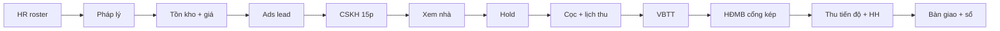

### 12.1. TGĐ

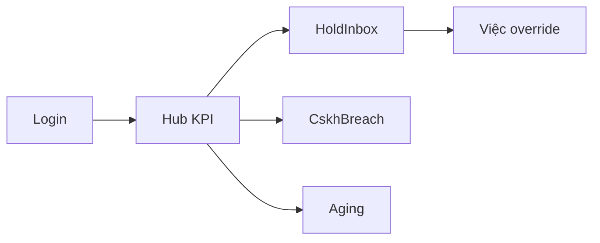

### 12.2. Ban Dự án

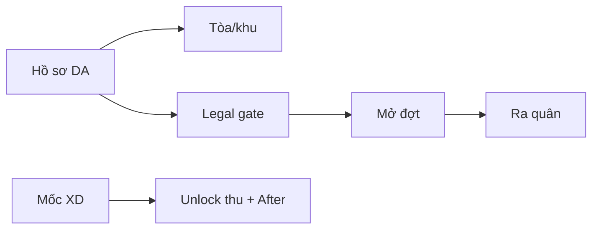

### 12.3. Sản phẩm – Giỏ – Giá

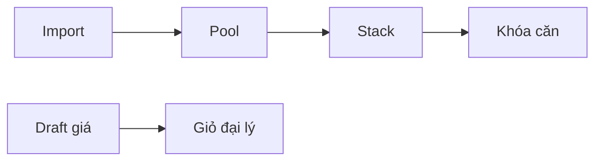

### 12.4. GĐ khối KD

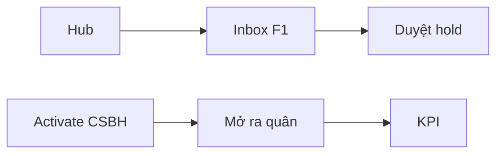

### 12.5. KD Inhouse

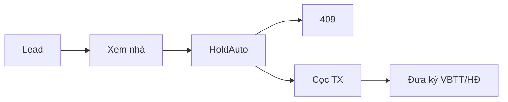

### 12.6. Kênh đại lý

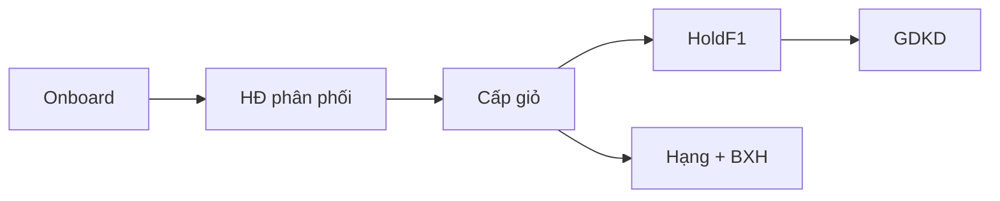

### 12.7. CSKH trước bán

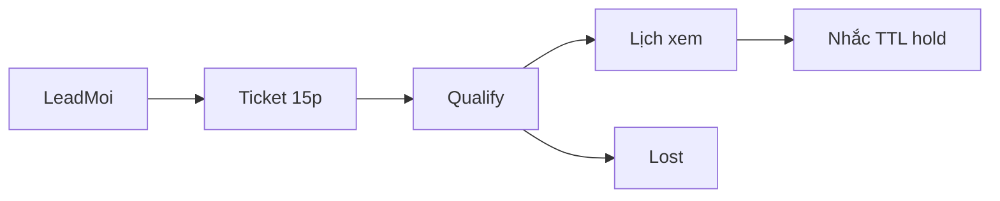

### 12.8. Marketing

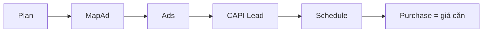

### 12.9. Pháp chế

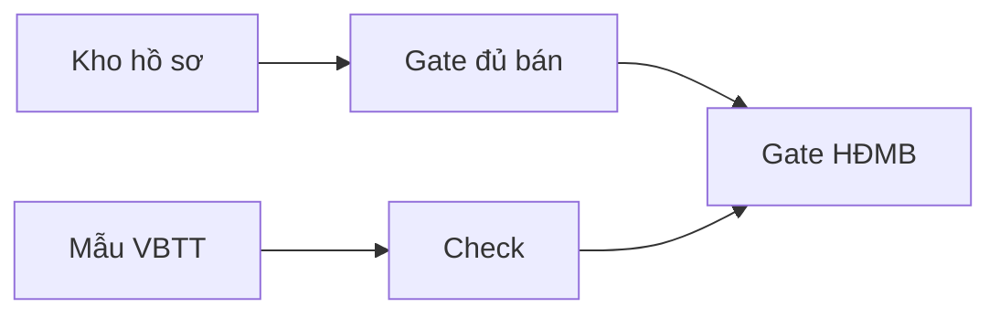

### 12.10. Công nợ

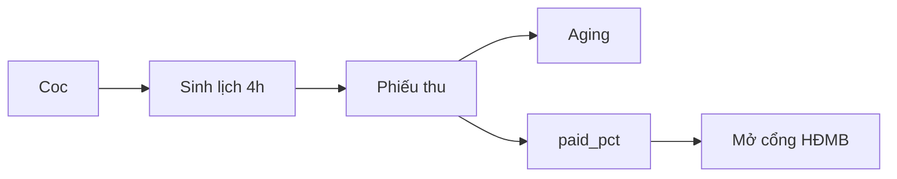

### 12.11. Hoa hồng

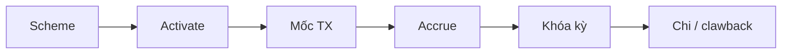

### 12.12. CSKH sau bán

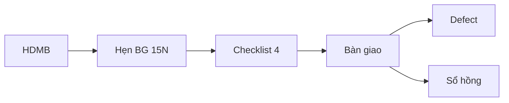

### 12.13. Nhân sự

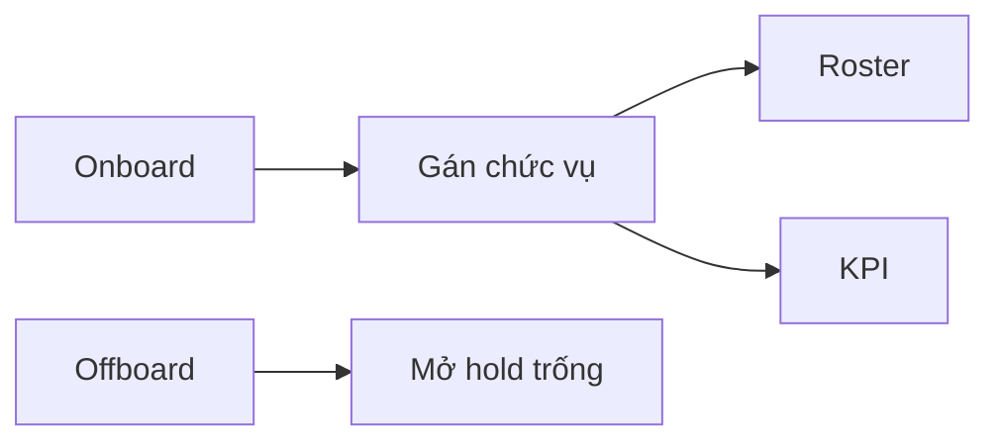

---

## 13. Rà soát tính năng hiện có và nâng cấp

**Kết luận:** Domain API pack BĐS **đã rộng hơn UI**. Chỗ «chưa hợp lý» chủ yếu là FE stub / chưa nối CSKH–HR–CAPI–Finance — không phải thiếu nghiệp vụ lõi trên server.

### 13.1. Đã có (API production-ready)

| Khối | Endpoint chính |
|------|----------------|
| Tenant | `POST/GET tenants`, `activate` |
| Hub | `GET hub`, `leaderboard` |
| Tồn kho | `units`, `stack`, `import`, `lock/unlock` |
| Hold | `POST holds`, approve/reject/cancel |
| TX | convert-deposit, reservation, vbtt, mortgage, contract, cancel, hdmb-gate |
| Policy | policies CRUD, activate, quote, price-lists |
| Project OS | towers, zones, layouts, legal-docs/gate, phases, milestones, plan-revisions |
| Agency | CRUD, contracts, basket, quote, tier override |
| Buyer | list/create, qualify, touch, matches, visits |
| Collection | receipts, aging, export |
| HH | schemes, commissions, statements lock/approve/pay, advances, tier recalc |
| Launch | create/open/close, war-room |
| After | appointment, check, handover, defects, title |
| Việc / Chat | staff tickets + rooms (P12) |

### 13.2. UI đang stub / lệch — bổ sung (P0 FE)

| Màn | Hiện | Nâng cấp bắt buộc |
|-----|------|-------------------|
| `/crm/bds/holds` | Stub | Form hold, duyệt F1, TTL, 409 |
| `/crm/bds/transactions` | Stub | Wizard cọc → VBTT → HĐMB + lý do 400 |
| `/crm/bds/leads` | Placeholder | = board `re_buyer` + visit + qualify |
| `/crm/bds/collections` | Placeholder | Phiếu thu, lịch, aging, export |
| `/crm/bds/tiers` | Placeholder | Bậc, quota, override |
| `/crm/bds/agencies` | List | HĐ, giỏ, AM, suspend |
| `/crm/bds/commissions` | Chỉ bảng | Scheme, khóa kỳ, chi, tạm ứng |
| `/crm/re-projects/[id]` | Tab RE cũ | Tab Tòa/Đợt/Mốc/Pháp lý/Policy draft |
| Policy | Chỉ API | `/crm/bds/policies` draft SP / activate GĐKD |

### 13.3. Chưa hợp lý — nâng khối (P1 U0–U8)

| Vấn đề | Nâng |
|--------|-----|
| Board CSKH không biết căn | `flow=re_buyer` + cột hold/TX |
| Deal Room trên khách mua căn | 404 skin `re_buyer` |
| CAPI chỉ log nội bộ | HTTP Meta Lead/Schedule/Purchase = `net_price_vnd` |
| GĐKD thấy `/crm/sales` | Ẩn B2B khi tenant CĐT |
| Công nợ / HH / hub rời | Finance hub 4 số CFO |
| Offboard không mở hold | Spine `staff.offboarded` |
| Lead 360 không có | Skin `/crm/leads/[id]` |
| Hub thiếu CSKH + thu ngày | 4 widget war-room |
| Tạo dự án chỉ «tên» | Form legal_gate, % HĐMB, one_price |
| HR không thấy thiếu 5 vị trí | Banner G0 + chặn ra quân |

### 13.4. Giữ nguyên (đã hợp lý)

- Cổng kép HĐMB (PC + Collection), GĐKD không bypass.  
- 409 hai hold một căn; one_price.  
- Aftersales checklist + sổ; defect không tạo ticket khách.  
- Hoa hồng sổ riêng, không `crm_b2b_commission_ledger`.  
- Broker không seed 12 ban CĐT.

---

*Duyệt playbook này cùng Q30–Q48. L3 nút bấm khớp runbook UI. Đổi SLA / cổng / kiêm PC+Collection = sửa spec này trước khi sửa code.*

