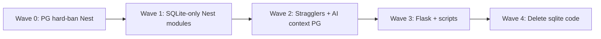

# Zero SQLite — Full-Stack Design

> **Date:** 2026-08-23  
> **Status:** Wave 0 plan ready — [2026-08-23-zero-sqlite-wave-0.md](../plans/2026-08-23-zero-sqlite-wave-0.md)  
> **Scope:** Nest `ptt-crm-api` + Flask legacy + scripts/e2e — loại bỏ `ptt.db` làm OLTP  
> **Context:** BĐS RE OLTP P1–P5 đã PG-primary trên VPS (`PTT_BDS_PACK=1`, `PTT_BDS_PG=1`). Nhiều module CRM agency đã có PG repo + flag `PTT_CRM_*_PG` (default `1`).

---

## 1. Mục tiêu

| Mục tiêu | Tiêu chí thành công |
|----------|---------------------|
| **Không OLTP trên SQLite** | Mọi read/write business qua PostgreSQL (`rnosaidb`) |
| **Không phụ thuộc `ptt.db` trên VPS prod** | API restart OK khi file không tồn tại |
| **Flask retired path** | `PTT_FLASK_MONOLITH_MODE=retired`; Flask không mở sqlite cho CRM |
| **Scripts/e2e** | Gate scripts dùng PG seed, không `export PTT_SQLITE_PATH=ptt.db` bắt buộc |

**Không nằm trong scope đầu tiên:** xóa hết file `*-sqlite.repository.ts` khỏi repo (cleanup cuối); migrate SEO SQLite domain (đã PG trên `seo_aeo` schema).

---

## 2. Hiện trạng (audit 2026-08-23)

### 2.1 Đã PG-primary (khi flag đúng)

- **catalog** — PG only (sqlite repo orphan)
- **leads read** — `PTT_LEADS_READ_SOURCE=pg` (default)
- **leads write** — `PgLeadsWriteRepository`
- **BĐS re-projects P1–P5** — `PTT_BDS_PACK` + `PTT_BDS_PG`
- **seo-admin hub** — PG `seo_aeo` schema

### 2.2 Dual flag (`PTT_CRM_*_PG`, default ON trừ payroll)

intake, leads-funnel, leads-contract, crm-staff, crm-leads-legacy, service-lifecycle, finance, svc-finance, kpi, sop — **vẫn có fallback SQLite khi flag off**.

**Stragglers** (sqlite dù flag PG on):

- `lifecycle-finance-confirm.repository.ts` — always sqlite
- AI context repos (`deal-score`, `churn-health`, `forecast`, …) — always sqlite
- `bds-hub` — sqlite fallback khi không PG-primary
- `payroll` — `PTT_CRM_PAYROLL_PG` default **0**

### 2.3 SQLite-only (chưa có PG repo)

proposals, customers, cases, sales, tickets, invoices, orders, marketing-plans, crm-config, owner-weekly, deal-room consumers, ai-intelligence sqlite contexts.

### 2.4 Flask

Registry `ptt_crm/crm_flask_retirement_registry.py` — nhiều module **RETIRED** (leads, hub, catalog, customers, intake, staff, …). Flask vẫn có hàng trăm file Python dùng `sqlite3` cho tests, gates, legacy helpers.

---

## 3. Ba hướng tiếp cận

### A. Flag hard-ban + bật PG (khuyến nghị làm trước)

- Thêm `PTT_SQLITE_DISABLED=1` → mọi `DatabaseSync` trong Nest **throw** (pattern BĐS).
- VPS: set tất cả `PTT_CRM_*_PG=1`, `PTT_CRM_PAYROLL_PG=1`, `PTT_LEADS_READ_SOURCE=pg`.
- Sửa stragglers còn sqlite khi PG on.
- **Ưu:** 1–2 ngày, unlock prod không cần `ptt.db` cho ~80% traffic.
- **Nhược:** 12 module sqlite-only vẫn lỗi cho đến Wave 2.

### B. Big-bang migrate tất cả module + Flask cùng lúc

- **Ưu:** Một lần cutover.
- **Nhược:** Rủi ro cao, 4–8 tuần, khó rollback — **không khuyến nghị**.

### C. Phased waves (khuyến nghị tổng thể)

Kết hợp A ngay + migrate sqlite-only theo wave + Flask/script cleanup.

---

## 4. Thiết kế đề xuất — Phased waves



### Wave 0 — Nest PG hard-ban (1–2 ngày)

1. **Config:** `PTT_SQLITE_DISABLED=1` in `app-config.service.ts`
2. **Guard:** shared `assertSqliteAllowed()` — used by all `*-sqlite.repository.ts` getters
3. **VPS `.env`:**
   ```bash
   PTT_SQLITE_DISABLED=1
   PTT_CRM_PAYROLL_PG=1
   PTT_CRM_LEADS_FUNNEL_PG=1
   # ... all PTT_CRM_*_PG=1
   PTT_BDS_PACK=1
   PTT_BDS_PG=1
   PTT_LEADS_READ_SOURCE=pg
   PTT_LEADS_WRITE_SOURCE=pg
   ```
4. **Remove sqlite fallbacks** in dual modules when `PTT_SQLITE_DISABLED=1` (optional: keep code, guard throws first)
5. **Health:** `sqlite: false` expected; không fail deploy
6. **Verify:** smoke ops-web BĐS + CRM routes đã PG

### Wave 1 — SQLite-only Nest modules (2–3 tuần)

Ưu tiên theo traffic VPS:

| Priority | Module | PG DDL | Notes |
|----------|--------|--------|-------|
| P1 | customers, cases | extend existing PG wave DDL | CSKH board |
| P1 | tickets | staff-tickets đã PG (`crm_staff_tickets`) — wire Nest tickets → PG | |
| P2 | proposals, marketing-plans | presales/marketing plan tables exist | |
| P2 | crm-config | pipeline config JSONB | AI/deal-score deps |
| P3 | orders, invoices | billing PG bridge | |
| P3 | sales, owner-weekly | dashboard aggregates | |

Pattern mỗi module: `*-pg.repository.ts` + service router + DDL script + apply on VPS.

### Wave 2 — Stragglers (1 tuần)

- `lifecycle-finance-confirm` → PG
- AI context repos → read from PG OLTP tables (leads, customers, finance)
- `bds-hub` — remove sqlite branch when BDS PG
- Delete orphan `catalog-sqlite.repository.ts`

### Wave 3 — Flask + scripts (1–2 tuần)

- Enforce `PTT_FLASK_MONOLITH_MODE=retired` on VPS
- `phase5_flask_retirement_gates` pass in CI/deploy
- Scripts: replace `PTT_SQLITE_PATH` bootstrap with PG seed scripts (`scripts/seed_*_pg.sh`)
- E2e: `playwright_ops_*` use API against PG-only Nest

### Wave 4 — Cleanup (ongoing)

- Remove `*-sqlite.repository.ts` files
- Remove `node:sqlite` dependency usage
- Archive `ptt.db` on VPS (backup only)
- Update runbooks

---

## 5. Cơ chế kỹ thuật

### 5.1 Global guard

```typescript
// sqlite-guard.util.ts
export function assertSqliteAllowed(): void {
  if (process.env.PTT_SQLITE_DISABLED === '1') {
    throw new ServiceUnavailableException({
      error: 'sqlite_disabled',
      hint: 'OLTP uses PostgreSQL only. Set PTT_CRM_*_PG=1 or apply missing DDL.',
    });
  }
}
```

### 5.2 Flag matrix (VPS prod target)

| Flag | Value |
|------|-------|
| `PTT_SQLITE_DISABLED` | `1` |
| `PTT_LEADS_READ_SOURCE` | `pg` |
| `PTT_LEADS_WRITE_SOURCE` | `pg` |
| `PTT_CRM_*_PG` | all `1` |
| `PTT_BDS_PACK` / `PTT_BDS_PG` | `1` |
| `PTT_FLASK_MONOLITH_MODE` | `retired` |

### 5.3 Rollback

- Set `PTT_SQLITE_DISABLED=0` + restore `ptt.db` from backup
- Per-module: flip individual `PTT_CRM_*_PG=0` (chỉ khi sqlite repo còn)

---

## 6. Rủi ro

| Rủi ro | Mitigation |
|--------|------------|
| Module sqlite-only 500 khi hard-ban | Wave 1 trước hard-ban **hoặc** hard-ban sau từng wave |
| Data chưa backfill PG | One-time `scripts/backfill_sqlite_to_pg_*.sh` per domain |
| Flask tests break | Keep sqlite for **test fixtures only** (`PTT_SQLITE_DISABLED` not set in CI unit tests) |
| Payroll default off | Explicit `PTT_CRM_PAYROLL_PG=1` on VPS |

---

## 7. Verification

- [ ] `grep -r DatabaseSync services/ptt-crm-api/src` — zero runtime paths when `PTT_SQLITE_DISABLED=1`
- [ ] VPS: `rm ptt.db` (after backup) → API healthy
- [ ] `phase5_flask_retirement_gates` OK
- [ ] ops-web smoke: leads, finance, BĐS project, accounting
- [ ] No `PTT_SQLITE_PATH` in production `.env`

---

## 8. Recommendation

**Bắt đầu Wave 0 ngay** (guard + VPS flags + stragglers fix), **song song Wave 1 P1** (customers, cases, tickets). Không big-bang.

Ước lượng: **4–6 tuần** full-stack zero sqlite prod; **Wave 0** có thể deploy trong session kế tiếp.

---

## 9. Next step

Sau khi spec được approve → `writing-plans` skill → implementation plan per wave → execute Wave 0 first.
